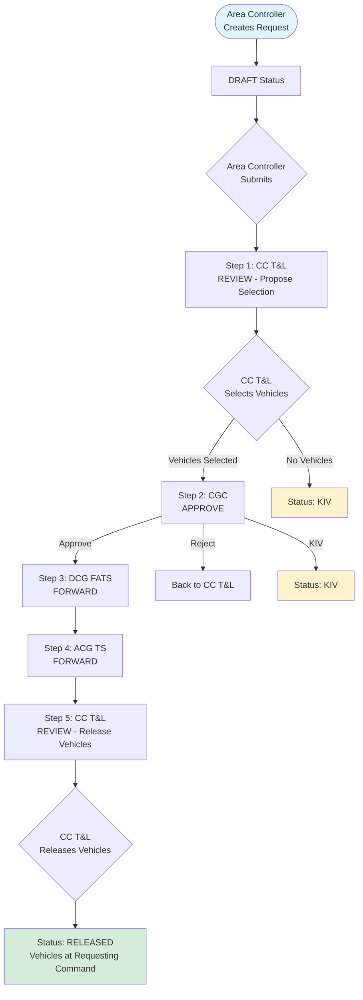
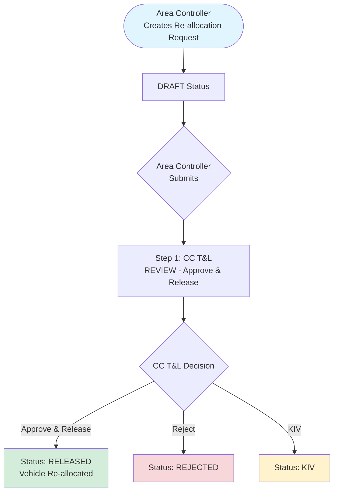
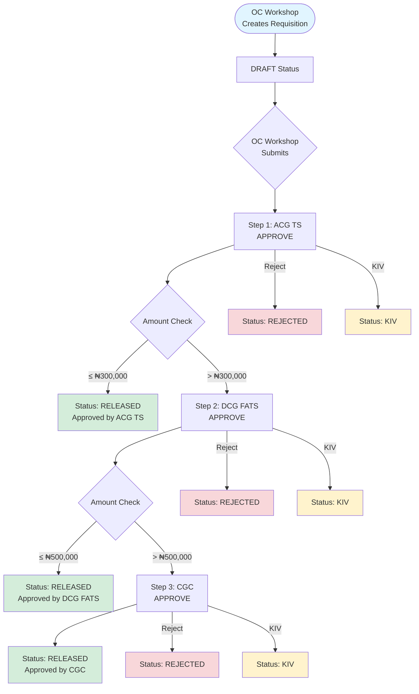
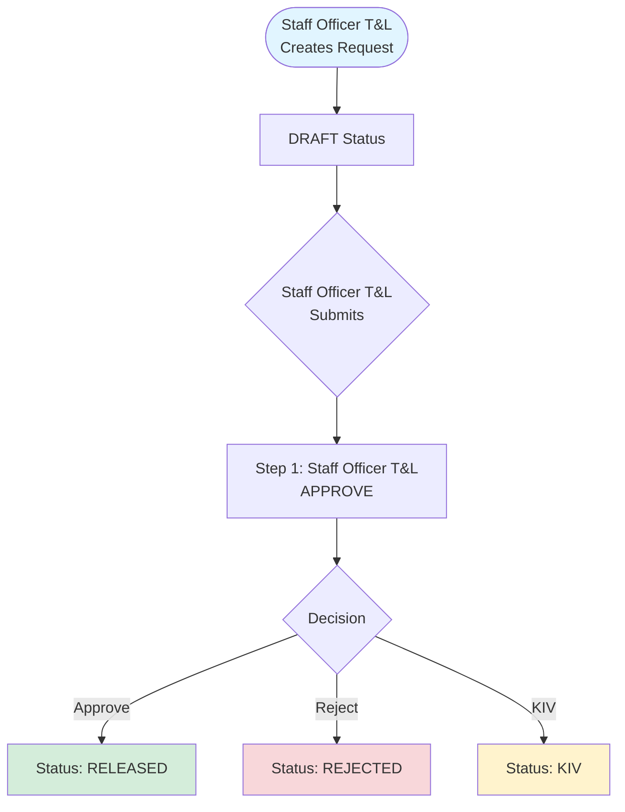

# Transport & Logistics (T&L) System Documentation

## Overview

The T&L System manages vehicle requests, allocations, requisitions, and maintenance workflows across multiple organizational levels. The system implements role-based access control with automated workflow routing based on request types and amount thresholds.

## System Architecture

### Request Types

1. **FLEET_NEW_VEHICLE** - Request for new vehicles
2. **FLEET_RE_ALLOCATION** - Re-allocation of existing vehicles
3. **FLEET_REQUISITION** - Maintenance requisitions (with amount-based routing)
4. **FLEET_REPAIR** - Vehicle repair requests
5. **FLEET_OPE** - Out of Pocket Expenses (e.g., fueling/maintenance)
6. **FLEET_USE** - Request for use of vehicles

### Request Statuses

- **DRAFT** - Request created but not yet submitted
- **SUBMITTED** - Request submitted into workflow
- **IN_REVIEW** - Request is at a workflow step awaiting action
- **KIV** - Keep In View (temporarily paused)
- **REJECTED** - Request rejected by an approver
- **RELEASED** - Vehicles released to requesting command

## Roles and Responsibilities

### CD (Chief Driver)
**Primary Activities**: View/Create requests at Command level

**Access & Functions**:
- ✅ Fleet Dashboard (`/fleet/dashboard/cd`)
- ✅ Create Requests (`/fleet/requests/create`)
- ✅ View Requests (`/fleet/requests`)
- ✅ View Vehicles (`/fleet/vehicles`)
- ✅ Issue Vehicles to Officers (`/fleet/vehicles/{vehicle}/issue`)
- ✅ Process Vehicle Returns (`/fleet/vehicles/{vehicle}/return`)
- ✅ Update Vehicle Service Status
- ✅ View Returns Reports (`/fleet/reports/returns`)

**Dashboard Features**:
- My Draft Requests count
- Submitted Requests count
- KIV Requests count
- Released Requests count
- Command Pool Vehicles count
- Active Assignments count
- Pending Returns count

### Area Controller (Unit Head)
**Primary Activities**: Approve/Forward Command requests

**Access & Functions**:
- ✅ Create Requests (New Vehicle, Re-allocation)
- ✅ Submit Requests
- ✅ View Requests
- ✅ Acknowledge receipt of released vehicles

### OC Workshop
**Primary Activities**: Create Requisitions (Maintenance)

**Access & Functions**:
- ✅ Create Maintenance Requisitions
- ✅ Upload Bills/Recommendations
- ✅ Upload Job Completion Receipts
- ✅ View Requests

**Note**: All requisitions initially go to ACG TS. Amount thresholds determine further routing:
- ≤ ₦300,000: Approved by ACG TS only
- > ₦300,000: Forwarded to DCG FATS
- > ₦500,000: Forwarded to CGC

### Staff Officer T&L
**Primary Activities**: Create Repair/OPE requests

**Access & Functions**:
- ✅ Create Repair Requests
- ✅ Create OPE Requests
- ✅ Create Vehicle Use Requests
- ✅ View Requests

### CC T&L (Comptroller T&L)
**Primary Activities**: Inventory Check (Propose) & Vehicle Release

**Access & Functions**:
- ✅ View Vehicle Inventory (New supply, Recently Added, Distribution chart)
- ✅ Propose Vehicle Selection for New Vehicle Requests
- ✅ Approve & Release vehicles for Re-allocation Requests
- ✅ Release vehicles after approval chain for New Vehicle Requests
- ✅ View all Requests
- ✅ Manage Vehicle Identifiers

**Dashboard Features**:
- In Stock vehicles count
- Reserved vehicles count
- KIV Requests count
- Inventory Checks pending count
- Release Pending count

### ACG TS
**Primary Activities**: Approve Requisitions < ₦300k

**Access & Functions**:
- ✅ Approve Requisitions ≤ ₦300,000
- ✅ Forward Requisitions > ₦300,000 to DCG FATS
- ✅ Forward New Vehicle proposals after CGC approval
- ✅ Approve/Reject/KIV decisions

### DCG FATS
**Primary Activities**: Approve Requisitions < ₦500k

**Access & Functions**:
- ✅ Approve Requisitions > ₦300,000 and ≤ ₦500,000
- ✅ Forward Requisitions > ₦500,000 to CGC
- ✅ Forward New Vehicle proposals after CGC approval
- ✅ Approve/Reject/KIV decisions

### CGC
**Primary Activities**: Approve Requisitions > ₦500k

**Access & Functions**:
- ✅ Approve Requisitions > ₦500,000
- ✅ Approve New Vehicle proposals (after CC T&L proposal)
- ✅ Approve/Reject/KIV decisions
- ✅ View all Requests

## Workflow Diagrams

### New Vehicle Request Flow

**Workflow Steps**:
1. **Area Controller** creates request (DRAFT)
2. **Area Controller** submits request
3. **CC T&L** reviews and proposes vehicle selection (can KIV if no vehicles available)
4. **CGC** approves/rejects/KIV the proposal
5. **DCG FATS** forwards (if approved)
6. **ACG TS** forwards
7. **CC T&L** releases vehicles to requesting command

### Re-allocation Request Flow

**Workflow Steps**:
1. **Area Controller** creates re-allocation request with selected vehicle (DRAFT)
2. **Area Controller** submits request
3. **CC T&L** directly approves and releases vehicle to requesting command

### Requisition Flow (Amount-Based Routing) I 

**Amount Thresholds**:
- **≤ ₦300,000**: Approved by ACG TS only (Example: ₦150,000)
- **> ₦300,000 and ≤ ₦500,000**: Approved by ACG TS → DCG FATS (Example: ₦450,000)
- **> ₦500,000**: Approved by ACG TS → DCG FATS → CGC (Example: ₦1,200,000)

### Repair/OPE Request Flow

## UI/UX Elements

### Request Show Page

**Visible Fields**:
- ✅ **Amount**: Displayed when request has amount (₦ format)
- ✅ **Vehicle**: Displayed when request has associated vehicle (Make, Model, Reg No)
- ✅ **Requested Type/Quantity**: For New Vehicle requests
- ✅ **Origin Command**: Command that created the request
- ✅ **Status**: Color-coded status badge
- ✅ **Created By**: User who created the request

**Workflow Progress Table**:
- ✅ Displays all workflow steps in order
- ✅ **Current Step Highlighting**: Current step highlighted with `bg-primary/5 font-semibold text-primary`
- ✅ Shows Role, Action, Decision, Actor, and Timestamp for each step
- ✅ Pending steps show "Pending" in italic gray text

**Notes & Attachments**:
- ✅ **Notes**: Displayed in a styled box with background
- ✅ **Attachments**: Clickable link with icon to view/download documents
- ✅ Supports PDF, JPG, PNG formats (max 5MB)

**Action Panels**:
- ✅ **CC T&L Proposal Panel**: Appears when CC T&L is at Step 1 of New Vehicle request
  - Vehicle selection table with checkboxes
  - Comment field
  - Submit Proposal button
- ✅ **CC T&L Release Panel**: Appears when CC T&L is at release step
  - Shows reserved vehicles count
  - Comment field
  - Approve and Release button
- ✅ **Generic Action Panel**: For other roles at their workflow steps
  - Comment field
  - Action buttons (Approve, Reject, Forward, KIV) based on step action type

### Request Index Page

**Inbox Section**:
- Shows requests awaiting current user's action
- Displays: ID, Origin, Request Type, Details, Status, Action button
- "New Request" button (if user has create permission)

**My Requests Section**:
- Shows requests created by current user
- Displays: ID, Request Type, Details, Status, Action buttons
- "Submit" button for DRAFT requests
- "View" button for all requests

## KIV (Keep In View) Functionality

**When KIV is Available**:
- CC T&L at proposal step (New Vehicle requests)
- CGC at approval step (New Vehicle requests)
- All approvers at their respective steps (Requisitions)

**KIV Behavior**:
- Request status changes to **KIV**
- Request stays at current workflow step
- Current step decision is recorded as "KIV"
- Request can be resumed later by the same role

**CC T&L Special KIV**:
- If CC T&L selects no vehicles during proposal, request automatically becomes KIV
- This allows waiting for vehicle availability

## Vehicle Inventory Management

### Vehicle Lifecycle Statuses

- **IN_STOCK**: Available in central inventory
- **AT_COMMAND_POOL**: Assigned to a command's pool
- **ASSIGNED**: Assigned to an officer
- **RESERVED**: Reserved for a pending request

### Vehicle Reservation

- Vehicles can be reserved by CC T&L during proposal step
- Reserved vehicles are locked and cannot be selected by other requests
- Reservation is released when:
  - Request is rejected
  - Request is completed and vehicles are released
  - Request becomes KIV

## Notification System

**Notification Triggers**:
- Request submitted into workflow
- Request reaches a step requiring action
- Request status changes (KIV, REJECTED, RELEASED)

**Notification Recipients**:
- Users with the role matching the current workflow step
- CD users at the origin command (for status updates)
- Command-scoped roles receive notifications for their command's requests

**Email Configuration**:
- System uses `MAIL_MAILER=log` for testing
- Check `storage/logs/laravel.log` for notification logs

## Testing Scenarios

See [TESTING_GUIDELINE.md](TESTING_GUIDELINE.md) for comprehensive testing scenarios including:
- New Vehicle Request (Full Chain)
- Maintenance Requisition (Amount Thresholds)
- Re-allocation
- UI/UX Verification

## Technical Implementation

### Key Files

**Controllers**:
- `app/Http/Controllers/Fleet/FleetRequestController.php` - Request management
- `app/Http/Controllers/Fleet/FleetDashboardController.php` - Role-specific dashboards
- `app/Http/Controllers/Fleet/FleetVehicleController.php` - Vehicle management
- `app/Http/Controllers/Fleet/FleetIssuanceController.php` - Vehicle issuance/returns

**Services**:
- `app/Services/Fleet/FleetWorkflowService.php` - Workflow logic and step management

**Models**:
- `app/Models/FleetRequest.php` - Request model
- `app/Models/FleetRequestStep.php` - Workflow step model
- `app/Models/FleetVehicle.php` - Vehicle model

**Views**:
- `resources/views/fleet/requests/index.blade.php` - Request listing
- `resources/views/fleet/requests/show.blade.php` - Request details
- `resources/views/fleet/requests/create.blade.php` - Request creation form

### Route Middleware

All fleet routes are protected with role-based middleware:
- Request creation: `CD|Area Controller|OC Workshop|Staff Officer T&L|CC T&L`
- Request viewing: `CD|O/C T&L|Transport Store/Receiver|Area Controller|OC Workshop|Staff Officer T&L|CC T&L|DCG FATS|ACG TS|CGC`
- Request actions: Role-specific based on workflow step

## Summary

The T&L System provides a comprehensive workflow management system for vehicle requests, allocations, and maintenance. Key features include:

✅ Role-based access control
✅ Automated workflow routing
✅ Amount-based approval thresholds for requisitions
✅ KIV functionality for temporary holds
✅ Vehicle inventory management
✅ Real-time notifications
✅ Clean UI/UX with proper field visibility
✅ Workflow progress tracking with current step highlighting

All workflows match the provided diagrams and specifications, ensuring efficient processing and reduced approval times.
