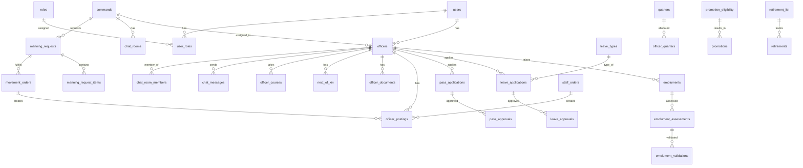

# NCS Employee Portal - Database Schema Design

## Table of Contents
1. [Entity Relationship Diagram](#entity-relationship-diagram)
2. [Core Tables](#core-tables)
3. [Workflow Tables](#workflow-tables)
4. [Reference Tables](#reference-tables)
5. [Audit & System Tables](#audit--system-tables)
6. [Indexes](#indexes)
7. [Enums & Status Values](#enums--status-values)

---

## Entity Relationship Diagram



---

## Core Tables

### users
Stores system user accounts for authentication and authorization.

| Column | Type | Constraints | Description |
|--------|------|-------------|-------------|
| id | BIGINT | PRIMARY KEY, AUTO_INCREMENT | Unique user ID |
| email | VARCHAR(255) | UNIQUE, NOT NULL | User email (login) |
| password_hash | VARCHAR(255) | NOT NULL | Hashed password |
| is_active | BOOLEAN | DEFAULT TRUE | Account active status |
| last_login | TIMESTAMP | NULL | Last login timestamp |
| created_at | TIMESTAMP | DEFAULT CURRENT_TIMESTAMP | Account creation date |
| updated_at | TIMESTAMP | DEFAULT CURRENT_TIMESTAMP ON UPDATE | Last update timestamp |
| created_by | BIGINT | FOREIGN KEY (users.id) | User who created this account |

### roles
System roles/permissions definition.

| Column | Type | Constraints | Description |
|--------|------|-------------|-------------|
| id | BIGINT | PRIMARY KEY, AUTO_INCREMENT | Role ID |
| name | VARCHAR(100) | UNIQUE, NOT NULL | Role name (HRD, Staff_Officer, Officer, etc.) |
| code | VARCHAR(50) | UNIQUE, NOT NULL | Role code for system use |
| description | TEXT | NULL | Role description |
| access_level | VARCHAR(50) | NOT NULL | Access level (system_wide, command_level, personal) |
| created_at | TIMESTAMP | DEFAULT CURRENT_TIMESTAMP | Creation timestamp |
| updated_at | TIMESTAMP | DEFAULT CURRENT_TIMESTAMP ON UPDATE | Update timestamp |

### user_roles
Many-to-many relationship between users and roles.

| Column | Type | Constraints | Description |
|--------|------|-------------|-------------|
| id | BIGINT | PRIMARY KEY, AUTO_INCREMENT | Relationship ID |
| user_id | BIGINT | FOREIGN KEY (users.id), NOT NULL | User ID |
| role_id | BIGINT | FOREIGN KEY (roles.id), NOT NULL | Role ID |
| command_id | BIGINT | FOREIGN KEY (commands.id), NULL | Command assignment (if role is command-level) |
| assigned_at | TIMESTAMP | DEFAULT CURRENT_TIMESTAMP | Assignment date |
| assigned_by | BIGINT | FOREIGN KEY (users.id) | User who assigned the role |
| is_active | BOOLEAN | DEFAULT TRUE | Active status |

### commands
Organizational units/commands where officers are posted.

| Column | Type | Constraints | Description |
|--------|------|-------------|-------------|
| id | BIGINT | PRIMARY KEY, AUTO_INCREMENT | Command ID |
| code | VARCHAR(50) | UNIQUE, NOT NULL | Command code |
| name | VARCHAR(255) | NOT NULL | Command name |
| location | VARCHAR(255) | NULL | Command location |
| area_controller_id | BIGINT | FOREIGN KEY (officers.id), NULL | Area Controller officer ID |
| is_active | BOOLEAN | DEFAULT TRUE | Active status |
| created_at | TIMESTAMP | DEFAULT CURRENT_TIMESTAMP | Creation timestamp |
| updated_at | TIMESTAMP | DEFAULT CURRENT_TIMESTAMP ON UPDATE | Update timestamp |

### officers
Core officer information and employment details.

| Column | Type | Constraints | Description |
|--------|------|-------------|-------------|
| id | BIGINT | PRIMARY KEY, AUTO_INCREMENT | Officer ID |
| user_id | BIGINT | FOREIGN KEY (users.id), UNIQUE, NULL | Associated user account |
| service_number | VARCHAR(50) | UNIQUE, NOT NULL | Service number (e.g., 57616) |
| initials | VARCHAR(50) | NOT NULL | Officer initials |
| surname | VARCHAR(255) | NOT NULL | Surname |
| sex | ENUM('M', 'F') | NOT NULL | Gender |
| date_of_birth | DATE | NOT NULL | Date of birth |
| date_of_first_appointment | DATE | NOT NULL | DOFA |
| date_of_present_appointment | DATE | NOT NULL | Date of last promotion |
| substantive_rank | VARCHAR(100) | NOT NULL | Current rank |
| salary_grade_level | VARCHAR(10) | NOT NULL | Grade level (GL 07, GL 08, etc.) |
| state_of_origin | VARCHAR(100) | NOT NULL | State of origin |
| lga | VARCHAR(100) | NOT NULL | Local Government Area |
| geopolitical_zone | VARCHAR(50) | NOT NULL | Geopolitical zone |
| marital_status | VARCHAR(50) | NULL | Marital status |
| entry_qualification | VARCHAR(255) | NOT NULL | Entry qualification |
| discipline | VARCHAR(255) | NULL | Discipline (optional for WAEC, NECO and below) |
| additional_qualification | VARCHAR(255) | NULL | Additional qualifications |
| present_station | BIGINT | FOREIGN KEY (commands.id) | Current command |
| date_posted_to_station | DATE | NULL | Date posted to current station |
| residential_address | TEXT | NULL | Residential address |
| permanent_home_address | TEXT | NOT NULL | Permanent home address |
| phone_number | VARCHAR(20) | NOT NULL | Phone number |
| email | VARCHAR(255) | UNIQUE, NOT NULL | Email address |
| bank_name | VARCHAR(255) | NULL | Bank name |
| bank_account_number | VARCHAR(50) | NULL | Bank account number |
| sort_code | VARCHAR(20) | NULL | Sort code (optional) |
| pfa_name | VARCHAR(255) | NULL | Pension Fund Administrator name |
| rsa_number | VARCHAR(50) | NULL | RSA number (usually 12 digits with PEN prefix) |
| unit | VARCHAR(255) | NULL | Unit assignment |
| interdicted | BOOLEAN | DEFAULT FALSE | Interdiction status |
| suspended | BOOLEAN | DEFAULT FALSE | Suspension status |
| dismissed | BOOLEAN | DEFAULT FALSE | Dismissal status |
| quartered | BOOLEAN | DEFAULT FALSE | Quarters allocation status |
| is_deceased | BOOLEAN | DEFAULT FALSE | Deceased status |
| deceased_date | DATE | NULL | Date of death |
| is_active | BOOLEAN | DEFAULT TRUE | Active officer status |
| profile_picture_url | VARCHAR(500) | NULL | Profile picture file path |
| created_at | TIMESTAMP | DEFAULT CURRENT_TIMESTAMP | Record creation |
| updated_at | TIMESTAMP | DEFAULT CURRENT_TIMESTAMP ON UPDATE | Last update |
| created_by | BIGINT | FOREIGN KEY (users.id) | User who created record |

### next_of_kin
Officer's next of kin information.

| Column | Type | Constraints | Description |
|--------|------|-------------|-------------|
| id | BIGINT | PRIMARY KEY, AUTO_INCREMENT | Next of kin ID |
| officer_id | BIGINT | FOREIGN KEY (officers.id), NOT NULL | Officer ID |
| name | VARCHAR(255) | NOT NULL | Next of kin name(s) |
| relationship | VARCHAR(100) | NOT NULL | Relationship to officer |
| phone_number | VARCHAR(20) | NULL | Contact phone number |
| address | TEXT | NULL | Address |
| is_primary | BOOLEAN | DEFAULT FALSE | Primary next of kin |
| created_at | TIMESTAMP | DEFAULT CURRENT_TIMESTAMP | Creation timestamp |
| updated_at | TIMESTAMP | DEFAULT CURRENT_TIMESTAMP ON UPDATE | Update timestamp |

### officer_documents
Documents uploaded by officers (JPEG format preferred).

| Column | Type | Constraints | Description |
|--------|------|-------------|-------------|
| id | BIGINT | PRIMARY KEY, AUTO_INCREMENT | Document ID |
| officer_id | BIGINT | FOREIGN KEY (officers.id), NOT NULL | Officer ID |
| document_type | VARCHAR(100) | NOT NULL | Document type (certificate, ID, etc.) |
| file_name | VARCHAR(255) | NOT NULL | Original file name |
| file_path | VARCHAR(500) | NOT NULL | Storage path |
| file_size | BIGINT | NULL | File size in bytes |
| mime_type | VARCHAR(100) | NULL | MIME type |
| uploaded_at | TIMESTAMP | DEFAULT CURRENT_TIMESTAMP | Upload timestamp |
| uploaded_by | BIGINT | FOREIGN KEY (users.id) | User who uploaded |

---

## Workflow Tables

### emolument_timelines
HRD-created timelines for emolument submission.

| Column | Type | Constraints | Description |
|--------|------|-------------|-------------|
| id | BIGINT | PRIMARY KEY, AUTO_INCREMENT | Timeline ID |
| year | INT | NOT NULL | Year for emolument |
| start_date | DATE | NOT NULL | Timeline start date |
| end_date | DATE | NOT NULL | Timeline end date |
| is_extended | BOOLEAN | DEFAULT FALSE | Extension status |
| extension_end_date | DATE | NULL | Extended end date |
| is_active | BOOLEAN | DEFAULT TRUE | Active timeline |
| created_by | BIGINT | FOREIGN KEY (users.id), NOT NULL | HRD user who created |
| created_at | TIMESTAMP | DEFAULT CURRENT_TIMESTAMP | Creation timestamp |
| updated_at | TIMESTAMP | DEFAULT CURRENT_TIMESTAMP ON UPDATE | Update timestamp |

### emoluments
Officer emolument submissions.

| Column | Type | Constraints | Description |
|--------|------|-------------|-------------|
| id | BIGINT | PRIMARY KEY, AUTO_INCREMENT | Emolument ID |
| officer_id | BIGINT | FOREIGN KEY (officers.id), NOT NULL | Officer ID |
| timeline_id | BIGINT | FOREIGN KEY (emolument_timelines.id), NOT NULL | Timeline ID |
| year | INT | NOT NULL | Year of emolument |
| bank_name | VARCHAR(255) | NOT NULL | Updated bank name |
| bank_account_number | VARCHAR(50) | NOT NULL | Updated account number |
| pfa_name | VARCHAR(255) | NOT NULL | Updated PFA name |
| rsa_pin | VARCHAR(50) | NOT NULL | Updated RSA PIN (12 digits, PEN prefix) |
| status | ENUM('RAISED', 'ASSESSED', 'VALIDATED', 'PROCESSED', 'REJECTED') | DEFAULT 'RAISED' | Workflow status |
| submitted_at | TIMESTAMP | DEFAULT CURRENT_TIMESTAMP | Submission timestamp |
| assessed_at | TIMESTAMP | NULL | Assessment timestamp |
| validated_at | TIMESTAMP | NULL | Validation timestamp |
| processed_at | TIMESTAMP | NULL | Processing timestamp |
| notes | TEXT | NULL | Additional notes |
| created_at | TIMESTAMP | DEFAULT CURRENT_TIMESTAMP | Creation timestamp |
| updated_at | TIMESTAMP | DEFAULT CURRENT_TIMESTAMP ON UPDATE | Update timestamp |

### emolument_assessments
Assessor reviews of emoluments.

| Column | Type | Constraints | Description |
|--------|------|-------------|-------------|
| id | BIGINT | PRIMARY KEY, AUTO_INCREMENT | Assessment ID |
| emolument_id | BIGINT | FOREIGN KEY (emoluments.id), NOT NULL | Emolument ID |
| assessor_id | BIGINT | FOREIGN KEY (users.id), NOT NULL | Assessor user ID |
| assessment_status | ENUM('PENDING', 'APPROVED', 'REJECTED') | DEFAULT 'PENDING' | Assessment status |
| comments | TEXT | NULL | Assessment comments |
| assessed_at | TIMESTAMP | DEFAULT CURRENT_TIMESTAMP | Assessment timestamp |

### emolument_validations
Validator/Area Controller final validation.

| Column | Type | Constraints | Description |
|--------|------|-------------|-------------|
| id | BIGINT | PRIMARY KEY, AUTO_INCREMENT | Validation ID |
| emolument_id | BIGINT | FOREIGN KEY (emoluments.id), NOT NULL | Emolument ID |
| assessment_id | BIGINT | FOREIGN KEY (emolument_assessments.id), NOT NULL | Assessment ID |
| validator_id | BIGINT | FOREIGN KEY (users.id), NOT NULL | Validator user ID |
| validation_status | ENUM('PENDING', 'APPROVED', 'REJECTED') | DEFAULT 'PENDING' | Validation status |
| comments | TEXT | NULL | Validation comments |
| validated_at | TIMESTAMP | DEFAULT CURRENT_TIMESTAMP | Validation timestamp |

### leave_types
System leave types (28 standard types + custom).

| Column | Type | Constraints | Description |
|--------|------|-------------|-------------|
| id | BIGINT | PRIMARY KEY, AUTO_INCREMENT | Leave type ID |
| name | VARCHAR(255) | UNIQUE, NOT NULL | Leave type name |
| code | VARCHAR(50) | UNIQUE, NOT NULL | Leave type code |
| max_duration_days | INT | NULL | Maximum duration in days |
| max_duration_months | INT | NULL | Maximum duration in months |
| max_occurrences_per_year | INT | NULL | Max times per year |
| requires_medical_certificate | BOOLEAN | DEFAULT FALSE | Medical certificate required |
| requires_approval_level | VARCHAR(50) | NULL | Required approval level |
| is_active | BOOLEAN | DEFAULT TRUE | Active status |
| description | TEXT | NULL | Description and rules |
| created_by | BIGINT | FOREIGN KEY (users.id) | Created by HRD |
| created_at | TIMESTAMP | DEFAULT CURRENT_TIMESTAMP | Creation timestamp |
| updated_at | TIMESTAMP | DEFAULT CURRENT_TIMESTAMP ON UPDATE | Update timestamp |

### leave_applications
Officer leave applications.

| Column | Type | Type | Description |
|--------|------|------|-------------|
| id | BIGINT | PRIMARY KEY, AUTO_INCREMENT | Leave application ID |
| officer_id | BIGINT | FOREIGN KEY (officers.id), NOT NULL | Officer ID |
| leave_type_id | BIGINT | FOREIGN KEY (leave_types.id), NOT NULL | Leave type ID |
| start_date | DATE | NOT NULL | Leave start date |
| end_date | DATE | NOT NULL | Leave end date |
| number_of_days | INT | NOT NULL | Calculated number of days |
| reason | TEXT | NULL | Reason for leave |
| expected_date_of_delivery | DATE | NULL | EDD (for maternity leave) |
| status | ENUM('PENDING', 'MINUTED', 'APPROVED', 'REJECTED', 'CANCELLED', 'COMPLETED') | DEFAULT 'PENDING' | Application status |
| medical_certificate_url | VARCHAR(500) | NULL | Medical certificate file path |
| submitted_at | TIMESTAMP | DEFAULT CURRENT_TIMESTAMP | Submission timestamp |
| minuted_at | TIMESTAMP | NULL | Minuted timestamp |
| approved_at | TIMESTAMP | NULL | Approval timestamp |
| rejected_at | TIMESTAMP | NULL | Rejection timestamp |
| rejection_reason | TEXT | NULL | Rejection reason |
| alert_sent_72h | BOOLEAN | DEFAULT FALSE | 72-hour alert sent |
| created_at | TIMESTAMP | DEFAULT CURRENT_TIMESTAMP | Creation timestamp |
| updated_at | TIMESTAMP | DEFAULT CURRENT_TIMESTAMP ON UPDATE | Update timestamp |

### leave_approvals
Leave approval workflow tracking.

| Column | Type | Constraints | Description |
|--------|------|-------------|-------------|
| id | BIGINT | PRIMARY KEY, AUTO_INCREMENT | Approval ID |
| leave_application_id | BIGINT | FOREIGN KEY (leave_applications.id), NOT NULL | Leave application ID |
| staff_officer_id | BIGINT | FOREIGN KEY (users.id), NOT NULL | Staff Officer who minuted |
| dc_admin_id | BIGINT | FOREIGN KEY (users.id), NULL | DC Admin who approved |
| area_controller_id | BIGINT | FOREIGN KEY (officers.id), NULL | Area Controller (name appears on document) |
| approval_status | ENUM('MINUTED', 'APPROVED', 'REJECTED') | DEFAULT 'MINUTED' | Approval status |
| minuted_at | TIMESTAMP | DEFAULT CURRENT_TIMESTAMP | Minuted timestamp |
| approved_at | TIMESTAMP | NULL | Approval timestamp |
| printed_at | TIMESTAMP | NULL | Document printed timestamp |
| printed_by | BIGINT | FOREIGN KEY (users.id) | Staff Officer who printed |

### pass_applications
Officer pass applications (max 5 days, only after annual leave exhausted).

| Column | Type | Constraints | Description |
|--------|------|-------------|-------------|
| id | BIGINT | PRIMARY KEY, AUTO_INCREMENT | Pass application ID |
| officer_id | BIGINT | FOREIGN KEY (officers.id), NOT NULL | Officer ID |
| start_date | DATE | NOT NULL | Pass start date |
| end_date | DATE | NOT NULL | Pass end date (max 5 days) |
| number_of_days | INT | NOT NULL | Number of days (max 5) |
| reason | TEXT | NULL | Reason for pass |
| status | ENUM('PENDING', 'MINUTED', 'APPROVED', 'REJECTED', 'CANCELLED', 'COMPLETED') | DEFAULT 'PENDING' | Application status |
| submitted_at | TIMESTAMP | DEFAULT CURRENT_TIMESTAMP | Submission timestamp |
| minuted_at | TIMESTAMP | NULL | Minuted timestamp |
| approved_at | TIMESTAMP | NULL | Approval timestamp |
| rejected_at | TIMESTAMP | NULL | Rejection timestamp |
| expiry_alert_sent | BOOLEAN | DEFAULT FALSE | Expiry alert sent |
| created_at | TIMESTAMP | DEFAULT CURRENT_TIMESTAMP | Creation timestamp |
| updated_at | TIMESTAMP | DEFAULT CURRENT_TIMESTAMP ON UPDATE | Update timestamp |

### pass_approvals
Pass approval workflow tracking.

| Column | Type | Constraints | Description |
|--------|------|-------------|-------------|
| id | BIGINT | PRIMARY KEY, AUTO_INCREMENT | Approval ID |
| pass_application_id | BIGINT | FOREIGN KEY (pass_applications.id), NOT NULL | Pass application ID |
| staff_officer_id | BIGINT | FOREIGN KEY (users.id), NOT NULL | Staff Officer who minuted |
| dc_admin_id | BIGINT | FOREIGN KEY (users.id), NULL | DC Admin who approved |
| area_controller_id | BIGINT | FOREIGN KEY (officers.id), NULL | Area Controller (name appears on document) |
| approval_status | ENUM('MINUTED', 'APPROVED', 'REJECTED') | DEFAULT 'MINUTED' | Approval status |
| minuted_at | TIMESTAMP | DEFAULT CURRENT_TIMESTAMP | Minuted timestamp |
| approved_at | TIMESTAMP | NULL | Approval timestamp |
| printed_at | TIMESTAMP | NULL | Document printed timestamp |
| printed_by | BIGINT | FOREIGN KEY (users.id) | Staff Officer who printed |

### manning_requests
Staff Officer requests for officers (manning level).

| Column | Type | Constraints | Description |
|--------|------|-------------|-------------|
| id | BIGINT | PRIMARY KEY, AUTO_INCREMENT | Request ID |
| command_id | BIGINT | FOREIGN KEY (commands.id), NOT NULL | Requesting command |
| requested_by | BIGINT | FOREIGN KEY (users.id), NOT NULL | Staff Officer user ID |
| status | ENUM('DRAFT', 'SUBMITTED', 'APPROVED', 'REJECTED', 'FULFILLED') | DEFAULT 'DRAFT' | Request status |
| submitted_at | TIMESTAMP | NULL | Submission timestamp |
| approved_by | BIGINT | FOREIGN KEY (officers.id), NULL | Area Controller who approved |
| approved_at | TIMESTAMP | NULL | Approval timestamp |
| forwarded_to_hrd_at | TIMESTAMP | NULL | Forwarded to HRD timestamp |
| fulfilled_at | TIMESTAMP | NULL | Fulfillment timestamp |
| notes | TEXT | NULL | Additional notes |
| created_at | TIMESTAMP | DEFAULT CURRENT_TIMESTAMP | Creation timestamp |
| updated_at | TIMESTAMP | DEFAULT CURRENT_TIMESTAMP ON UPDATE | Update timestamp |

### manning_request_items
Individual requirements within a manning request.

| Column | Type | Constraints | Description |
|--------|------|-------------|-------------|
| id | BIGINT | PRIMARY KEY, AUTO_INCREMENT | Item ID |
| manning_request_id | BIGINT | FOREIGN KEY (manning_requests.id), NOT NULL | Manning request ID |
| rank | VARCHAR(100) | NOT NULL | Required rank |
| quantity_needed | INT | NOT NULL | Number of officers needed |
| sex_requirement | ENUM('M', 'F', 'ANY') | DEFAULT 'ANY' | Sex requirement (optional) |
| qualification_requirement | VARCHAR(255) | NULL | Qualification requirement (optional) |
| matched_officer_id | BIGINT | FOREIGN KEY (officers.id), NULL | Matched officer ID (after HRD processing) |

### staff_orders
HRD-created staff orders for individual postings.

| Column | Type | Constraints | Description |
|--------|------|-------------|-------------|
| id | BIGINT | PRIMARY KEY, AUTO_INCREMENT | Staff order ID |
| order_number | VARCHAR(100) | UNIQUE, NOT NULL | Order number |
| officer_id | BIGINT | FOREIGN KEY (officers.id), NOT NULL | Officer being posted |
| from_command_id | BIGINT | FOREIGN KEY (commands.id), NULL | Previous command |
| to_command_id | BIGINT | FOREIGN KEY (commands.id), NOT NULL | New command |
| effective_date | DATE | NOT NULL | Effective posting date |
| order_type | ENUM('STAFF_ORDER', 'MOVEMENT_ORDER') | DEFAULT 'STAFF_ORDER' | Order type |
| created_by | BIGINT | FOREIGN KEY (users.id), NOT NULL | HRD user who created |
| is_altered | BOOLEAN | DEFAULT FALSE | Altered status |
| altered_at | TIMESTAMP | NULL | Alteration timestamp |
| created_at | TIMESTAMP | DEFAULT CURRENT_TIMESTAMP | Creation timestamp |
| updated_at | TIMESTAMP | DEFAULT CURRENT_TIMESTAMP ON UPDATE | Update timestamp |

### movement_orders
HRD-created movement orders (bulk postings based on criteria).

| Column | Type | Constraints | Description |
|--------|------|-------------|-------------|
| id | BIGINT | PRIMARY KEY, AUTO_INCREMENT | Movement order ID |
| order_number | VARCHAR(100) | UNIQUE, NOT NULL | Order number |
| criteria_months_at_station | INT | NULL | Minimum months at station |
| manning_request_id | BIGINT | FOREIGN KEY (manning_requests.id), NULL | Related manning request |
| created_by | BIGINT | FOREIGN KEY (users.id), NOT NULL | HRD user who created |
| status | ENUM('DRAFT', 'ACTIVE', 'COMPLETED') | DEFAULT 'DRAFT' | Order status |
| created_at | TIMESTAMP | DEFAULT CURRENT_TIMESTAMP | Creation timestamp |
| updated_at | TIMESTAMP | DEFAULT CURRENT_TIMESTAMP ON UPDATE | Update timestamp |

### officer_postings
Officer posting history and current assignments.

| Column | Type | Constraints | Description |
|--------|------|-------------|-------------|
| id | BIGINT | PRIMARY KEY, AUTO_INCREMENT | Posting ID |
| officer_id | BIGINT | FOREIGN KEY (officers.id), NOT NULL | Officer ID |
| command_id | BIGINT | FOREIGN KEY (commands.id), NOT NULL | Command ID |
| staff_order_id | BIGINT | FOREIGN KEY (staff_orders.id), NULL | Related staff order |
| movement_order_id | BIGINT | FOREIGN KEY (movement_orders.id), NULL | Related movement order |
| posting_date | DATE | NOT NULL | Posting effective date |
| is_current | BOOLEAN | DEFAULT TRUE | Current posting status |
| documented_at | TIMESTAMP | NULL | Documented by Staff Officer timestamp |
| documented_by | BIGINT | FOREIGN KEY (users.id), NULL | Staff Officer who documented |
| created_at | TIMESTAMP | DEFAULT CURRENT_TIMESTAMP | Creation timestamp |
| updated_at | TIMESTAMP | DEFAULT CURRENT_TIMESTAMP ON UPDATE | Update timestamp |

### duty_rosters
Staff Officer-prepared duty rosters.

| Column | Type | Constraints | Description |
|--------|------|-------------|-------------|
| id | BIGINT | PRIMARY KEY, AUTO_INCREMENT | Roster ID |
| command_id | BIGINT | FOREIGN KEY (commands.id), NOT NULL | Command ID |
| roster_period_start | DATE | NOT NULL | Roster period start |
| roster_period_end | DATE | NOT NULL | Roster period end |
| prepared_by | BIGINT | FOREIGN KEY (users.id), NOT NULL | Staff Officer user ID |
| approved_by | BIGINT | FOREIGN KEY (officers.id), NULL | Area Controller who approved |
| approved_at | TIMESTAMP | NULL | Approval timestamp |
| status | ENUM('DRAFT', 'SUBMITTED', 'APPROVED', 'ACTIVE') | DEFAULT 'DRAFT' | Roster status |
| created_at | TIMESTAMP | DEFAULT CURRENT_TIMESTAMP | Creation timestamp |
| updated_at | TIMESTAMP | DEFAULT CURRENT_TIMESTAMP ON UPDATE | Update timestamp |

### roster_assignments
Individual officer assignments in rosters.

| Column | Type | Constraints | Description |
|--------|------|-------------|-------------|
| id | BIGINT | PRIMARY KEY, AUTO_INCREMENT | Assignment ID |
| roster_id | BIGINT | FOREIGN KEY (duty_rosters.id), NOT NULL | Roster ID |
| officer_id | BIGINT | FOREIGN KEY (officers.id), NOT NULL | Officer ID |
| duty_date | DATE | NOT NULL | Duty date |
| shift | VARCHAR(50) | NULL | Shift assignment |
| notes | TEXT | NULL | Additional notes |

### promotion_eligibility_criteria
HRD-set criteria for promotion eligibility.

| Column | Type | Constraints | Description |
|--------|------|-------------|-------------|
| id | BIGINT | PRIMARY KEY, AUTO_INCREMENT | Criteria ID |
| rank | VARCHAR(100) | NOT NULL | Rank |
| years_in_rank_required | DECIMAL(4,2) | NOT NULL | Years required in rank |
| is_active | BOOLEAN | DEFAULT TRUE | Active criteria |
| created_by | BIGINT | FOREIGN KEY (users.id), NOT NULL | HRD user |
| created_at | TIMESTAMP | DEFAULT CURRENT_TIMESTAMP | Creation timestamp |
| updated_at | TIMESTAMP | DEFAULT CURRENT_TIMESTAMP ON UPDATE | Update timestamp |

### promotion_eligibility_lists
Generated eligibility lists for promotion.

| Column | Type | Constraints | Description |
|--------|------|-------------|-------------|
| id | BIGINT | PRIMARY KEY, AUTO_INCREMENT | List ID |
| year | INT | NOT NULL | Year of eligibility list |
| generated_at | TIMESTAMP | DEFAULT CURRENT_TIMESTAMP | Generation timestamp |
| generated_by | BIGINT | FOREIGN KEY (users.id), NOT NULL | HRD user |
| status | ENUM('DRAFT', 'FINALIZED', 'SUBMITTED_TO_BOARD') | DEFAULT 'DRAFT' | List status |

### promotion_eligibility_list_items
Individual officers in eligibility list.

| Column | Type | Constraints | Description |
|--------|------|-------------|-------------|
| id | BIGINT | PRIMARY KEY, AUTO_INCREMENT | Item ID |
| eligibility_list_id | BIGINT | FOREIGN KEY (promotion_eligibility_lists.id), NOT NULL | Eligibility list ID |
| officer_id | BIGINT | FOREIGN KEY (officers.id), NOT NULL | Officer ID |
| serial_number | INT | NOT NULL | Serial number in list |
| current_rank | VARCHAR(100) | NOT NULL | Current rank |
| years_in_rank | DECIMAL(4,2) | NOT NULL | Years in current rank |
| date_of_first_appointment | DATE | NOT NULL | DOFA |
| date_of_present_appointment | DATE | NOT NULL | Date of last promotion |
| state | VARCHAR(100) | NOT NULL | State |
| date_of_birth | DATE | NOT NULL | DOB |
| excluded_reason | VARCHAR(255) | NULL | Reason for exclusion (if excluded) |

### promotions
Board-approved promotions.

| Column | Type | Constraints | Description |
|--------|------|-------------|-------------|
| id | BIGINT | PRIMARY KEY, AUTO_INCREMENT | Promotion ID |
| officer_id | BIGINT | FOREIGN KEY (officers.id), NOT NULL | Officer ID |
| eligibility_list_item_id | BIGINT | FOREIGN KEY (promotion_eligibility_list_items.id), NULL | Related eligibility item |
| from_rank | VARCHAR(100) | NOT NULL | Previous rank |
| to_rank | VARCHAR(100) | NOT NULL | New rank |
| promotion_date | DATE | NOT NULL | Promotion effective date |
| approved_by_board | BOOLEAN | DEFAULT FALSE | Board approval status |
| board_meeting_date | DATE | NULL | Board meeting date |
| notes | TEXT | NULL | Additional notes |
| created_at | TIMESTAMP | DEFAULT CURRENT_TIMESTAMP | Creation timestamp |
| updated_at | TIMESTAMP | DEFAULT CURRENT_TIMESTAMP ON UPDATE | Update timestamp |

### retirement_list
HRD-generated retirement lists.

| Column | Type | Constraints | Description |
|--------|------|-------------|-------------|
| id | BIGINT | PRIMARY KEY, AUTO_INCREMENT | Retirement list ID |
| year | INT | NOT NULL | Year of retirement list |
| generated_at | TIMESTAMP | DEFAULT CURRENT_TIMESTAMP | Generation timestamp |
| generated_by | BIGINT | FOREIGN KEY (users.id), NOT NULL | HRD user |
| status | ENUM('DRAFT', 'FINALIZED', 'NOTIFIED') | DEFAULT 'DRAFT' | List status |

### retirement_list_items
Individual officers in retirement list.

| Column | Type | Constraints | Description |
|--------|------|-------------|-------------|
| id | BIGINT | PRIMARY KEY, AUTO_INCREMENT | Item ID |
| retirement_list_id | BIGINT | FOREIGN KEY (retirement_list.id), NOT NULL | Retirement list ID |
| officer_id | BIGINT | FOREIGN KEY (officers.id), NOT NULL | Officer ID |
| serial_number | INT | NOT NULL | Serial number |
| rank | VARCHAR(100) | NOT NULL | Rank |
| initials | VARCHAR(50) | NOT NULL | Initials |
| name | VARCHAR(255) | NOT NULL | Full name |
| retirement_condition | ENUM('AGE', 'SVC') | NOT NULL | Condition (age 60 or 35 years service) |
| date_of_birth | DATE | NOT NULL | DOB |
| date_of_first_appointment | DATE | NOT NULL | DOFA |
| date_of_pre_retirement_leave | DATE | NOT NULL | DOPR (3 months before retirement) |
| retirement_date | DATE | NOT NULL | Retirement date |
| notified | BOOLEAN | DEFAULT FALSE | Officer notified status |
| notified_at | TIMESTAMP | NULL | Notification timestamp |

### officer_courses
Course nominations and completions (HRD tracks).

| Column | Type | Constraints | Description |
|--------|------|-------------|-------------|
| id | BIGINT | PRIMARY KEY, AUTO_INCREMENT | Course ID |
| officer_id | BIGINT | FOREIGN KEY (officers.id), NOT NULL | Officer ID |
| course_name | VARCHAR(255) | NOT NULL | Course name |
| course_type | VARCHAR(100) | NULL | Course type |
| start_date | DATE | NULL | Course start date |
| end_date | DATE | NULL | Course end date |
| is_completed | BOOLEAN | DEFAULT FALSE | Completion status |
| completion_date | DATE | NULL | Completion date |
| certificate_url | VARCHAR(500) | NULL | Certificate file path |
| nominated_by | BIGINT | FOREIGN KEY (users.id), NOT NULL | HRD user who nominated |
| notes | TEXT | NULL | Additional notes |
| created_at | TIMESTAMP | DEFAULT CURRENT_TIMESTAMP | Creation timestamp |
| updated_at | TIMESTAMP | DEFAULT CURRENT_TIMESTAMP ON UPDATE | Update timestamp |

### quarters
Building unit quarters management.

| Column | Type | Constraints | Description |
|--------|------|-------------|-------------|
| id | BIGINT | PRIMARY KEY, AUTO_INCREMENT | Quarter ID |
| command_id | BIGINT | FOREIGN KEY (commands.id), NOT NULL | Command ID |
| quarter_number | VARCHAR(50) | NOT NULL | Quarter number/identifier |
| quarter_type | VARCHAR(100) | NULL | Quarter type |
| is_occupied | BOOLEAN | DEFAULT FALSE | Occupancy status |
| is_active | BOOLEAN | DEFAULT TRUE | Active status |
| created_at | TIMESTAMP | DEFAULT CURRENT_TIMESTAMP | Creation timestamp |
| updated_at | TIMESTAMP | DEFAULT CURRENT_TIMESTAMP ON UPDATE | Update timestamp |

### officer_quarters
Officer quarters allocation history.

| Column | Type | Constraints | Description |
|--------|------|-------------|-------------|
| id | BIGINT | PRIMARY KEY, AUTO_INCREMENT | Allocation ID |
| officer_id | BIGINT | FOREIGN KEY (officers.id), NOT NULL | Officer ID |
| quarter_id | BIGINT | FOREIGN KEY (quarters.id), NOT NULL | Quarter ID |
| allocated_date | DATE | NOT NULL | Allocation date |
| deallocated_date | DATE | NULL | Deallocation date |
| is_current | BOOLEAN | DEFAULT TRUE | Current allocation |
| allocated_by | BIGINT | FOREIGN KEY (users.id), NOT NULL | Building Unit user |
| created_at | TIMESTAMP | DEFAULT CURRENT_TIMESTAMP | Creation timestamp |
| updated_at | TIMESTAMP | DEFAULT CURRENT_TIMESTAMP ON UPDATE | Update timestamp |

### deceased_officers
Welfare unit deceased officer records.

| Column | Type | Constraints | Description |
|--------|------|-------------|-------------|
| id | BIGINT | PRIMARY KEY, AUTO_INCREMENT | Record ID |
| officer_id | BIGINT | FOREIGN KEY (officers.id), NOT NULL | Officer ID |
| reported_by | BIGINT | FOREIGN KEY (users.id), NOT NULL | User who reported (Area Controller or Staff Officer) |
| reported_at | TIMESTAMP | DEFAULT CURRENT_TIMESTAMP | Report timestamp |
| validated_by | BIGINT | FOREIGN KEY (users.id), NULL | Welfare user who validated |
| validated_at | TIMESTAMP | NULL | Validation timestamp |
| death_certificate_url | VARCHAR(500) | NULL | Death certificate file path |
| date_of_death | DATE | NOT NULL | Date of death |
| next_of_kin_data | JSON | NULL | Next of kin information (JSON format) |
| bank_name | VARCHAR(255) | NULL | Bank name for benefits |
| bank_account_number | VARCHAR(50) | NULL | Account number for benefits |
| rsa_administrator | VARCHAR(255) | NULL | RSA administrator (e.g., Tangerine, Stanbic IBTC Pensions) |
| benefits_processed | BOOLEAN | DEFAULT FALSE | Benefits processing status |
| benefits_processed_at | TIMESTAMP | NULL | Benefits processing timestamp |
| notes | TEXT | NULL | Additional notes |

---

## Reference Tables

### internal_staff_orders
Staff Officer-prepared internal staff orders.

| Column | Type | Constraints | Description |
|--------|------|-------------|-------------|
| id | BIGINT | PRIMARY KEY, AUTO_INCREMENT | Order ID |
| command_id | BIGINT | FOREIGN KEY (commands.id), NOT NULL | Command ID |
| order_number | VARCHAR(100) | UNIQUE, NOT NULL | Internal order number |
| order_date | DATE | NOT NULL | Order date |
| prepared_by | BIGINT | FOREIGN KEY (users.id), NOT NULL | Staff Officer user ID |
| description | TEXT | NULL | Order description |
| created_at | TIMESTAMP | DEFAULT CURRENT_TIMESTAMP | Creation timestamp |
| updated_at | TIMESTAMP | DEFAULT CURRENT_TIMESTAMP ON UPDATE | Update timestamp |

### release_letters
Staff Officer-prepared release letters.

| Column | Type | Constraints | Description |
|--------|------|-------------|-------------|
| id | BIGINT | PRIMARY KEY, AUTO_INCREMENT | Letter ID |
| officer_id | BIGINT | FOREIGN KEY (officers.id), NOT NULL | Officer ID |
| command_id | BIGINT | FOREIGN KEY (commands.id), NOT NULL | Command ID |
| letter_number | VARCHAR(100) | UNIQUE, NOT NULL | Letter number |
| release_date | DATE | NOT NULL | Release date |
| reason | TEXT | NULL | Release reason |
| prepared_by | BIGINT | FOREIGN KEY (users.id), NOT NULL | Staff Officer user ID |
| created_at | TIMESTAMP | DEFAULT CURRENT_TIMESTAMP | Creation timestamp |
| updated_at | TIMESTAMP | DEFAULT CURRENT_TIMESTAMP ON UPDATE | Update timestamp |

---

## NCS Employee App Tables

### chat_rooms
Command chat rooms.

| Column | Type | Constraints | Description |
|--------|------|-------------|-------------|
| id | BIGINT | PRIMARY KEY, AUTO_INCREMENT | Chat room ID |
| command_id | BIGINT | FOREIGN KEY (commands.id), NOT NULL | Command ID |
| room_type | ENUM('COMMAND', 'MANAGEMENT', 'UNIT') | DEFAULT 'COMMAND' | Room type |
| name | VARCHAR(255) | NOT NULL | Room name |
| description | TEXT | NULL | Room description |
| is_active | BOOLEAN | DEFAULT TRUE | Active status |
| created_at | TIMESTAMP | DEFAULT CURRENT_TIMESTAMP | Creation timestamp |
| updated_at | TIMESTAMP | DEFAULT CURRENT_TIMESTAMP ON UPDATE | Update timestamp |

### chat_room_members
Chat room membership.

| Column | Type | Constraints | Description |
|--------|------|-------------|-------------|
| id | BIGINT | PRIMARY KEY, AUTO_INCREMENT | Membership ID |
| chat_room_id | BIGINT | FOREIGN KEY (chat_rooms.id), NOT NULL | Chat room ID |
| officer_id | BIGINT | FOREIGN KEY (officers.id), NOT NULL | Officer ID |
| added_by | BIGINT | FOREIGN KEY (users.id), NULL | User who added member |
| is_active | BOOLEAN | DEFAULT TRUE | Active membership |
| joined_at | TIMESTAMP | DEFAULT CURRENT_TIMESTAMP | Join timestamp |
| left_at | TIMESTAMP | NULL | Leave timestamp |

### chat_messages
Chat messages in rooms.

| Column | Type | Constraints | Description |
|--------|------|-------------|-------------|
| id | BIGINT | PRIMARY KEY, AUTO_INCREMENT | Message ID |
| chat_room_id | BIGINT | FOREIGN KEY (chat_rooms.id), NOT NULL | Chat room ID |
| sender_id | BIGINT | FOREIGN KEY (officers.id), NOT NULL | Sender officer ID |
| message_text | TEXT | NOT NULL | Message content |
| attachment_url | VARCHAR(500) | NULL | Attachment file path |
| is_broadcast | BOOLEAN | DEFAULT FALSE | Broadcast message (from HRD) |
| created_at | TIMESTAMP | DEFAULT CURRENT_TIMESTAMP | Message timestamp |
| updated_at | TIMESTAMP | DEFAULT CURRENT_TIMESTAMP ON UPDATE | Update timestamp |

---

## Audit & System Tables

### audit_logs
System-wide audit trail.

| Column | Type | Constraints | Description |
|--------|------|-------------|-------------|
| id | BIGINT | PRIMARY KEY, AUTO_INCREMENT | Log ID |
| user_id | BIGINT | FOREIGN KEY (users.id), NULL | User who performed action |
| action | VARCHAR(100) | NOT NULL | Action performed |
| entity_type | VARCHAR(100) | NOT NULL | Entity type (officers, emoluments, etc.) |
| entity_id | BIGINT | NULL | Entity ID |
| old_values | JSON | NULL | Previous values (JSON) |
| new_values | JSON | NULL | New values (JSON) |
| ip_address | VARCHAR(45) | NULL | IP address |
| user_agent | VARCHAR(500) | NULL | User agent |
| created_at | TIMESTAMP | DEFAULT CURRENT_TIMESTAMP | Action timestamp |

### notifications
System notifications to users.

| Column | Type | Constraints | Description |
|--------|------|-------------|-------------|
| id | BIGINT | PRIMARY KEY, AUTO_INCREMENT | Notification ID |
| user_id | BIGINT | FOREIGN KEY (users.id), NOT NULL | Recipient user ID |
| notification_type | VARCHAR(100) | NOT NULL | Notification type |
| title | VARCHAR(255) | NOT NULL | Notification title |
| message | TEXT | NOT NULL | Notification message |
| entity_type | VARCHAR(100) | NULL | Related entity type |
| entity_id | BIGINT | NULL | Related entity ID |
| is_read | BOOLEAN | DEFAULT FALSE | Read status |
| read_at | TIMESTAMP | NULL | Read timestamp |
| created_at | TIMESTAMP | DEFAULT CURRENT_TIMESTAMP | Creation timestamp |

### system_settings
System configuration settings.

| Column | Type | Constraints | Description |
|--------|------|-------------|-------------|
| id | BIGINT | PRIMARY KEY, AUTO_INCREMENT | Setting ID |
| setting_key | VARCHAR(100) | UNIQUE, NOT NULL | Setting key |
| setting_value | TEXT | NULL | Setting value |
| description | TEXT | NULL | Setting description |
| updated_by | BIGINT | FOREIGN KEY (users.id), NULL | User who updated |
| updated_at | TIMESTAMP | DEFAULT CURRENT_TIMESTAMP ON UPDATE | Update timestamp |

---

## Indexes

### Performance Indexes

```sql
-- Users
CREATE INDEX idx_users_email ON users(email);
CREATE INDEX idx_users_active ON users(is_active);

-- Officers
CREATE INDEX idx_officers_service_number ON officers(service_number);
CREATE INDEX idx_officers_present_station ON officers(present_station);
CREATE INDEX idx_officers_rank ON officers(substantive_rank);
CREATE INDEX idx_officers_active ON officers(is_active);
CREATE INDEX idx_officers_deceased ON officers(is_deceased);
CREATE INDEX idx_officers_user_id ON officers(user_id);

-- Emoluments
CREATE INDEX idx_emoluments_officer_year ON emoluments(officer_id, year);
CREATE INDEX idx_emoluments_status ON emoluments(status);
CREATE INDEX idx_emoluments_timeline ON emoluments(timeline_id);

-- Leave Applications
CREATE INDEX idx_leave_applications_officer ON leave_applications(officer_id);
CREATE INDEX idx_leave_applications_status ON leave_applications(status);
CREATE INDEX idx_leave_applications_dates ON leave_applications(start_date, end_date);

-- Pass Applications
CREATE INDEX idx_pass_applications_officer ON pass_applications(officer_id);
CREATE INDEX idx_pass_applications_status ON pass_applications(status);
CREATE INDEX idx_pass_applications_dates ON pass_applications(start_date, end_date);

-- Postings
CREATE INDEX idx_officer_postings_officer ON officer_postings(officer_id);
CREATE INDEX idx_officer_postings_command ON officer_postings(command_id);
CREATE INDEX idx_officer_postings_current ON officer_postings(is_current);

-- Manning Requests
CREATE INDEX idx_manning_requests_command ON manning_requests(command_id);
CREATE INDEX idx_manning_requests_status ON manning_requests(status);

-- Chat
CREATE INDEX idx_chat_messages_room ON chat_messages(chat_room_id);
CREATE INDEX idx_chat_messages_sender ON chat_messages(sender_id);
CREATE INDEX idx_chat_room_members_officer ON chat_room_members(officer_id);

-- Audit
CREATE INDEX idx_audit_logs_user ON audit_logs(user_id);
CREATE INDEX idx_audit_logs_entity ON audit_logs(entity_type, entity_id);
CREATE INDEX idx_audit_logs_created ON audit_logs(created_at);

-- Notifications
CREATE INDEX idx_notifications_user ON notifications(user_id);
CREATE INDEX idx_notifications_unread ON notifications(user_id, is_read);
```

---

## Enums & Status Values

### Emolument Status
- `RAISED` - Officer has submitted emolument
- `ASSESSED` - Assessor has reviewed and approved
- `VALIDATED` - Validator/Area Controller has validated
- `PROCESSED` - Accounts has processed payment
- `REJECTED` - Rejected at any stage

### Leave Application Status
- `PENDING` - Awaiting Staff Officer processing
- `MINUTED` - Minuted to DC Admin
- `APPROVED` - Approved by DC Admin
- `REJECTED` - Rejected
- `CANCELLED` - Cancelled by officer
- `COMPLETED` - Leave period completed

### Pass Application Status
- `PENDING` - Awaiting Staff Officer processing
- `MINUTED` - Minuted to DC Admin
- `APPROVED` - Approved by DC Admin
- `REJECTED` - Rejected
- `CANCELLED` - Cancelled by officer
- `COMPLETED` - Pass period completed

### Manning Request Status
- `DRAFT` - Being prepared by Staff Officer
- `SUBMITTED` - Submitted to Area Controller
- `APPROVED` - Approved by Area Controller
- `REJECTED` - Rejected
- `FULFILLED` - HRD has fulfilled the request

### Order Status
- `DRAFT` - Order being prepared
- `ACTIVE` - Order is active
- `COMPLETED` - Order completed

### Roster Status
- `DRAFT` - Being prepared
- `SUBMITTED` - Submitted for approval
- `APPROVED` - Approved by Area Controller
- `ACTIVE` - Currently active

---

## Database Relationships Summary

### Key Relationships:
1. **Users ↔ Officers**: One-to-one (officer has one user account)
2. **Users ↔ Roles**: Many-to-many (users can have multiple roles)
3. **Officers ↔ Commands**: Many-to-one (officer belongs to one command at a time)
4. **Officers ↔ Emoluments**: One-to-many (officer can have multiple emoluments per year)
5. **Officers ↔ Leave Applications**: One-to-many
6. **Officers ↔ Postings**: One-to-many (posting history)
7. **Commands ↔ Chat Rooms**: One-to-many
8. **Officers ↔ Chat Room Members**: Many-to-many
9. **Emoluments → Assessments → Validations**: Sequential workflow
10. **Leave Applications → Leave Approvals**: Approval workflow

---

## Notes

1. **Service Numbers**: Auto-increment from last service number (handled at application level, not database)
2. **RSA PIN Format**: 12 digits, usually with PEN prefix (validation at application level)
3. **Document Storage**: File paths stored, actual files stored in file system or cloud storage
4. **Audit Trail**: All critical actions logged in audit_logs table
5. **Soft Deletes**: Consider adding `deleted_at` timestamp for soft deletes instead of hard deletes
6. **JSON Fields**: Used for flexible data storage (next_of_kin_data, old_values, new_values)
7. **Status Tracking**: Multiple status fields track workflow progression
8. **Timestamps**: All tables include created_at and updated_at for audit purposes

