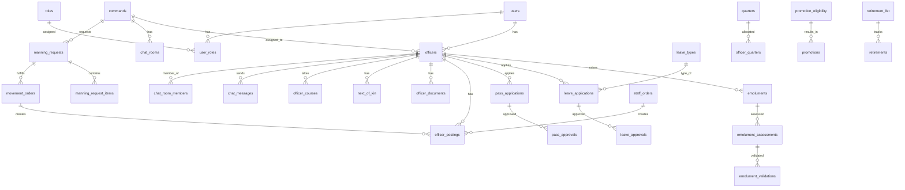

# NCS Employee Portal - Complete Documentation

This document consolidates all project documentation.

## Table of Contents
1. [System Specification](#system-specification)
2. [Database Schema](#database-schema)
3. [API Specification](#api-specification)
4. [Laravel Setup](#laravel-setup)
5. [Project Status](#project-status)

---

## System Specification

# NCS Employee Portal - System Specification

## Table of Contents
1. [Roles & Permissions](#roles--permissions)
2. [Workflows](#workflows)
3. [Application Flows Based on Role Interactions](#application-flows-based-on-role-interactions)
4. [Critical Interaction Points](#critical-interaction-points)
5. [Leave Types](#leave-types)
6. [Business Rules & Constraints](#business-rules--constraints)
7. [Key Optimizations Implemented](#key-optimizations-implemented)
8. [System Safeguards](#system-safeguards)
9. [Performance Indicators](#performance-indicators)

---

## Roles & Permissions

### HRD (Human Resources Department) - System Administrator
**Primary Role:** Overall system management and strategic HR operations

**Access Level:** Full system access across all commands

**Core Functions:**
1. Generate Staff Orders
2. Generate Movement Orders
3. Onboard Serving Officers
4. Generate Eligibility List for Promotion
5. Generate Retirement List
6. Nominate Officers for courses and indicate completion of the course which goes directly into the officers record
7. Create timeline for Officers to raise emolument (The Start and End date can be extended by HRD, Cron Job)
8. Trigger the system to match criteria for Manning Level requests
9. Alter Staff Orders and Movement Orders
10. Set the number of years that an officer will stay on the rank to be eligible for promotion
11. Create new types of leave and assign duration
12. Onboard officers for NCS Employee App
13. Create, extend, and manage emolument timelines with automated cron job capabilities
14. Generate and process staff orders for officer postings
15. Create movement orders based on tenure criteria or manning requirements
16. Override posting decisions when necessary
17. System-wide configuration and parameter management
18. Generate comprehensive system reports

### Staff Officer - Administrative Manager
**Primary Role:** Command-level administration and coordination

**Access Level:** Command-level operations

**Core Functions:**
1. Prepares the Roaster
2. Sends the Manning Level of officers to HRD (Rank, compulsory, Sex and Qualification optional)
3. Minutes pass request to the Comptroller or DC Admin
4. Prepare Internal Staff Order
5. Prepare a release letter
6. Documents an officer
7. Sends Manning Level Request to HRD
8. Minutes Leave or Pass requests to DC Admin for approval
9. Prints out approved leave or pass
10. Can add officers to Management Groups in NCS Employee App (for unit heads below Chief Superintendent and Legal department non-officers)
11. Prepare and manage duty rosters for the command
12. Create manning level requests (specify rank, sex, qualification requirements)
13. Process leave and pass applications from officers
14. Maintain command nominal roll
15. Manage command chat groups in NCS App
16. Track officer movements in and out of command
17. Coordinate with other unit staff officers
18. Generate command-level reports and statistics

### Building Unit - Accommodation Manager
**Primary Role:** Officer quarters allocation and management

**Access Level:** Quarters and accommodation records

**Core Functions:**
1. Quarters the Officers (But the status on the PE form will indicate whether the Officers is quartered or not)
2. At the Command level, enters the Quartered status Yes or No option on the drop down
3. Allocate quarters to eligible officers
4. Update quartered status (Yes/No) in the system
5. Maintain quarters occupancy database
6. Process quarter allocation requests
7. Deallocate quarters when officers are posted
8. Track quarters maintenance requirements
9. Generate accommodation reports
10. Manage waiting lists for quarters

### Establishment - Service Number Administrator
**Primary Role:** New officer registration and service number management

**Access Level:** New recruitment and service numbers

**Core Functions:**
1. Onboard new officers
2. Allocate Service Number to new officers (starts from the last service number of an officer, e.g., if the last service number is 57616, new officers will be 57617, 57618, etc.)
3. Maintain service number registry
4. Process new recruit documentation
5. Create initial officer records
6. Coordinate recruitment exercises
7. Process appointment letters
8. Assign initial ranks to new officers
9. Ensure unique identification for all officers

### Accounts - Financial Processor
**Primary Role:** Payment processing and financial management

**Access Level:** Financial records system-wide

**Core Functions:**
1. Generate list of officers that has been Validated (Remember Validation is done by the Area Controller). The fields needed by accounts are:
   - Bank
   - Account Number
   - PFA (Pension Fund Administrator)
   - Retirement Savings Account (RSA)
2. Generate list of deceased officers (This list is from Welfare Unit)
3. Extract payment data: Bank Name, Account Number, PFA, RSA
4. Process salary payments and remittances
5. Calculate and process death benefits
6. Process pension remittances
7. Generate payment reports and reconciliations
8. Maintain financial audit trails
9. Handle payment exceptions and corrections
10. Generate payroll and financial statistics

### Board (Promotion Board) - Career Progression Manager
**Primary Role:** Management of promotions and rank changes

**Access Level:** Promotion and career records

**Core Functions:**
1. Changes the officers Rank to a new rank (This part is not edited by the officer)
2. Review promotion eligibility lists generated by HRD
3. Conduct promotion exercises
4. Update promotion effective dates
5. Maintain promotion history records
6. Generate seniority lists
7. Consider disciplinary records in promotion decisions
8. Make promotion recommendations
9. Track time in rank for all officers

### Assessor - Emolument Reviewer
**Primary Role:** First-level review of emolument submissions

**Access Level:** Subordinate officers only within command

**Core Functions:**
1. Clicks Access for the officer (The only officers an Assessor can see are those officers under his command that have raised Emolument)
2. The officers will appear on a list and they'd be a button for view details
3. View list of subordinate officers who have raised emoluments
4. Access detailed emolument information for review
5. Verify accuracy of banking information
6. Validate PFA and RSA PIN details
7. Confirm completeness of next of kin information
8. Perform assessment by clicking "Assess" for each reviewed emolument
9. Flag discrepancies or issues
10. Generate assessment reports
11. Track assessment completion rates

### Validator - Final Emolument Approver
**Primary Role:** Final verification before payment processing

**Access Level:** Command-level validation

**Core Functions:**
1. Validates officers that the Assessor has assessed
2. Review emoluments that have been assessed
3. Perform final validation checks
4. Ensure regulatory compliance
5. Cross-verify documentation
6. Approve emoluments for accounts processing
7. Quality control of assessed information
8. Maintain validation logs

### Officer - End User
**Primary Role:** Personal record management and service applications

**Access Level:** Personal records only

**Core Functions:**
1. Onboarding: Fill all the required fields
2. Apply for Leave
3. Apply for Pass
4. Raise Emolument (This is done once a year)
5. Chatting through the NCS Employee Application
6. Change their display picture
7. Login to raise emolument during the timeline period set by HRD
8. Edit the following fields during emolument: Bank Name, Account Number, Name of Pension Fund Administrator (PFA), Retirement Savings Account (RSA) PIN (usually with a prefix PEN and usually 12 digits), and their next of KIN
9. Complete onboarding process with all required information
10. Update editable emolument fields: Bank Name, Account Number, PFA, RSA PIN, Next of Kin
11. Apply for leave (maximum 2 times per year for annual leave)
12. Apply for pass (maximum 5 days, only after exhausting annual leave)
13. View personal service records and history
14. Access NCS Employee App for communication
15. Participate in command-specific chat rooms
16. Update profile picture
17. Upload and maintain personal documents (JPEG format)
18. Track application statuses (leave, pass, emolument)
19. Receive system notifications and alerts

### Area Controller (Comptroller) - Senior Validator
**Primary Role:** Command oversight and final validation authority

**Access Level:** Area command with validation authority

**Core Functions:**
1. His name will appear on the Leave or pass as the officer that has approved it
2. Approve Roaster generated by the Staff Officer
3. Approves Manning Level to be sent to HRD
4. Validates officers (Validation is required before Accounts can generate lists)
5. Can indicate that an officer is deceased (along with Staff Role)
6. Validate emoluments after assessment
7. Provide final approval for emolument processing
8. Approve duty rosters submitted by Staff Officer
9. Approve manning level requests before forwarding to HRD
10. Indicate when an officer is deceased (initiates benefits process)
11. Monitor overall command performance
12. Make strategic decisions for the command
13. Oversee multiple units within area of responsibility
14. Review and approve internal movements

### DC Admin (Deputy Comptroller Administration) - Operational Approver
**Primary Role:** Day-to-day approval of routine administrative requests

**Access Level:** Command-level approval authority

**Core Functions:**
1. Approve Pass
2. Approve Leave
(Both are sent to him by the staff officer after the officer has applied)
3. Review and approve/reject leave applications minuted by Staff Officer
4. Review and approve/reject pass requests (ensure 5-day maximum)
5. Process urgent leave requests
6. Ensure compliance with leave and pass eligibility rules
7. Support Area Controller in administrative functions
8. Handle routine operational approvals
9. Maintain approval audit trail

### Welfare - Benefits Administrator
**Primary Role:** Deceased officer management and welfare support

**Access Level:** Welfare and benefits records

**Core Functions:**
1. Validates when an officer is deceased (The Area Controller or Staff Role can indicate that an officer is deceased)
2. Generates data on the deceased officer with the following fields:
   - SVC no
   - Rank
   - DOB
   - Next of Kin(s)
   - Bank Name
   - Account Number
   - Retirement Savings Account Administrator (RSA), e.g., Tangerine, Stanbic IBTC Pensions etc
3. Validate deceased officer status upon report
4. Generate comprehensive deceased officer data including all required fields
5. Process welfare claims and benefits
6. Coordinate with Accounts for benefit payments
7. Maintain beneficiary records
8. Handle compassionate cases
9. Process emergency support requests
10. Generate welfare reports

---

## Workflows

### 1. Emolument Form Workflow

**Timeline Creation Phase:**
1. **HRD creates timeline** - HRD will create a timeline for Officers to raise emolument (The Start and End date can be extended by HRD, Cron Job)
2. **System activates timeline** - System activates timeline and notifies all officers
3. **Cron job monitors** - Cron job monitors for automatic extensions if configured

**Officer Submission Phase:**
1. **Officers login** - Officers can Login at the point to be able to raise emolument
2. **Officers view previous data** - Officers view previous year's data for reference
3. **Officers edit fields** - The Editable Fields are:
   - Bank Name
   - Account Number
   - Name of Pension Fund Administrator (PFA)
   - Retirement Savings Account (RSA) PIN (usually with a prefix PEN and usually 12 digits)
   - Next of KIN
4. **Officers submit** - Officers submit emolument (Status: RAISED)

**Assessment Phase:**
1. **Assessor receives notification** - Assessor receives notification of raised emoluments
2. **Assessor accesses** - Assessor clicks Access for the officer (The only officers an Assessor can see are those officers under his command that have raised Emolument). The officers will appear on a list with a button for view details
3. **Assessor reviews** - Assessor reviews only subordinate officers' submissions
4. **Assessor verifies** - Assessor verifies all information accuracy
5. **Assessor approves** - Assessor approves assessment (Status: ASSESSED)

**Validation Phase:**
1. **Validator receives** - Validator/Area Controller receives assessed emoluments
2. **Validator validates** - Validator validates officers that the Assessor has assessed
3. **Validator performs final review** - Validator performs final review and compliance check
4. **Area Controller validates** - Area Controller validates the officers (This validation is required before Accounts can generate lists)
5. **Validator approves** - Validator approves for payment (Status: VALIDATED)

**Payment Phase:**
1. **Accounts generates list** - Accounts generates list of officers that has been Validated with the fields: Bank, Account Number, PFA (Pension Fund Administrator), and Retirement Savings Account (RSA)
2. **Accounts extracts data** - Accounts extracts payment information
3. **Accounts processes** - Accounts processes payments (Status: PROCESSED)

### 2. Officers Onboarding Workflow

**For New Recruits:**
1. **Establishment allocates** - Establishment allocates service number
2. **Establishment creates record** - Establishment creates initial record
3. **System generates link** - System generates onboarding link
4. **Email sent** - Email sent to new officer

**For Existing Officers:**
1. **HRD initiates** - HRD initiates onboarding
2. **HRD enters email** - HRD enters officer email
3. **System sends link** - System sends unique onboarding link

**Officer Completion:**
1. **Officer receives email** - Officer receives email and clicks link
2. **Officer fills information** - Officers will fill the following information in multi-step form:
   - Step 1: Personal Information
   - Step 2: Employment Details
   - Step 3: Banking and Pension
   - Step 4: Next of Kin and Documents
   
   **Complete Field List:**
   - Service Number
   - Initials
   - Surname
   - Sex
   - Date of First Appointment
   - Date of Present Appointment
   - Substantive Rank
   - Salary Grade Level
   - Date of Birth
   - State of Origin
   - LGA
   - Geopolitical Zone
   - Marital Status
   - Entry Qualification
   - Discipline (Optional for WAEC, NECO and Below)
   - Additional Qualification (Optional)
   - Present Station
   - Date posted to station
   - Residential Address
   - Permanent Home Address
   - Phone Number
   - Email
   - Bank
   - Bank Account Number
   - Sort Code (Optional)
   - Name of PFA
   - RSA Number
   - Unit
   - Name(s) of Next of KIN
   - Relationship
   - Interdicted
   - Suspended
   - Quartered
3. **Officer accepts disclaimer** - Officer accepts disclaimer about false information
4. **Upload documents** - Officers must upload documents preferably in JPEG to save space
5. **Caveat displayed** - System displays caveat: "Any false information provided by you can lead to Dismissal for Forgery under the PSR Rules"
6. **System creates account** - System creates account and assigns to command chat
7. **Establishment processes** - Establishment unit processes the onboarding and allocates Service Number

### 3. Pass and Leave Workflow

**Important Rules:**
- Maximum number of days given to an officer for pass should be 5 days
- Pass can only be applied if and only if the officer has exhausted the Annual leave
- Annual leave can be applied for a maximum of 2 times
- Annual leave duration: 28 Days for GL 07 and Below, 30 days for Level 08 and above

**Leave Application Process:**

**Application Phase:**
1. **Officer checks eligibility** - Officer checks leave eligibility in system
2. **Officer applies** - Officer applies for Leave or Pass
3. **Officer selects type** - Officer selects from 28 leave types
4. **Officer submits** - Officer submits application with dates and reason
5. **System validates** - System calculates days and validates eligibility

**Processing Phase:**
1. **Staff Officer receives** - Staff Officer receives leave application
2. **Staff Officer reviews** - Staff Officer reviews supporting documents
3. **Staff Officer minutes** - Staff Officer Minutes it to the DC Admin for approval
4. **Status changes** - Application status changes to MINUTED

**Approval Phase:**
1. **DC Admin reviews** - DC Admin reviews minuted application
2. **DC Admin approves** - DC Admin approves or rejects with reason
3. **Area Controller name appears** - If approved, Area Controller's name appears on document
4. **Status changes** - Status changes to APPROVED

**Distribution Phase:**
1. **Staff Officer prints** - Staff Officer prints approved leave document
2. **Staff Officer distributes** - Staff Officer distributes to officer
3. **Officer receives notification** - System sends automatic notification to officer
4. **System monitors** - System monitors leave (alerts 72 hours before end)

**Pass Application Process (Special Rules):**
- Maximum 5 days only
- Annual leave must be exhausted
- Maximum 2 passes per year

**Process Flow:**
1. **Officer applies** - Officer applies for pass (system validates eligibility)
2. **Staff Officer processes** - Staff Officer processes and minutes to DC Admin
3. **DC Admin approves** - DC Admin approves (ensures 5-day limit)
4. **Staff Officer prints** - Staff Officer prints and distributes
5. **System monitors** - System monitors pass duration
6. **System alerts** - Automatic alert sent on expiry date

### 4. Manning Level Workflow

**Request Creation:**
1. **Staff Officer analyzes** - Staff Officer analyzes command needs
2. **Staff Officer prepares list** - The Staff Officer will prepare a list of officers that the command needs (Rank, Sex and Qualification optional)
3. **Staff Officer enters requirements** - The staff officer will enter for example in the Manning Request: DC needed 3, AC needed 3, etc
4. **Staff Officer submits** - Staff Officer submits to Area Controller

**Approval Process:**
1. **Staff Officer minutes** - The Staff Officer Minutes it for the Comptroller's approval
2. **Area Controller reviews** - Area Controller reviews justification
3. **Area Controller approves** - Area Controller approves and forwards to HRD

**Matching Process:**
1. **HRD receives request** - Once the Comptroller Approves, it goes to HRD
2. **System searches** - System searches for matching officers
3. **System filters** - System filters by rank, sex, qualification, status
4. **HRD triggers matching** - Then HRD will trigger the system to match the criteria
5. **HRD selects** - HRD selects from matched candidates
6. **HRD generates orders** - HRD generates movement orders
7. **HRD can alter** - HRD must have an option to be able to alter the Staff Orders and Movement Orders

**Implementation:**
1. **Officers notified** - Officers receive posting notifications
2. **New command sees officer** - New command Staff Officer sees officer on dashboard
3. **Staff Officer documents** - Staff Officer documents arrival
4. **System updates** - System updates nominal rolls and chat rooms

### 5. Staff Order and Movement Order Workflow

**Staff Order:**
1. **HRD searches officer** - HRD will search for the officer and change the posting at any time he deems fit
2. **Officer appears on dashboard** - The officer posted appears on the dashboard of the Staff Officer of the new officer's posting
3. **Staff Officer documents** - The Staff Officer documents the officer
4. **Officer removed from previous roll** - The officer's name automatically goes off the previous command's nominal roll
5. **Chat room transfer** - When an officer is posted out, he goes to his new command chat room and leaves the previous one

**Movement Order:**
1. **HRD enters criteria** - HRD will enter a criteria that will bring up officers that have spent a particular time it deems fit (this timing will be in Months)
2. **HRD posts officers** - HRD will post the officers
3. **HRD can use Manning Level** - HRD can also use Manning Level for postings
4. **Officer appears on dashboard** - The officer posted appears on the dashboard of the Staff Officer of the new officer's posting
5. **Staff Officer documents** - The Staff Officer documents the officer
6. **Officer removed from previous roll** - The officer's name automatically goes off the previous command's nominal roll
7. **Chat room transfer** - When an officer is posted out, he goes to his new command chat room and leaves the previous one

**Note:** This workflow can occur after the manning request or without the manning request.

### 6. Building/Quartering Workflow

1. **Command level entry** - At the Command level, Building Unit will enter the Quartered status Yes or No option on the drop down
2. **Status on PE form** - The status on the PE form will indicate whether the Officers is quartered or not

### 7. Eligibility List for Promotion Workflow

**Setup Phase:**
1. **HRD sets criteria** - The HRD will set the number of years that an officer will stay on the rank to be eligible for promotion
2. **System stores criteria** - System stores promotion criteria

**Generation Phase:**
1. **System checks eligibility** - System automatically checks eligibility
2. **System checks exclusions** - The system will check if the officer has been:
   - Officers not meeting time in rank
   - Interdicted (set by Discipline seat)
   - Suspended (set by Discipline seat)
   - Dismissed (set by Discipline seat)
   - Officers under investigation
   - Has a pending investigation issue (set by the investigation seat)
   - Deceased (set by Welfare seat)
3. **Excluded officers** - The above category of officers won't feature on the Eligibility List even if they are due for promotion
4. **System generates list** - System generates eligibility list

**Board Review:**
1. **Board receives list** - Board receives eligibility list
2. **Board conducts exercise** - Board conducts promotion exercise
3. **Board makes decisions** - Board makes promotion decisions
4. **Board updates ranks** - Board updates ranks in system

**Implementation:**
1. **System updates records** - System updates officer records
2. **New rank recorded** - New rank and date recorded
3. **Officers notified** - Officers receive promotion notifications

**List Fields:**
The Eligibility List carries the following fields:
   - S no
   - Initials
   - Rank
   - Initial
   - State
   - Date of birth
   - Date of first appointment
   - Date of present appointment (Date of present appointment is the date of last promotion, of course supplied by the board)

### 8. Statutory Retirement List Workflow

**Retirement Criteria:**
- An officer is due for retirement when he reaches the age of 60 years or 35 years in service, whichever comes first

**Automatic Detection:**
1. **System daily checks** - System daily checks for:
   - Officers reaching age 60
   - Officers completing 35 years service
2. **System generates list** - System generates retirement list

**Processing:**
1. **HRD reviews** - HRD reviews retirement list
2. **HRD generates list** - The list is generated by HRD and contains the following fields:
   - S no
   - Rank
   - Initials
   - Name
   - Condition for retirement (AGE or SVC)
   - Date of Birth (DOB)
   - Date of First Appointment (DOFA)
   - Date of Pre Retirement Leave (DOPR) - this pre Retirement is 3 months before retirement date
   - Retirement Date
3. **System calculates** - System calculates pre-retirement leave (3 months prior)
4. **System activates status** - System activates pre-retirement status
5. **Notifications sent** - Notifications sent to:
   - Retiring officer
   - Accounts (for benefits processing)
   - Welfare (for transition support)
6. **Officer informed** - The officer will be informed

### 9. Service Number Allocation Workflow

1. **Establishment allocates** - This is done by establishment unit
2. **Sequential numbering** - Any new officer documented will start from the last service number of an officer (e.g., if the last service number is 57616, new officers will be 57617, 57618, etc.)
3. **Pattern precedence** - This is the flow that will take precedence on any new recruitment, so officers newly recruited will be built in this pattern

### 10. NCS Employee App (Social Media Application) Workflow

**Automatic Room Assignment:**
1. **HRD onboards** - Onboarding is done by HRD
2. **On onboarding** - On onboarding: Officer added to command chat room
3. **Command chat rooms** - The application will have a command chat room that only selects officers of a command
4. **On posting** - On posting: Officer moved from old to new command chat
5. **Automatic transfer** - When an officer is posted out, he goes to his new command chat room and leaves the previous one
6. **Management groups created** - Management groups created for AC and above
7. **Staff Officer can add** - Staff Officer can manually add officers to groups

**Management Groups:**
- Management Groups are automatically created in a command from an Assistant Comptroller and above
- Staff Officer can add any officer to unit (As some units heads are below Chief Superintendent and also Legal department that are non officer can be added but they must be onboarded by HRD)

**Features Available:**
- Command-specific discussions
- Real-time messaging
- File and document sharing
- Broadcast messages from HRD
- Profile picture management

---

## Application Flows Based on Role Interactions

### FLOW 1: EMOLUMENT PROCESS

**Timeline Creation Phase:**
1. HRD creates emolument timeline with start and end dates
2. System activates timeline and notifies all officers
3. Cron job monitors for automatic extensions if configured

**Officer Submission Phase:**
1. Officers log in during active timeline
2. Officers view previous year's data for reference
3. Officers update editable fields (Banking, PFA, Next of Kin)
4. Officers submit emolument (Status: RAISED)

**Assessment Phase:**
1. Assessor receives notification of raised emoluments
2. Assessor reviews only subordinate officers' submissions
3. Assessor verifies all information accuracy
4. Assessor approves assessment (Status: ASSESSED)

**Validation Phase:**
1. Validator/Area Controller receives assessed emoluments
2. Validator performs final review and compliance check
3. Validator approves for payment (Status: VALIDATED)

**Payment Phase:**
1. Accounts generates validated officers report
2. Accounts extracts payment information
3. Accounts processes payments (Status: PROCESSED)

---

### FLOW 2: LEAVE APPLICATION PROCESS

**Application Phase:**
1. Officer checks leave eligibility in system
2. Officer selects from 28 leave types
3. Officer submits application with dates and reason
4. System calculates days and validates eligibility

**Processing Phase:**
1. Staff Officer receives leave application
2. Staff Officer reviews supporting documents
3. Staff Officer minutes to DC Admin
4. Application status changes to MINUTED

**Approval Phase:**
1. DC Admin reviews minuted application
2. DC Admin approves or rejects with reason
3. If approved, Area Controller's name appears on document
4. Status changes to APPROVED

**Distribution Phase:**
1. Staff Officer prints approved leave document
2. Staff Officer distributes to officer
3. System sends automatic notification to officer
4. System monitors leave (alerts 72 hours before end)

---

### FLOW 3: PASS APPLICATION PROCESS

**Special Rules:**
- Maximum 5 days only
- Annual leave must be exhausted
- Maximum 2 passes per year

**Process Flow:**
1. Officer applies for pass (system validates eligibility)
2. Staff Officer processes and minutes to DC Admin
3. DC Admin approves (ensures 5-day limit)
4. Staff Officer prints and distributes
5. System monitors pass duration
6. Automatic alert sent on expiry date

---

### FLOW 4: OFFICER ONBOARDING PROCESS

**For New Recruits:**
1. Establishment allocates service number
2. Establishment creates initial record
3. System generates onboarding link
4. Email sent to new officer

**For Existing Officers:**
1. HRD initiates onboarding
2. HRD enters officer email
3. System sends unique onboarding link

**Officer Completion:**
1. Officer receives email and clicks link
2. Officer completes multi-step form:
   - Step 1: Personal Information
   - Step 2: Employment Details  
   - Step 3: Banking and Pension
   - Step 4: Next of Kin and Documents
3. Officer accepts disclaimer about false information
4. System creates account and assigns to command chat

---

### FLOW 5: MANNING LEVEL REQUEST PROCESS

**Request Creation:**
1. Staff Officer analyzes command needs
2. Staff Officer creates request specifying:
   - Ranks needed and quantities
   - Sex requirements (if any)
   - Qualification requirements (optional)
3. Staff Officer submits to Area Controller

**Approval Process:**
1. Area Controller reviews justification
2. Area Controller approves and forwards to HRD

**Matching Process:**
1. HRD receives approved request
2. System searches for matching officers
3. System filters by rank, sex, qualification, status
4. HRD selects from matched candidates
5. HRD generates movement orders

**Implementation:**
1. Officers receive posting notifications
2. New command Staff Officer sees officer on dashboard
3. Staff Officer documents arrival
4. System updates nominal rolls and chat rooms

---

### FLOW 6: PROMOTION ELIGIBILITY PROCESS

**Setup Phase:**
1. HRD sets years required in each rank
2. System stores promotion criteria

**Generation Phase:**
1. System automatically checks eligibility
2. System filters out:
   - Officers not meeting time in rank
   - Interdicted officers
   - Suspended officers
   - Officers under investigation
   - Deceased officers
3. System generates eligibility list

**Board Review:**
1. Board receives eligibility list
2. Board conducts promotion exercise
3. Board makes promotion decisions
4. Board updates ranks in system

**Implementation:**
1. System updates officer records
2. New rank and date recorded
3. Officers receive promotion notifications

---

### FLOW 7: RETIREMENT PROCESS

**Automatic Detection:**
1. System daily checks for:
   - Officers reaching age 60
   - Officers completing 35 years service
2. System generates retirement list

**Processing:**
1. HRD reviews retirement list
2. System calculates pre-retirement leave (3 months prior)
3. System activates pre-retirement status
4. Notifications sent to:
   - Retiring officer
   - Accounts (for benefits processing)
   - Welfare (for transition support)

---

### FLOW 8: DECEASED OFFICER PROCESS

**Reporting:**
1. Area Controller or Staff Officer reports death
2. System flags as potentially deceased
3. Welfare receives notification

**Validation:**
1. Welfare validates death certificate
2. Welfare confirms deceased status
3. System updates all relevant records

**Benefits Processing:**
1. Welfare generates comprehensive deceased data
2. Accounts calculates entitlements
3. Accounts processes payments to next of kin
4. Welfare provides support to beneficiaries

---

### FLOW 9: STAFF/MOVEMENT ORDER PROCESS

**Staff Order (Individual Posting):**
1. HRD searches for specific officer
2. HRD changes posting location
3. Officer receives movement notification
4. Old command removes from roll
5. New command adds to roll

**Movement Order (Bulk Posting):**
1. HRD sets criteria (time at station in months)
2. System identifies eligible officers
3. HRD reviews and confirms postings
4. Multiple officers receive notifications
5. Automatic nominal roll updates

---

### FLOW 10: NCS EMPLOYEE APP CHAT MANAGEMENT

**Automatic Room Assignment:**
1. On onboarding: Officer added to command chat room
2. On posting: Officer moved from old to new command chat
3. Management groups created for AC and above
4. Staff Officer can manually add officers to groups

**Features Available:**
- Command-specific discussions
- Real-time messaging
- File and document sharing
- Broadcast messages from HRD
- Profile picture management

---

## Critical Interaction Points

### Emolument Chain of Command:
Officer (Raises) → Assessor (Reviews) → Validator (Approves) → Accounts (Pays)

### Leave Approval Chain:
Officer (Applies) → Staff Officer (Minutes) → DC Admin (Approves) → Staff Officer (Distributes)

### Manning Request Chain:
Staff Officer (Requests) → Area Controller (Approves) → HRD (Processes) → Officers (Posted)

### Posting Implementation Chain:
HRD (Initiates) → Officers (Notified) → Staff Officer (Documents) → System (Updates Rolls)

### Deceased Benefits Chain:
Reporter (Indicates) → Welfare (Validates) → Accounts (Calculates) → Next of Kin (Receives)

---

## Leave Types

### Standard Leave Types

1. **Annual Leave**
   - Can be applied in parts but maximum of 2 times in a year within the stipulated calendar days for officers
   - Duration: 28 Days for GL 07 and Below, 30 days for Level 08 and above

2. **Leave on Permanent invalidation**
   - 2 months to be recommended by a Medical Officer

3. **Deferred Leave**
   - (No specific duration mentioned)

4. **Casual Leave**
   - 7 working days
   - Must be when you've exhausted your Annual leave

5. **Sick Leave**
   - Must be recommended by a medical officer
   - No duration specified

6. **Maternity Leave**
   - 112 working days a year
   - There should be a space where she can supply her Expected Date of Delivery (EDD)

7. **Maternity Leave on adoption of Child Under 4 months**
   - 84 working days a year

8. **Paternity Leave**
   - 14 working days a year

9. **Paternity Leave on adoption of Child Under 4 months**
   - 14 working days a year

10. **Examination Leave**
    - (No specific duration mentioned)

11. **Leave for Compulsory Examination**
    - (No specific duration mentioned)

12. **Leave for non compulsory examination**
    - (No specific duration mentioned)

13. **Sabbatical Leave**
    - 12 calendar months once every 5 years

14. **Study Leave without pay**
    - 4 years in the first instance but you can apply for an extension

15. **Study Leave with pay**
    - 3 years with an extension of 1 year

16. **Leave on compassionate grounds**
    - (No specific duration mentioned)

17. **Pre-retirement leave**
    - (No specific duration mentioned)

18. **Leave of absence**
    - (No specific duration mentioned)

19. **Leave on grounds on urgent private affairs**
    - (No specific duration mentioned)

20. **Leave for cultural and sporting activities**
    - (No specific duration mentioned)

21. **Leave to take part in trade Union activities**
    - (No specific duration mentioned)

22. **Leave for in-service training**
    - 4 years maximum

23. **Leave of absence to Join Spouse on course of instruction abroad**
    - 9 months

24. **Special leave to join spouse on ground of public policy**
    - (No specific duration mentioned)

25. **Leave of absence on grounds of public policy for technical aid program**
    - (No specific duration mentioned)

26. **Leave of absence for Special or Personal assistants on ground of public policy**
    - (No specific duration mentioned)

27. **Leave of absence for Spouse of President, Vice President, Governor and Deputy Governor**
    - (No specific duration mentioned)

**Note:** HRD can create a type of leave too and assign the duration.

---

## Business Rules & Constraints

### General Rules

1. **Document Upload Format**
   - When officers are onboarding or new recruits, they must upload documents preferably in JPEG to save space

2. **Onboarding Caveat**
   - Any false information provided by an officer can lead to Dismissal for Forgery under the PSR Rules

3. **Pass Rules**
   - Maximum number of days given to an officer for pass should be 5 days
   - Pass can only be applied if and only if the officer has exhausted the Annual leave

4. **Annual Leave Rules**
   - Can be applied for a maximum of 2 times in a year
   - Duration: 28 Days for GL 07 and Below, 30 days for Level 08 and above

5. **Emolument Rules**
   - Emolument is done once a year
   - HRD creates timeline with Start and End date (can be extended by HRD, Cron Job)
   - Officers can only login during the timeline period to raise emolument

6. **RSA PIN Format**
   - Retirement Savings Account (RSA) PIN usually has a prefix PEN
   - RSA PIN is usually 12 digits

### Retirement Rules

1. **Retirement Criteria**
   - An officer is due for retirement when he reaches the age of 60 years or 35 years in service, whichever comes first

2. **Pre-Retirement Leave**
   - Pre-Retirement Leave is 3 months before retirement date

### Promotion Rules

1. **Eligibility Exclusions**
   - Officers with the following statuses will NOT feature on the Eligibility List even if they are due for promotion:
     - Interdicted (set by Discipline seat)
     - Suspended (set by Discipline seat)
     - Dismissed (set by Discipline seat)
     - Has a pending investigation issue (set by the investigation seat)
     - Deceased (set by Welfare seat)

2. **Rank Changes**
   - Rank changes are done by Board
   - Officers cannot edit their own rank

### Validation Rules

1. **Emolument Validation Flow**
   - Assessor accesses officers under his command who have raised Emolument
   - Validator validates officers that the Assessor has assessed
   - Area Controller validates officers (required before Accounts can generate lists)

2. **Deceased Officer Validation**
   - Area Controller or Staff Role can indicate that an officer is deceased
   - Welfare validates when an officer is deceased
   - Welfare generates data on deceased officers

### Service Number Rules

1. **Allocation**
   - Service Number allocation is done by Establishment unit
   - New officers start from the last service number + 1 (sequential numbering)
   - Example: If last service number is 57616, new officers will be 57617, 57618, etc.

### Posting and Transfer Rules

1. **Automatic Updates**
   - When an officer is posted, their name automatically goes off the previous command's nominal roll
   - Officer appears on the dashboard of the Staff Officer of the new posting
   - Officer automatically transfers to new command chat room and leaves previous one

2. **Staff Orders**
   - HRD can search for officer and change posting at any time
   - HRD can alter Staff Orders and Movement Orders

3. **Movement Orders**
   - HRD enters criteria based on time spent (in Months)
   - HRD can use Manning Level for postings

### Notification Rules

1. **Pass Notifications**
   - System alerts the officer when the pass ends

2. **Leave Notifications**
   - System alerts the officer when the Leave is 72 hours to the end

3. **Approval Notifications**
   - Officer receives automatic message to go for pass or leave after approval

### NCS Employee App Rules

1. **Chat Rooms**
   - Command chat rooms only include officers of that command
   - Automatic transfer when officer is posted

2. **Management Groups**
   - Automatically created in a command from Assistant Comptroller and above
   - Staff Officer can add officers to unit (for unit heads below Chief Superintendent and Legal department non-officers)
   - Non-officers must be onboarded by HRD

### Leave Type Management

1. **HRD Authority**
   - HRD can create new types of leave and assign the duration

---

## Key Optimizations Implemented

### 1. Streamlined Approval Processes
- Reduced bottlenecks by clear role separation
- Automated status tracking at each stage
- Real-time notifications to next approver

### 2. Automated Workflows
- Cron jobs for timeline management
- Automatic eligibility calculations
- System-generated notifications
- Auto-population of previous data

### 3. Command-Based Boundaries
- Officers can only see their command data
- Reduces data overload
- Improves system performance
- Maintains security

### 4. Status-Driven Processing
- Clear status indicators at each stage
- Prevents duplicate processing
- Easy tracking and reporting
- Audit trail maintenance

### 5. Integrated Communication
- Automatic chat room management
- Role-based group creation
- Seamless posting transitions
- Real-time updates

### 6. Document Management
- Standardized JPEG format
- Compressed storage
- Easy retrieval
- Linked to officer profiles

### 7. Notification System
- Email for critical actions
- In-app for routine updates
- SMS for time-sensitive alerts
- Automated reminders

### 8. Quality Control Checkpoints
- Assessment before validation
- Validation before payment
- Approval before distribution
- Verification at each stage

---

## System Safeguards

### Role Separation:
- No user can approve their own requests
- Assessors cannot validate
- Staff Officers cannot approve
- Clear hierarchical structure

### Data Integrity:
- Automatic backups every 6 hours
- Transaction logs for all changes
- Rollback capabilities
- Audit trail for 7 years

### Access Control:
- Role-based permissions
- Command-level restrictions
- Personal data protection
- Secure authentication

### Process Validation:
- Eligibility checks before applications
- Status verification before transitions
- Duplicate prevention mechanisms
- Error handling at each stage

---

## Performance Indicators

### System Efficiency Metrics:
- **Emolument processing time:** Target 5 days from raise to validation
- **Leave approval cycle:** Target 48 hours
- **Manning request fulfillment:** Target 7 days
- **Movement order implementation:** Target 72 hours
- **Retirement processing:** 30 days advance notification

### User Satisfaction Indicators:
- Self-service capabilities for officers
- Real-time status tracking
- Automated notifications
- Mobile app accessibility
- Document upload simplicity

### Administrative Efficiency:
- Reduced manual data entry
- Automated report generation
- Bulk processing capabilities
- Integration between modules
- Centralized dashboard for each role

---

## Appendix

### Field Definitions

**PFA:** Pension Fund Administrator

**RSA:** Retirement Savings Account

**RSA PIN:** Retirement Savings Account PIN (usually with prefix PEN, 12 digits)

**DOB:** Date of Birth

**DOFA:** Date of First Appointment

**DOPR:** Date of Pre Retirement Leave

**EDD:** Expected Date of Delivery (for Maternity Leave)

**GL:** Grade Level

**LGA:** Local Government Area

**PE Form:** Personal Emolument Form

**PSR Rules:** Public Service Rules

**SVC:** Service (years in service)

**DC:** Deputy Comptroller

**AC:** Assistant Comptroller


---

## Database Schema

# NCS Employee Portal - Database Schema Design

## Table of Contents
1. [Entity Relationship Diagram](#entity-relationship-diagram)
2. [Core Tables](#core-tables)
3. [Workflow Tables](#workflow-tables)
4. [Reference Tables](#reference-tables)
5. [Audit & System Tables](#audit--system-tables)
6. [Indexes](#indexes)
7. [Enums & Status Values](#enums--status-values)

---

## Entity Relationship Diagram



---

## Core Tables

### users
Stores system user accounts for authentication and authorization.

| Column | Type | Constraints | Description |
|--------|------|-------------|-------------|
| id | BIGINT | PRIMARY KEY, AUTO_INCREMENT | Unique user ID |
| email | VARCHAR(255) | UNIQUE, NOT NULL | User email (login) |
| password_hash | VARCHAR(255) | NOT NULL | Hashed password |
| is_active | BOOLEAN | DEFAULT TRUE | Account active status |
| last_login | TIMESTAMP | NULL | Last login timestamp |
| created_at | TIMESTAMP | DEFAULT CURRENT_TIMESTAMP | Account creation date |
| updated_at | TIMESTAMP | DEFAULT CURRENT_TIMESTAMP ON UPDATE | Last update timestamp |
| created_by | BIGINT | FOREIGN KEY (users.id) | User who created this account |

### roles
System roles/permissions definition.

| Column | Type | Constraints | Description |
|--------|------|-------------|-------------|
| id | BIGINT | PRIMARY KEY, AUTO_INCREMENT | Role ID |
| name | VARCHAR(100) | UNIQUE, NOT NULL | Role name (HRD, Staff_Officer, Officer, etc.) |
| code | VARCHAR(50) | UNIQUE, NOT NULL | Role code for system use |
| description | TEXT | NULL | Role description |
| access_level | VARCHAR(50) | NOT NULL | Access level (system_wide, command_level, personal) |
| created_at | TIMESTAMP | DEFAULT CURRENT_TIMESTAMP | Creation timestamp |
| updated_at | TIMESTAMP | DEFAULT CURRENT_TIMESTAMP ON UPDATE | Update timestamp |

### user_roles
Many-to-many relationship between users and roles.

| Column | Type | Constraints | Description |
|--------|------|-------------|-------------|
| id | BIGINT | PRIMARY KEY, AUTO_INCREMENT | Relationship ID |
| user_id | BIGINT | FOREIGN KEY (users.id), NOT NULL | User ID |
| role_id | BIGINT | FOREIGN KEY (roles.id), NOT NULL | Role ID |
| command_id | BIGINT | FOREIGN KEY (commands.id), NULL | Command assignment (if role is command-level) |
| assigned_at | TIMESTAMP | DEFAULT CURRENT_TIMESTAMP | Assignment date |
| assigned_by | BIGINT | FOREIGN KEY (users.id) | User who assigned the role |
| is_active | BOOLEAN | DEFAULT TRUE | Active status |

### commands
Organizational units/commands where officers are posted.

| Column | Type | Constraints | Description |
|--------|------|-------------|-------------|
| id | BIGINT | PRIMARY KEY, AUTO_INCREMENT | Command ID |
| code | VARCHAR(50) | UNIQUE, NOT NULL | Command code |
| name | VARCHAR(255) | NOT NULL | Command name |
| location | VARCHAR(255) | NULL | Command location |
| area_controller_id | BIGINT | FOREIGN KEY (officers.id), NULL | Area Controller officer ID |
| is_active | BOOLEAN | DEFAULT TRUE | Active status |
| created_at | TIMESTAMP | DEFAULT CURRENT_TIMESTAMP | Creation timestamp |
| updated_at | TIMESTAMP | DEFAULT CURRENT_TIMESTAMP ON UPDATE | Update timestamp |

### officers
Core officer information and employment details.

| Column | Type | Constraints | Description |
|--------|------|-------------|-------------|
| id | BIGINT | PRIMARY KEY, AUTO_INCREMENT | Officer ID |
| user_id | BIGINT | FOREIGN KEY (users.id), UNIQUE, NULL | Associated user account |
| service_number | VARCHAR(50) | UNIQUE, NOT NULL | Service number (e.g., 57616) |
| initials | VARCHAR(50) | NOT NULL | Officer initials |
| surname | VARCHAR(255) | NOT NULL | Surname |
| sex | ENUM('M', 'F') | NOT NULL | Gender |
| date_of_birth | DATE | NOT NULL | Date of birth |
| date_of_first_appointment | DATE | NOT NULL | DOFA |
| date_of_present_appointment | DATE | NOT NULL | Date of last promotion |
| substantive_rank | VARCHAR(100) | NOT NULL | Current rank |
| salary_grade_level | VARCHAR(10) | NOT NULL | Grade level (GL 07, GL 08, etc.) |
| state_of_origin | VARCHAR(100) | NOT NULL | State of origin |
| lga | VARCHAR(100) | NOT NULL | Local Government Area |
| geopolitical_zone | VARCHAR(50) | NOT NULL | Geopolitical zone |
| marital_status | VARCHAR(50) | NULL | Marital status |
| entry_qualification | VARCHAR(255) | NOT NULL | Entry qualification |
| discipline | VARCHAR(255) | NULL | Discipline (optional for WAEC, NECO and below) |
| additional_qualification | VARCHAR(255) | NULL | Additional qualifications |
| present_station | BIGINT | FOREIGN KEY (commands.id) | Current command |
| date_posted_to_station | DATE | NULL | Date posted to current station |
| residential_address | TEXT | NULL | Residential address |
| permanent_home_address | TEXT | NOT NULL | Permanent home address |
| phone_number | VARCHAR(20) | NOT NULL | Phone number |
| email | VARCHAR(255) | UNIQUE, NOT NULL | Email address |
| bank_name | VARCHAR(255) | NULL | Bank name |
| bank_account_number | VARCHAR(50) | NULL | Bank account number |
| sort_code | VARCHAR(20) | NULL | Sort code (optional) |
| pfa_name | VARCHAR(255) | NULL | Pension Fund Administrator name |
| rsa_number | VARCHAR(50) | NULL | RSA number (usually 12 digits with PEN prefix) |
| unit | VARCHAR(255) | NULL | Unit assignment |
| interdicted | BOOLEAN | DEFAULT FALSE | Interdiction status |
| suspended | BOOLEAN | DEFAULT FALSE | Suspension status |
| dismissed | BOOLEAN | DEFAULT FALSE | Dismissal status |
| quartered | BOOLEAN | DEFAULT FALSE | Quarters allocation status |
| is_deceased | BOOLEAN | DEFAULT FALSE | Deceased status |
| deceased_date | DATE | NULL | Date of death |
| is_active | BOOLEAN | DEFAULT TRUE | Active officer status |
| profile_picture_url | VARCHAR(500) | NULL | Profile picture file path |
| created_at | TIMESTAMP | DEFAULT CURRENT_TIMESTAMP | Record creation |
| updated_at | TIMESTAMP | DEFAULT CURRENT_TIMESTAMP ON UPDATE | Last update |
| created_by | BIGINT | FOREIGN KEY (users.id) | User who created record |

### next_of_kin
Officer's next of kin information.

| Column | Type | Constraints | Description |
|--------|------|-------------|-------------|
| id | BIGINT | PRIMARY KEY, AUTO_INCREMENT | Next of kin ID |
| officer_id | BIGINT | FOREIGN KEY (officers.id), NOT NULL | Officer ID |
| name | VARCHAR(255) | NOT NULL | Next of kin name(s) |
| relationship | VARCHAR(100) | NOT NULL | Relationship to officer |
| phone_number | VARCHAR(20) | NULL | Contact phone number |
| address | TEXT | NULL | Address |
| is_primary | BOOLEAN | DEFAULT FALSE | Primary next of kin |
| created_at | TIMESTAMP | DEFAULT CURRENT_TIMESTAMP | Creation timestamp |
| updated_at | TIMESTAMP | DEFAULT CURRENT_TIMESTAMP ON UPDATE | Update timestamp |

### officer_documents
Documents uploaded by officers (JPEG format preferred).

| Column | Type | Constraints | Description |
|--------|------|-------------|-------------|
| id | BIGINT | PRIMARY KEY, AUTO_INCREMENT | Document ID |
| officer_id | BIGINT | FOREIGN KEY (officers.id), NOT NULL | Officer ID |
| document_type | VARCHAR(100) | NOT NULL | Document type (certificate, ID, etc.) |
| file_name | VARCHAR(255) | NOT NULL | Original file name |
| file_path | VARCHAR(500) | NOT NULL | Storage path |
| file_size | BIGINT | NULL | File size in bytes |
| mime_type | VARCHAR(100) | NULL | MIME type |
| uploaded_at | TIMESTAMP | DEFAULT CURRENT_TIMESTAMP | Upload timestamp |
| uploaded_by | BIGINT | FOREIGN KEY (users.id) | User who uploaded |

---

## Workflow Tables

### emolument_timelines
HRD-created timelines for emolument submission.

| Column | Type | Constraints | Description |
|--------|------|-------------|-------------|
| id | BIGINT | PRIMARY KEY, AUTO_INCREMENT | Timeline ID |
| year | INT | NOT NULL | Year for emolument |
| start_date | DATE | NOT NULL | Timeline start date |
| end_date | DATE | NOT NULL | Timeline end date |
| is_extended | BOOLEAN | DEFAULT FALSE | Extension status |
| extension_end_date | DATE | NULL | Extended end date |
| is_active | BOOLEAN | DEFAULT TRUE | Active timeline |
| created_by | BIGINT | FOREIGN KEY (users.id), NOT NULL | HRD user who created |
| created_at | TIMESTAMP | DEFAULT CURRENT_TIMESTAMP | Creation timestamp |
| updated_at | TIMESTAMP | DEFAULT CURRENT_TIMESTAMP ON UPDATE | Update timestamp |

### emoluments
Officer emolument submissions.

| Column | Type | Constraints | Description |
|--------|------|-------------|-------------|
| id | BIGINT | PRIMARY KEY, AUTO_INCREMENT | Emolument ID |
| officer_id | BIGINT | FOREIGN KEY (officers.id), NOT NULL | Officer ID |
| timeline_id | BIGINT | FOREIGN KEY (emolument_timelines.id), NOT NULL | Timeline ID |
| year | INT | NOT NULL | Year of emolument |
| bank_name | VARCHAR(255) | NOT NULL | Updated bank name |
| bank_account_number | VARCHAR(50) | NOT NULL | Updated account number |
| pfa_name | VARCHAR(255) | NOT NULL | Updated PFA name |
| rsa_pin | VARCHAR(50) | NOT NULL | Updated RSA PIN (12 digits, PEN prefix) |
| status | ENUM('RAISED', 'ASSESSED', 'VALIDATED', 'PROCESSED', 'REJECTED') | DEFAULT 'RAISED' | Workflow status |
| submitted_at | TIMESTAMP | DEFAULT CURRENT_TIMESTAMP | Submission timestamp |
| assessed_at | TIMESTAMP | NULL | Assessment timestamp |
| validated_at | TIMESTAMP | NULL | Validation timestamp |
| processed_at | TIMESTAMP | NULL | Processing timestamp |
| notes | TEXT | NULL | Additional notes |
| created_at | TIMESTAMP | DEFAULT CURRENT_TIMESTAMP | Creation timestamp |
| updated_at | TIMESTAMP | DEFAULT CURRENT_TIMESTAMP ON UPDATE | Update timestamp |

### emolument_assessments
Assessor reviews of emoluments.

| Column | Type | Constraints | Description |
|--------|------|-------------|-------------|
| id | BIGINT | PRIMARY KEY, AUTO_INCREMENT | Assessment ID |
| emolument_id | BIGINT | FOREIGN KEY (emoluments.id), NOT NULL | Emolument ID |
| assessor_id | BIGINT | FOREIGN KEY (users.id), NOT NULL | Assessor user ID |
| assessment_status | ENUM('PENDING', 'APPROVED', 'REJECTED') | DEFAULT 'PENDING' | Assessment status |
| comments | TEXT | NULL | Assessment comments |
| assessed_at | TIMESTAMP | DEFAULT CURRENT_TIMESTAMP | Assessment timestamp |

### emolument_validations
Validator/Area Controller final validation.

| Column | Type | Constraints | Description |
|--------|------|-------------|-------------|
| id | BIGINT | PRIMARY KEY, AUTO_INCREMENT | Validation ID |
| emolument_id | BIGINT | FOREIGN KEY (emoluments.id), NOT NULL | Emolument ID |
| assessment_id | BIGINT | FOREIGN KEY (emolument_assessments.id), NOT NULL | Assessment ID |
| validator_id | BIGINT | FOREIGN KEY (users.id), NOT NULL | Validator user ID |
| validation_status | ENUM('PENDING', 'APPROVED', 'REJECTED') | DEFAULT 'PENDING' | Validation status |
| comments | TEXT | NULL | Validation comments |
| validated_at | TIMESTAMP | DEFAULT CURRENT_TIMESTAMP | Validation timestamp |

### leave_types
System leave types (28 standard types + custom).

| Column | Type | Constraints | Description |
|--------|------|-------------|-------------|
| id | BIGINT | PRIMARY KEY, AUTO_INCREMENT | Leave type ID |
| name | VARCHAR(255) | UNIQUE, NOT NULL | Leave type name |
| code | VARCHAR(50) | UNIQUE, NOT NULL | Leave type code |
| max_duration_days | INT | NULL | Maximum duration in days |
| max_duration_months | INT | NULL | Maximum duration in months |
| max_occurrences_per_year | INT | NULL | Max times per year |
| requires_medical_certificate | BOOLEAN | DEFAULT FALSE | Medical certificate required |
| requires_approval_level | VARCHAR(50) | NULL | Required approval level |
| is_active | BOOLEAN | DEFAULT TRUE | Active status |
| description | TEXT | NULL | Description and rules |
| created_by | BIGINT | FOREIGN KEY (users.id) | Created by HRD |
| created_at | TIMESTAMP | DEFAULT CURRENT_TIMESTAMP | Creation timestamp |
| updated_at | TIMESTAMP | DEFAULT CURRENT_TIMESTAMP ON UPDATE | Update timestamp |

### leave_applications
Officer leave applications.

| Column | Type | Type | Description |
|--------|------|------|-------------|
| id | BIGINT | PRIMARY KEY, AUTO_INCREMENT | Leave application ID |
| officer_id | BIGINT | FOREIGN KEY (officers.id), NOT NULL | Officer ID |
| leave_type_id | BIGINT | FOREIGN KEY (leave_types.id), NOT NULL | Leave type ID |
| start_date | DATE | NOT NULL | Leave start date |
| end_date | DATE | NOT NULL | Leave end date |
| number_of_days | INT | NOT NULL | Calculated number of days |
| reason | TEXT | NULL | Reason for leave |
| expected_date_of_delivery | DATE | NULL | EDD (for maternity leave) |
| status | ENUM('PENDING', 'MINUTED', 'APPROVED', 'REJECTED', 'CANCELLED', 'COMPLETED') | DEFAULT 'PENDING' | Application status |
| medical_certificate_url | VARCHAR(500) | NULL | Medical certificate file path |
| submitted_at | TIMESTAMP | DEFAULT CURRENT_TIMESTAMP | Submission timestamp |
| minuted_at | TIMESTAMP | NULL | Minuted timestamp |
| approved_at | TIMESTAMP | NULL | Approval timestamp |
| rejected_at | TIMESTAMP | NULL | Rejection timestamp |
| rejection_reason | TEXT | NULL | Rejection reason |
| alert_sent_72h | BOOLEAN | DEFAULT FALSE | 72-hour alert sent |
| created_at | TIMESTAMP | DEFAULT CURRENT_TIMESTAMP | Creation timestamp |
| updated_at | TIMESTAMP | DEFAULT CURRENT_TIMESTAMP ON UPDATE | Update timestamp |

### leave_approvals
Leave approval workflow tracking.

| Column | Type | Constraints | Description |
|--------|------|-------------|-------------|
| id | BIGINT | PRIMARY KEY, AUTO_INCREMENT | Approval ID |
| leave_application_id | BIGINT | FOREIGN KEY (leave_applications.id), NOT NULL | Leave application ID |
| staff_officer_id | BIGINT | FOREIGN KEY (users.id), NOT NULL | Staff Officer who minuted |
| dc_admin_id | BIGINT | FOREIGN KEY (users.id), NULL | DC Admin who approved |
| area_controller_id | BIGINT | FOREIGN KEY (officers.id), NULL | Area Controller (name appears on document) |
| approval_status | ENUM('MINUTED', 'APPROVED', 'REJECTED') | DEFAULT 'MINUTED' | Approval status |
| minuted_at | TIMESTAMP | DEFAULT CURRENT_TIMESTAMP | Minuted timestamp |
| approved_at | TIMESTAMP | NULL | Approval timestamp |
| printed_at | TIMESTAMP | NULL | Document printed timestamp |
| printed_by | BIGINT | FOREIGN KEY (users.id) | Staff Officer who printed |

### pass_applications
Officer pass applications (max 5 days, only after annual leave exhausted).

| Column | Type | Constraints | Description |
|--------|------|-------------|-------------|
| id | BIGINT | PRIMARY KEY, AUTO_INCREMENT | Pass application ID |
| officer_id | BIGINT | FOREIGN KEY (officers.id), NOT NULL | Officer ID |
| start_date | DATE | NOT NULL | Pass start date |
| end_date | DATE | NOT NULL | Pass end date (max 5 days) |
| number_of_days | INT | NOT NULL | Number of days (max 5) |
| reason | TEXT | NULL | Reason for pass |
| status | ENUM('PENDING', 'MINUTED', 'APPROVED', 'REJECTED', 'CANCELLED', 'COMPLETED') | DEFAULT 'PENDING' | Application status |
| submitted_at | TIMESTAMP | DEFAULT CURRENT_TIMESTAMP | Submission timestamp |
| minuted_at | TIMESTAMP | NULL | Minuted timestamp |
| approved_at | TIMESTAMP | NULL | Approval timestamp |
| rejected_at | TIMESTAMP | NULL | Rejection timestamp |
| expiry_alert_sent | BOOLEAN | DEFAULT FALSE | Expiry alert sent |
| created_at | TIMESTAMP | DEFAULT CURRENT_TIMESTAMP | Creation timestamp |
| updated_at | TIMESTAMP | DEFAULT CURRENT_TIMESTAMP ON UPDATE | Update timestamp |

### pass_approvals
Pass approval workflow tracking.

| Column | Type | Constraints | Description |
|--------|------|-------------|-------------|
| id | BIGINT | PRIMARY KEY, AUTO_INCREMENT | Approval ID |
| pass_application_id | BIGINT | FOREIGN KEY (pass_applications.id), NOT NULL | Pass application ID |
| staff_officer_id | BIGINT | FOREIGN KEY (users.id), NOT NULL | Staff Officer who minuted |
| dc_admin_id | BIGINT | FOREIGN KEY (users.id), NULL | DC Admin who approved |
| area_controller_id | BIGINT | FOREIGN KEY (officers.id), NULL | Area Controller (name appears on document) |
| approval_status | ENUM('MINUTED', 'APPROVED', 'REJECTED') | DEFAULT 'MINUTED' | Approval status |
| minuted_at | TIMESTAMP | DEFAULT CURRENT_TIMESTAMP | Minuted timestamp |
| approved_at | TIMESTAMP | NULL | Approval timestamp |
| printed_at | TIMESTAMP | NULL | Document printed timestamp |
| printed_by | BIGINT | FOREIGN KEY (users.id) | Staff Officer who printed |

### manning_requests
Staff Officer requests for officers (manning level).

| Column | Type | Constraints | Description |
|--------|------|-------------|-------------|
| id | BIGINT | PRIMARY KEY, AUTO_INCREMENT | Request ID |
| command_id | BIGINT | FOREIGN KEY (commands.id), NOT NULL | Requesting command |
| requested_by | BIGINT | FOREIGN KEY (users.id), NOT NULL | Staff Officer user ID |
| status | ENUM('DRAFT', 'SUBMITTED', 'APPROVED', 'REJECTED', 'FULFILLED') | DEFAULT 'DRAFT' | Request status |
| submitted_at | TIMESTAMP | NULL | Submission timestamp |
| approved_by | BIGINT | FOREIGN KEY (officers.id), NULL | Area Controller who approved |
| approved_at | TIMESTAMP | NULL | Approval timestamp |
| forwarded_to_hrd_at | TIMESTAMP | NULL | Forwarded to HRD timestamp |
| fulfilled_at | TIMESTAMP | NULL | Fulfillment timestamp |
| notes | TEXT | NULL | Additional notes |
| created_at | TIMESTAMP | DEFAULT CURRENT_TIMESTAMP | Creation timestamp |
| updated_at | TIMESTAMP | DEFAULT CURRENT_TIMESTAMP ON UPDATE | Update timestamp |

### manning_request_items
Individual requirements within a manning request.

| Column | Type | Constraints | Description |
|--------|------|-------------|-------------|
| id | BIGINT | PRIMARY KEY, AUTO_INCREMENT | Item ID |
| manning_request_id | BIGINT | FOREIGN KEY (manning_requests.id), NOT NULL | Manning request ID |
| rank | VARCHAR(100) | NOT NULL | Required rank |
| quantity_needed | INT | NOT NULL | Number of officers needed |
| sex_requirement | ENUM('M', 'F', 'ANY') | DEFAULT 'ANY' | Sex requirement (optional) |
| qualification_requirement | VARCHAR(255) | NULL | Qualification requirement (optional) |
| matched_officer_id | BIGINT | FOREIGN KEY (officers.id), NULL | Matched officer ID (after HRD processing) |

### staff_orders
HRD-created staff orders for individual postings.

| Column | Type | Constraints | Description |
|--------|------|-------------|-------------|
| id | BIGINT | PRIMARY KEY, AUTO_INCREMENT | Staff order ID |
| order_number | VARCHAR(100) | UNIQUE, NOT NULL | Order number |
| officer_id | BIGINT | FOREIGN KEY (officers.id), NOT NULL | Officer being posted |
| from_command_id | BIGINT | FOREIGN KEY (commands.id), NULL | Previous command |
| to_command_id | BIGINT | FOREIGN KEY (commands.id), NOT NULL | New command |
| effective_date | DATE | NOT NULL | Effective posting date |
| order_type | ENUM('STAFF_ORDER', 'MOVEMENT_ORDER') | DEFAULT 'STAFF_ORDER' | Order type |
| created_by | BIGINT | FOREIGN KEY (users.id), NOT NULL | HRD user who created |
| is_altered | BOOLEAN | DEFAULT FALSE | Altered status |
| altered_at | TIMESTAMP | NULL | Alteration timestamp |
| created_at | TIMESTAMP | DEFAULT CURRENT_TIMESTAMP | Creation timestamp |
| updated_at | TIMESTAMP | DEFAULT CURRENT_TIMESTAMP ON UPDATE | Update timestamp |

### movement_orders
HRD-created movement orders (bulk postings based on criteria).

| Column | Type | Constraints | Description |
|--------|------|-------------|-------------|
| id | BIGINT | PRIMARY KEY, AUTO_INCREMENT | Movement order ID |
| order_number | VARCHAR(100) | UNIQUE, NOT NULL | Order number |
| criteria_months_at_station | INT | NULL | Minimum months at station |
| manning_request_id | BIGINT | FOREIGN KEY (manning_requests.id), NULL | Related manning request |
| created_by | BIGINT | FOREIGN KEY (users.id), NOT NULL | HRD user who created |
| status | ENUM('DRAFT', 'ACTIVE', 'COMPLETED') | DEFAULT 'DRAFT' | Order status |
| created_at | TIMESTAMP | DEFAULT CURRENT_TIMESTAMP | Creation timestamp |
| updated_at | TIMESTAMP | DEFAULT CURRENT_TIMESTAMP ON UPDATE | Update timestamp |

### officer_postings
Officer posting history and current assignments.

| Column | Type | Constraints | Description |
|--------|------|-------------|-------------|
| id | BIGINT | PRIMARY KEY, AUTO_INCREMENT | Posting ID |
| officer_id | BIGINT | FOREIGN KEY (officers.id), NOT NULL | Officer ID |
| command_id | BIGINT | FOREIGN KEY (commands.id), NOT NULL | Command ID |
| staff_order_id | BIGINT | FOREIGN KEY (staff_orders.id), NULL | Related staff order |
| movement_order_id | BIGINT | FOREIGN KEY (movement_orders.id), NULL | Related movement order |
| posting_date | DATE | NOT NULL | Posting effective date |
| is_current | BOOLEAN | DEFAULT TRUE | Current posting status |
| documented_at | TIMESTAMP | NULL | Documented by Staff Officer timestamp |
| documented_by | BIGINT | FOREIGN KEY (users.id), NULL | Staff Officer who documented |
| created_at | TIMESTAMP | DEFAULT CURRENT_TIMESTAMP | Creation timestamp |
| updated_at | TIMESTAMP | DEFAULT CURRENT_TIMESTAMP ON UPDATE | Update timestamp |

### duty_rosters
Staff Officer-prepared duty rosters.

| Column | Type | Constraints | Description |
|--------|------|-------------|-------------|
| id | BIGINT | PRIMARY KEY, AUTO_INCREMENT | Roster ID |
| command_id | BIGINT | FOREIGN KEY (commands.id), NOT NULL | Command ID |
| roster_period_start | DATE | NOT NULL | Roster period start |
| roster_period_end | DATE | NOT NULL | Roster period end |
| prepared_by | BIGINT | FOREIGN KEY (users.id), NOT NULL | Staff Officer user ID |
| approved_by | BIGINT | FOREIGN KEY (officers.id), NULL | Area Controller who approved |
| approved_at | TIMESTAMP | NULL | Approval timestamp |
| status | ENUM('DRAFT', 'SUBMITTED', 'APPROVED', 'ACTIVE') | DEFAULT 'DRAFT' | Roster status |
| created_at | TIMESTAMP | DEFAULT CURRENT_TIMESTAMP | Creation timestamp |
| updated_at | TIMESTAMP | DEFAULT CURRENT_TIMESTAMP ON UPDATE | Update timestamp |

### roster_assignments
Individual officer assignments in rosters.

| Column | Type | Constraints | Description |
|--------|------|-------------|-------------|
| id | BIGINT | PRIMARY KEY, AUTO_INCREMENT | Assignment ID |
| roster_id | BIGINT | FOREIGN KEY (duty_rosters.id), NOT NULL | Roster ID |
| officer_id | BIGINT | FOREIGN KEY (officers.id), NOT NULL | Officer ID |
| duty_date | DATE | NOT NULL | Duty date |
| shift | VARCHAR(50) | NULL | Shift assignment |
| notes | TEXT | NULL | Additional notes |

### promotion_eligibility_criteria
HRD-set criteria for promotion eligibility.

| Column | Type | Constraints | Description |
|--------|------|-------------|-------------|
| id | BIGINT | PRIMARY KEY, AUTO_INCREMENT | Criteria ID |
| rank | VARCHAR(100) | NOT NULL | Rank |
| years_in_rank_required | DECIMAL(4,2) | NOT NULL | Years required in rank |
| is_active | BOOLEAN | DEFAULT TRUE | Active criteria |
| created_by | BIGINT | FOREIGN KEY (users.id), NOT NULL | HRD user |
| created_at | TIMESTAMP | DEFAULT CURRENT_TIMESTAMP | Creation timestamp |
| updated_at | TIMESTAMP | DEFAULT CURRENT_TIMESTAMP ON UPDATE | Update timestamp |

### promotion_eligibility_lists
Generated eligibility lists for promotion.

| Column | Type | Constraints | Description |
|--------|------|-------------|-------------|
| id | BIGINT | PRIMARY KEY, AUTO_INCREMENT | List ID |
| year | INT | NOT NULL | Year of eligibility list |
| generated_at | TIMESTAMP | DEFAULT CURRENT_TIMESTAMP | Generation timestamp |
| generated_by | BIGINT | FOREIGN KEY (users.id), NOT NULL | HRD user |
| status | ENUM('DRAFT', 'FINALIZED', 'SUBMITTED_TO_BOARD') | DEFAULT 'DRAFT' | List status |

### promotion_eligibility_list_items
Individual officers in eligibility list.

| Column | Type | Constraints | Description |
|--------|------|-------------|-------------|
| id | BIGINT | PRIMARY KEY, AUTO_INCREMENT | Item ID |
| eligibility_list_id | BIGINT | FOREIGN KEY (promotion_eligibility_lists.id), NOT NULL | Eligibility list ID |
| officer_id | BIGINT | FOREIGN KEY (officers.id), NOT NULL | Officer ID |
| serial_number | INT | NOT NULL | Serial number in list |
| current_rank | VARCHAR(100) | NOT NULL | Current rank |
| years_in_rank | DECIMAL(4,2) | NOT NULL | Years in current rank |
| date_of_first_appointment | DATE | NOT NULL | DOFA |
| date_of_present_appointment | DATE | NOT NULL | Date of last promotion |
| state | VARCHAR(100) | NOT NULL | State |
| date_of_birth | DATE | NOT NULL | DOB |
| excluded_reason | VARCHAR(255) | NULL | Reason for exclusion (if excluded) |

### promotions
Board-approved promotions.

| Column | Type | Constraints | Description |
|--------|------|-------------|-------------|
| id | BIGINT | PRIMARY KEY, AUTO_INCREMENT | Promotion ID |
| officer_id | BIGINT | FOREIGN KEY (officers.id), NOT NULL | Officer ID |
| eligibility_list_item_id | BIGINT | FOREIGN KEY (promotion_eligibility_list_items.id), NULL | Related eligibility item |
| from_rank | VARCHAR(100) | NOT NULL | Previous rank |
| to_rank | VARCHAR(100) | NOT NULL | New rank |
| promotion_date | DATE | NOT NULL | Promotion effective date |
| approved_by_board | BOOLEAN | DEFAULT FALSE | Board approval status |
| board_meeting_date | DATE | NULL | Board meeting date |
| notes | TEXT | NULL | Additional notes |
| created_at | TIMESTAMP | DEFAULT CURRENT_TIMESTAMP | Creation timestamp |
| updated_at | TIMESTAMP | DEFAULT CURRENT_TIMESTAMP ON UPDATE | Update timestamp |

### retirement_list
HRD-generated retirement lists.

| Column | Type | Constraints | Description |
|--------|------|-------------|-------------|
| id | BIGINT | PRIMARY KEY, AUTO_INCREMENT | Retirement list ID |
| year | INT | NOT NULL | Year of retirement list |
| generated_at | TIMESTAMP | DEFAULT CURRENT_TIMESTAMP | Generation timestamp |
| generated_by | BIGINT | FOREIGN KEY (users.id), NOT NULL | HRD user |
| status | ENUM('DRAFT', 'FINALIZED', 'NOTIFIED') | DEFAULT 'DRAFT' | List status |

### retirement_list_items
Individual officers in retirement list.

| Column | Type | Constraints | Description |
|--------|------|-------------|-------------|
| id | BIGINT | PRIMARY KEY, AUTO_INCREMENT | Item ID |
| retirement_list_id | BIGINT | FOREIGN KEY (retirement_list.id), NOT NULL | Retirement list ID |
| officer_id | BIGINT | FOREIGN KEY (officers.id), NOT NULL | Officer ID |
| serial_number | INT | NOT NULL | Serial number |
| rank | VARCHAR(100) | NOT NULL | Rank |
| initials | VARCHAR(50) | NOT NULL | Initials |
| name | VARCHAR(255) | NOT NULL | Full name |
| retirement_condition | ENUM('AGE', 'SVC') | NOT NULL | Condition (age 60 or 35 years service) |
| date_of_birth | DATE | NOT NULL | DOB |
| date_of_first_appointment | DATE | NOT NULL | DOFA |
| date_of_pre_retirement_leave | DATE | NOT NULL | DOPR (3 months before retirement) |
| retirement_date | DATE | NOT NULL | Retirement date |
| notified | BOOLEAN | DEFAULT FALSE | Officer notified status |
| notified_at | TIMESTAMP | NULL | Notification timestamp |

### officer_courses
Course nominations and completions (HRD tracks).

| Column | Type | Constraints | Description |
|--------|------|-------------|-------------|
| id | BIGINT | PRIMARY KEY, AUTO_INCREMENT | Course ID |
| officer_id | BIGINT | FOREIGN KEY (officers.id), NOT NULL | Officer ID |
| course_name | VARCHAR(255) | NOT NULL | Course name |
| course_type | VARCHAR(100) | NULL | Course type |
| start_date | DATE | NULL | Course start date |
| end_date | DATE | NULL | Course end date |
| is_completed | BOOLEAN | DEFAULT FALSE | Completion status |
| completion_date | DATE | NULL | Completion date |
| certificate_url | VARCHAR(500) | NULL | Certificate file path |
| nominated_by | BIGINT | FOREIGN KEY (users.id), NOT NULL | HRD user who nominated |
| notes | TEXT | NULL | Additional notes |
| created_at | TIMESTAMP | DEFAULT CURRENT_TIMESTAMP | Creation timestamp |
| updated_at | TIMESTAMP | DEFAULT CURRENT_TIMESTAMP ON UPDATE | Update timestamp |

### quarters
Building unit quarters management.

| Column | Type | Constraints | Description |
|--------|------|-------------|-------------|
| id | BIGINT | PRIMARY KEY, AUTO_INCREMENT | Quarter ID |
| command_id | BIGINT | FOREIGN KEY (commands.id), NOT NULL | Command ID |
| quarter_number | VARCHAR(50) | NOT NULL | Quarter number/identifier |
| quarter_type | VARCHAR(100) | NULL | Quarter type |
| is_occupied | BOOLEAN | DEFAULT FALSE | Occupancy status |
| is_active | BOOLEAN | DEFAULT TRUE | Active status |
| created_at | TIMESTAMP | DEFAULT CURRENT_TIMESTAMP | Creation timestamp |
| updated_at | TIMESTAMP | DEFAULT CURRENT_TIMESTAMP ON UPDATE | Update timestamp |

### officer_quarters
Officer quarters allocation history.

| Column | Type | Constraints | Description |
|--------|------|-------------|-------------|
| id | BIGINT | PRIMARY KEY, AUTO_INCREMENT | Allocation ID |
| officer_id | BIGINT | FOREIGN KEY (officers.id), NOT NULL | Officer ID |
| quarter_id | BIGINT | FOREIGN KEY (quarters.id), NOT NULL | Quarter ID |
| allocated_date | DATE | NOT NULL | Allocation date |
| deallocated_date | DATE | NULL | Deallocation date |
| is_current | BOOLEAN | DEFAULT TRUE | Current allocation |
| allocated_by | BIGINT | FOREIGN KEY (users.id), NOT NULL | Building Unit user |
| created_at | TIMESTAMP | DEFAULT CURRENT_TIMESTAMP | Creation timestamp |
| updated_at | TIMESTAMP | DEFAULT CURRENT_TIMESTAMP ON UPDATE | Update timestamp |

### deceased_officers
Welfare unit deceased officer records.

| Column | Type | Constraints | Description |
|--------|------|-------------|-------------|
| id | BIGINT | PRIMARY KEY, AUTO_INCREMENT | Record ID |
| officer_id | BIGINT | FOREIGN KEY (officers.id), NOT NULL | Officer ID |
| reported_by | BIGINT | FOREIGN KEY (users.id), NOT NULL | User who reported (Area Controller or Staff Officer) |
| reported_at | TIMESTAMP | DEFAULT CURRENT_TIMESTAMP | Report timestamp |
| validated_by | BIGINT | FOREIGN KEY (users.id), NULL | Welfare user who validated |
| validated_at | TIMESTAMP | NULL | Validation timestamp |
| death_certificate_url | VARCHAR(500) | NULL | Death certificate file path |
| date_of_death | DATE | NOT NULL | Date of death |
| next_of_kin_data | JSON | NULL | Next of kin information (JSON format) |
| bank_name | VARCHAR(255) | NULL | Bank name for benefits |
| bank_account_number | VARCHAR(50) | NULL | Account number for benefits |
| rsa_administrator | VARCHAR(255) | NULL | RSA administrator (e.g., Tangerine, Stanbic IBTC Pensions) |
| benefits_processed | BOOLEAN | DEFAULT FALSE | Benefits processing status |
| benefits_processed_at | TIMESTAMP | NULL | Benefits processing timestamp |
| notes | TEXT | NULL | Additional notes |

---

## Reference Tables

### internal_staff_orders
Staff Officer-prepared internal staff orders.

| Column | Type | Constraints | Description |
|--------|------|-------------|-------------|
| id | BIGINT | PRIMARY KEY, AUTO_INCREMENT | Order ID |
| command_id | BIGINT | FOREIGN KEY (commands.id), NOT NULL | Command ID |
| order_number | VARCHAR(100) | UNIQUE, NOT NULL | Internal order number |
| order_date | DATE | NOT NULL | Order date |
| prepared_by | BIGINT | FOREIGN KEY (users.id), NOT NULL | Staff Officer user ID |
| description | TEXT | NULL | Order description |
| created_at | TIMESTAMP | DEFAULT CURRENT_TIMESTAMP | Creation timestamp |
| updated_at | TIMESTAMP | DEFAULT CURRENT_TIMESTAMP ON UPDATE | Update timestamp |

### release_letters
Staff Officer-prepared release letters.

| Column | Type | Constraints | Description |
|--------|------|-------------|-------------|
| id | BIGINT | PRIMARY KEY, AUTO_INCREMENT | Letter ID |
| officer_id | BIGINT | FOREIGN KEY (officers.id), NOT NULL | Officer ID |
| command_id | BIGINT | FOREIGN KEY (commands.id), NOT NULL | Command ID |
| letter_number | VARCHAR(100) | UNIQUE, NOT NULL | Letter number |
| release_date | DATE | NOT NULL | Release date |
| reason | TEXT | NULL | Release reason |
| prepared_by | BIGINT | FOREIGN KEY (users.id), NOT NULL | Staff Officer user ID |
| created_at | TIMESTAMP | DEFAULT CURRENT_TIMESTAMP | Creation timestamp |
| updated_at | TIMESTAMP | DEFAULT CURRENT_TIMESTAMP ON UPDATE | Update timestamp |

---

## NCS Employee App Tables

### chat_rooms
Command chat rooms.

| Column | Type | Constraints | Description |
|--------|------|-------------|-------------|
| id | BIGINT | PRIMARY KEY, AUTO_INCREMENT | Chat room ID |
| command_id | BIGINT | FOREIGN KEY (commands.id), NOT NULL | Command ID |
| room_type | ENUM('COMMAND', 'MANAGEMENT', 'UNIT') | DEFAULT 'COMMAND' | Room type |
| name | VARCHAR(255) | NOT NULL | Room name |
| description | TEXT | NULL | Room description |
| is_active | BOOLEAN | DEFAULT TRUE | Active status |
| created_at | TIMESTAMP | DEFAULT CURRENT_TIMESTAMP | Creation timestamp |
| updated_at | TIMESTAMP | DEFAULT CURRENT_TIMESTAMP ON UPDATE | Update timestamp |

### chat_room_members
Chat room membership.

| Column | Type | Constraints | Description |
|--------|------|-------------|-------------|
| id | BIGINT | PRIMARY KEY, AUTO_INCREMENT | Membership ID |
| chat_room_id | BIGINT | FOREIGN KEY (chat_rooms.id), NOT NULL | Chat room ID |
| officer_id | BIGINT | FOREIGN KEY (officers.id), NOT NULL | Officer ID |
| added_by | BIGINT | FOREIGN KEY (users.id), NULL | User who added member |
| is_active | BOOLEAN | DEFAULT TRUE | Active membership |
| joined_at | TIMESTAMP | DEFAULT CURRENT_TIMESTAMP | Join timestamp |
| left_at | TIMESTAMP | NULL | Leave timestamp |

### chat_messages
Chat messages in rooms.

| Column | Type | Constraints | Description |
|--------|------|-------------|-------------|
| id | BIGINT | PRIMARY KEY, AUTO_INCREMENT | Message ID |
| chat_room_id | BIGINT | FOREIGN KEY (chat_rooms.id), NOT NULL | Chat room ID |
| sender_id | BIGINT | FOREIGN KEY (officers.id), NOT NULL | Sender officer ID |
| message_text | TEXT | NOT NULL | Message content |
| attachment_url | VARCHAR(500) | NULL | Attachment file path |
| is_broadcast | BOOLEAN | DEFAULT FALSE | Broadcast message (from HRD) |
| created_at | TIMESTAMP | DEFAULT CURRENT_TIMESTAMP | Message timestamp |
| updated_at | TIMESTAMP | DEFAULT CURRENT_TIMESTAMP ON UPDATE | Update timestamp |

---

## Audit & System Tables

### audit_logs
System-wide audit trail.

| Column | Type | Constraints | Description |
|--------|------|-------------|-------------|
| id | BIGINT | PRIMARY KEY, AUTO_INCREMENT | Log ID |
| user_id | BIGINT | FOREIGN KEY (users.id), NULL | User who performed action |
| action | VARCHAR(100) | NOT NULL | Action performed |
| entity_type | VARCHAR(100) | NOT NULL | Entity type (officers, emoluments, etc.) |
| entity_id | BIGINT | NULL | Entity ID |
| old_values | JSON | NULL | Previous values (JSON) |
| new_values | JSON | NULL | New values (JSON) |
| ip_address | VARCHAR(45) | NULL | IP address |
| user_agent | VARCHAR(500) | NULL | User agent |
| created_at | TIMESTAMP | DEFAULT CURRENT_TIMESTAMP | Action timestamp |

### notifications
System notifications to users.

| Column | Type | Constraints | Description |
|--------|------|-------------|-------------|
| id | BIGINT | PRIMARY KEY, AUTO_INCREMENT | Notification ID |
| user_id | BIGINT | FOREIGN KEY (users.id), NOT NULL | Recipient user ID |
| notification_type | VARCHAR(100) | NOT NULL | Notification type |
| title | VARCHAR(255) | NOT NULL | Notification title |
| message | TEXT | NOT NULL | Notification message |
| entity_type | VARCHAR(100) | NULL | Related entity type |
| entity_id | BIGINT | NULL | Related entity ID |
| is_read | BOOLEAN | DEFAULT FALSE | Read status |
| read_at | TIMESTAMP | NULL | Read timestamp |
| created_at | TIMESTAMP | DEFAULT CURRENT_TIMESTAMP | Creation timestamp |

### system_settings
System configuration settings.

| Column | Type | Constraints | Description |
|--------|------|-------------|-------------|
| id | BIGINT | PRIMARY KEY, AUTO_INCREMENT | Setting ID |
| setting_key | VARCHAR(100) | UNIQUE, NOT NULL | Setting key |
| setting_value | TEXT | NULL | Setting value |
| description | TEXT | NULL | Setting description |
| updated_by | BIGINT | FOREIGN KEY (users.id), NULL | User who updated |
| updated_at | TIMESTAMP | DEFAULT CURRENT_TIMESTAMP ON UPDATE | Update timestamp |

---

## Indexes

### Performance Indexes

```sql
-- Users
CREATE INDEX idx_users_email ON users(email);
CREATE INDEX idx_users_active ON users(is_active);

-- Officers
CREATE INDEX idx_officers_service_number ON officers(service_number);
CREATE INDEX idx_officers_present_station ON officers(present_station);
CREATE INDEX idx_officers_rank ON officers(substantive_rank);
CREATE INDEX idx_officers_active ON officers(is_active);
CREATE INDEX idx_officers_deceased ON officers(is_deceased);
CREATE INDEX idx_officers_user_id ON officers(user_id);

-- Emoluments
CREATE INDEX idx_emoluments_officer_year ON emoluments(officer_id, year);
CREATE INDEX idx_emoluments_status ON emoluments(status);
CREATE INDEX idx_emoluments_timeline ON emoluments(timeline_id);

-- Leave Applications
CREATE INDEX idx_leave_applications_officer ON leave_applications(officer_id);
CREATE INDEX idx_leave_applications_status ON leave_applications(status);
CREATE INDEX idx_leave_applications_dates ON leave_applications(start_date, end_date);

-- Pass Applications
CREATE INDEX idx_pass_applications_officer ON pass_applications(officer_id);
CREATE INDEX idx_pass_applications_status ON pass_applications(status);
CREATE INDEX idx_pass_applications_dates ON pass_applications(start_date, end_date);

-- Postings
CREATE INDEX idx_officer_postings_officer ON officer_postings(officer_id);
CREATE INDEX idx_officer_postings_command ON officer_postings(command_id);
CREATE INDEX idx_officer_postings_current ON officer_postings(is_current);

-- Manning Requests
CREATE INDEX idx_manning_requests_command ON manning_requests(command_id);
CREATE INDEX idx_manning_requests_status ON manning_requests(status);

-- Chat
CREATE INDEX idx_chat_messages_room ON chat_messages(chat_room_id);
CREATE INDEX idx_chat_messages_sender ON chat_messages(sender_id);
CREATE INDEX idx_chat_room_members_officer ON chat_room_members(officer_id);

-- Audit
CREATE INDEX idx_audit_logs_user ON audit_logs(user_id);
CREATE INDEX idx_audit_logs_entity ON audit_logs(entity_type, entity_id);
CREATE INDEX idx_audit_logs_created ON audit_logs(created_at);

-- Notifications
CREATE INDEX idx_notifications_user ON notifications(user_id);
CREATE INDEX idx_notifications_unread ON notifications(user_id, is_read);
```

---

## Enums & Status Values

### Emolument Status
- `RAISED` - Officer has submitted emolument
- `ASSESSED` - Assessor has reviewed and approved
- `VALIDATED` - Validator/Area Controller has validated
- `PROCESSED` - Accounts has processed payment
- `REJECTED` - Rejected at any stage

### Leave Application Status
- `PENDING` - Awaiting Staff Officer processing
- `MINUTED` - Minuted to DC Admin
- `APPROVED` - Approved by DC Admin
- `REJECTED` - Rejected
- `CANCELLED` - Cancelled by officer
- `COMPLETED` - Leave period completed

### Pass Application Status
- `PENDING` - Awaiting Staff Officer processing
- `MINUTED` - Minuted to DC Admin
- `APPROVED` - Approved by DC Admin
- `REJECTED` - Rejected
- `CANCELLED` - Cancelled by officer
- `COMPLETED` - Pass period completed

### Manning Request Status
- `DRAFT` - Being prepared by Staff Officer
- `SUBMITTED` - Submitted to Area Controller
- `APPROVED` - Approved by Area Controller
- `REJECTED` - Rejected
- `FULFILLED` - HRD has fulfilled the request

### Order Status
- `DRAFT` - Order being prepared
- `ACTIVE` - Order is active
- `COMPLETED` - Order completed

### Roster Status
- `DRAFT` - Being prepared
- `SUBMITTED` - Submitted for approval
- `APPROVED` - Approved by Area Controller
- `ACTIVE` - Currently active

---

## Database Relationships Summary

### Key Relationships:
1. **Users ↔ Officers**: One-to-one (officer has one user account)
2. **Users ↔ Roles**: Many-to-many (users can have multiple roles)
3. **Officers ↔ Commands**: Many-to-one (officer belongs to one command at a time)
4. **Officers ↔ Emoluments**: One-to-many (officer can have multiple emoluments per year)
5. **Officers ↔ Leave Applications**: One-to-many
6. **Officers ↔ Postings**: One-to-many (posting history)
7. **Commands ↔ Chat Rooms**: One-to-many
8. **Officers ↔ Chat Room Members**: Many-to-many
9. **Emoluments → Assessments → Validations**: Sequential workflow
10. **Leave Applications → Leave Approvals**: Approval workflow

---

## Notes

1. **Service Numbers**: Auto-increment from last service number (handled at application level, not database)
2. **RSA PIN Format**: 12 digits, usually with PEN prefix (validation at application level)
3. **Document Storage**: File paths stored, actual files stored in file system or cloud storage
4. **Audit Trail**: All critical actions logged in audit_logs table
5. **Soft Deletes**: Consider adding `deleted_at` timestamp for soft deletes instead of hard deletes
6. **JSON Fields**: Used for flexible data storage (next_of_kin_data, old_values, new_values)
7. **Status Tracking**: Multiple status fields track workflow progression
8. **Timestamps**: All tables include created_at and updated_at for audit purposes


---

## API Specification

# NCS Employee Portal - API Specification

## Table of Contents
1. [Authentication](#authentication)
2. [Base URL & Conventions](#base-url--conventions)
3. [Response Format](#response-format)
4. [Error Handling](#error-handling)
5. [Authentication Endpoints](#authentication-endpoints)
6. [User & Role Management](#user--role-management)
7. [Officer Management](#officer-management)
8. [Emolument Endpoints](#emolument-endpoints)
9. [Leave & Pass Endpoints](#leave--pass-endpoints)
10. [Posting & Movement Endpoints](#posting--movement-endpoints)
11. [Manning Level Endpoints](#manning-level-endpoints)
12. [Promotion Endpoints](#promotion-endpoints)
13. [Retirement Endpoints](#retirement-endpoints)
14. [Roaster Management](#roaster-management)
15. [Quarters Management](#quarters-management)
16. [NCS Employee App (Chat)](#ncs-employee-app-chat)
17. [Document Management](#document-management)
18. [Notifications](#notifications)
19. [Reports & Lists](#reports--lists)

---

## Authentication

### Laravel Sanctum
- All API endpoints (except login/register) require authentication
- Token-based authentication using Laravel Sanctum
- Token passed in `Authorization` header: `Bearer {token}`
- Token expiration: 24 hours (configurable)

### Role-Based Access Control
- Each endpoint validates user role permissions
- Command-level restrictions enforced
- Officers can only access their own data (except for authorized roles)

---

## Base URL & Conventions

### Base URL
```
Production: https://api.ncsportal.gov.ng/v1
Development: http://localhost:8000/api/v1
```

### HTTP Methods
- `GET` - Retrieve resources
- `POST` - Create resources
- `PUT` - Update entire resource
- `PATCH` - Partial update
- `DELETE` - Delete resource

### URL Conventions
- Use plural nouns: `/api/v1/officers`, `/api/v1/emoluments`
- Nested resources: `/api/v1/officers/{id}/emoluments`
- Filtering: `/api/v1/officers?rank=DC&command_id=1`
- Pagination: `/api/v1/officers?page=1&per_page=20`
- Sorting: `/api/v1/officers?sort=service_number&order=asc`

---

## Response Format

### Success Response
```json
{
  "success": true,
  "message": "Operation completed successfully",
  "data": {
    // Response data
  },
  "meta": {
    "timestamp": "2024-01-15T10:30:00Z"
  }
}
```

### Paginated Response
```json
{
  "success": true,
  "data": [
    // Array of items
  ],
  "meta": {
    "current_page": 1,
    "per_page": 20,
    "total": 150,
    "last_page": 8,
    "from": 1,
    "to": 20
  },
  "links": {
    "first": "/api/v1/officers?page=1",
    "last": "/api/v1/officers?page=8",
    "prev": null,
    "next": "/api/v1/officers?page=2"
  }
}
```

### Error Response
```json
{
  "success": false,
  "message": "Validation failed",
  "errors": {
    "field_name": ["Error message 1", "Error message 2"]
  },
  "meta": {
    "timestamp": "2024-01-15T10:30:00Z",
    "code": "VALIDATION_ERROR"
  }
}
```

---

## Error Handling

### HTTP Status Codes
- `200 OK` - Successful GET, PUT, PATCH
- `201 Created` - Successful POST
- `204 No Content` - Successful DELETE
- `400 Bad Request` - Invalid request
- `401 Unauthorized` - Authentication required
- `403 Forbidden` - Insufficient permissions
- `404 Not Found` - Resource not found
- `422 Unprocessable Entity` - Validation errors
- `500 Internal Server Error` - Server error

### Error Codes
- `AUTHENTICATION_REQUIRED` - Token missing/invalid
- `PERMISSION_DENIED` - Insufficient role permissions
- `VALIDATION_ERROR` - Request validation failed
- `RESOURCE_NOT_FOUND` - Resource doesn't exist
- `WORKFLOW_ERROR` - Invalid workflow state transition
- `DUPLICATE_ENTRY` - Resource already exists

---

## Authentication Endpoints

### POST /api/v1/auth/login
**Description:** Officer login (can use email or service number)

**Request Body (Option 1 - Email):**
```json
{
  "email": "officer@example.com",
  "password": "password123"
}
```

**Request Body (Option 2 - Service Number):**
```json
{
  "service_number": "57616",
  "password": "password123"
}
```

**Response (200):**
```json
{
  "success": true,
  "data": {
    "user": {
      "id": 1,
      "email": "officer@example.com",
      "roles": ["Officer"],
      "officer": {
        "id": 1,
        "service_number": "57616",
        "name": "John Doe",
        "rank": "DC",
        "command": {
          "id": 1,
          "name": "Lagos Command"
        }
      }
    },
    "token": "1|abcdef123456...",
    "token_type": "Bearer",
    "expires_at": "2024-01-16T10:30:00Z"
  }
}
```

**Validation Rules:**
- Either `email` OR `service_number` is required (not both)
- `email`: required_without:service_number, email format
- `service_number`: required_without:email, string, exists:officers,service_number
- `password`: required, min:8

**Notes:**
- System will authenticate using email if provided, otherwise uses service_number
- Service number lookup is case-insensitive
- Password must match the user account associated with the email or service number

---

### POST /api/v1/auth/logout
**Description:** Logout current user

**Headers:** `Authorization: Bearer {token}`

**Response (200):**
```json
{
  "success": true,
  "message": "Logged out successfully"
}
```

---

### POST /api/v1/auth/refresh
**Description:** Refresh authentication token

**Headers:** `Authorization: Bearer {token}`

**Response (200):**
```json
{
  "success": true,
  "data": {
    "token": "2|newtoken123...",
    "expires_at": "2024-01-16T10:30:00Z"
  }
}
```

---

### GET /api/v1/auth/me
**Description:** Get current authenticated user

**Headers:** `Authorization: Bearer {token}`

**Response (200):**
```json
{
  "success": true,
  "data": {
    "user": {
      "id": 1,
      "email": "officer@example.com",
      "roles": ["Officer"],
      "officer": {
        "id": 1,
        "service_number": "57616",
        "initials": "J.",
        "surname": "Doe",
        "rank": "DC",
        "command": {
          "id": 1,
          "name": "Lagos Command"
        }
      }
    }
  }
}
```

---

## User & Role Management

### GET /api/v1/users
**Description:** List all users (HRD only)

**Headers:** `Authorization: Bearer {token}`

**Query Parameters:**
- `role` - Filter by role
- `command_id` - Filter by command
- `is_active` - Filter by active status
- `page` - Page number
- `per_page` - Items per page

**Response (200):**
```json
{
  "success": true,
  "data": [
    {
      "id": 1,
      "email": "officer@example.com",
      "roles": ["Officer"],
      "is_active": true,
      "last_login": "2024-01-15T08:00:00Z"
    }
  ],
  "meta": { /* pagination */ }
}
```

---

### POST /api/v1/users
**Description:** Create new user (HRD only)

**Request Body:**
```json
{
  "email": "newuser@example.com",
  "password": "password123",
  "role_ids": [2],
  "command_id": 1
}
```

**Validation Rules:**
- `email`: required, email, unique:users
- `password`: required, min:8, confirmed
- `role_ids`: required, array, exists:roles,id
- `command_id`: required_if:role,command_level, exists:commands,id

---

### GET /api/v1/roles
**Description:** List all roles

**Response (200):**
```json
{
  "success": true,
  "data": [
    {
      "id": 1,
      "name": "HRD",
      "code": "HRD",
      "description": "Human Resources Department",
      "access_level": "system_wide"
    }
  ]
}
```

---

## Officer Management

### GET /api/v1/officers
**Description:** List officers (with role-based filtering)

**Query Parameters:**
- `command_id` - Filter by command
- `rank` - Filter by rank
- `service_number` - Search by service number
- `is_active` - Filter by active status
- `is_deceased` - Filter deceased officers
- `search` - Search by name/service number
- `page`, `per_page`, `sort`, `order`

**Response (200):**
```json
{
  "success": true,
  "data": [
    {
      "id": 1,
      "service_number": "57616",
      "initials": "J.",
      "surname": "Doe",
      "full_name": "J. Doe",
      "rank": "DC",
      "command": {
        "id": 1,
        "name": "Lagos Command"
      },
      "is_active": true,
      "is_deceased": false
    }
  ],
  "meta": { /* pagination */ }
}
```

**Access Control:**
- Officers: Only see themselves
- Staff Officer: See officers in their command
- HRD/Area Controller: See all officers

---

### GET /api/v1/officers/{id}
**Description:** Get officer details

**Response (200):**
```json
{
  "success": true,
  "data": {
    "id": 1,
    "service_number": "57616",
    "initials": "J.",
    "surname": "Doe",
    "sex": "M",
    "date_of_birth": "1980-01-15",
    "date_of_first_appointment": "2005-03-01",
    "date_of_present_appointment": "2020-06-15",
    "substantive_rank": "DC",
    "salary_grade_level": "GL 08",
    "state_of_origin": "Lagos",
    "lga": "Ikeja",
    "geopolitical_zone": "South West",
    "marital_status": "Married",
    "entry_qualification": "B.Sc",
    "discipline": "Computer Science",
    "additional_qualification": "M.Sc",
    "present_station": {
      "id": 1,
      "name": "Lagos Command"
    },
    "date_posted_to_station": "2023-01-10",
    "residential_address": "123 Main St, Lagos",
    "permanent_home_address": "456 Home St, Lagos",
    "phone_number": "+2348012345678",
    "email": "officer@example.com",
    "bank_name": "First Bank",
    "bank_account_number": "1234567890",
    "sort_code": "123456",
    "pfa_name": "Tangerine",
    "rsa_number": "PEN123456789012",
    "unit": "IT Unit",
    "interdicted": false,
    "suspended": false,
    "dismissed": false,
    "quartered": true,
    "is_deceased": false,
    "profile_picture_url": "/storage/profiles/1.jpg",
    "next_of_kin": [
      {
        "id": 1,
        "name": "Jane Doe",
        "relationship": "Spouse",
        "phone_number": "+2348012345679"
      }
    ],
    "created_at": "2023-01-01T00:00:00Z",
    "updated_at": "2024-01-15T10:00:00Z"
  }
}
```

---

### POST /api/v1/officers/onboarding
**Description:** Submit onboarding form (Officer)

**Request Body:**
```json
{
  "service_number": "57617",
  "initials": "J.",
  "surname": "Doe",
  "sex": "M",
  "date_of_first_appointment": "2024-01-01",
  "date_of_present_appointment": "2024-01-01",
  "substantive_rank": "AC",
  "salary_grade_level": "GL 07",
  "date_of_birth": "1990-01-15",
  "state_of_origin": "Lagos",
  "lga": "Ikeja",
  "geopolitical_zone": "South West",
  "marital_status": "Single",
  "entry_qualification": "B.Sc",
  "discipline": "Computer Science",
  "additional_qualification": null,
  "present_station": 1,
  "date_posted_to_station": "2024-01-01",
  "residential_address": "123 Main St",
  "permanent_home_address": "456 Home St",
  "phone_number": "+2348012345678",
  "email": "newofficer@example.com",
  "bank_name": "First Bank",
  "bank_account_number": "1234567890",
  "sort_code": "123456",
  "pfa_name": "Tangerine",
  "rsa_number": "PEN123456789012",
  "unit": "IT Unit",
  "next_of_kin": [
    {
      "name": "Jane Doe",
      "relationship": "Spouse",
      "phone_number": "+2348012345679"
    }
  ],
  "interdicted": false,
  "suspended": false,
  "quartered": false,
  "documents": [
    {
      "type": "certificate",
      "file": "base64_encoded_file_or_file_id"
    }
  ]
}
```

**Validation Rules:**
- All fields as per onboarding requirements
- `rsa_number`: required, regex:/^PEN\d{12}$/
- `email`: required, email, unique
- `service_number`: required, unique (if new recruit)
- Documents: max 5MB, jpeg/jpg/png preferred

**Response (201):**
```json
{
  "success": true,
  "message": "Onboarding submitted successfully",
  "data": {
    "officer_id": 123,
    "status": "pending_review"
  }
}
```

---

### PATCH /api/v1/officers/{id}
**Description:** Update officer information (restricted fields)

**Access Control:**
- Officers: Can only update limited fields (profile picture, phone)
- HRD/Staff Officer: Can update most fields
- Board: Can update rank only

**Request Body (Officer):**
```json
{
  "phone_number": "+2348012345678",
  "profile_picture": "base64_encoded_file"
}
```

**Request Body (HRD):**
```json
{
  "present_station": 2,
  "date_posted_to_station": "2024-01-20",
  "unit": "New Unit"
}
```

---

### POST /api/v1/officers/{id}/documents
**Description:** Upload document for officer

**Request Body (multipart/form-data):**
```
document_type: "certificate"
file: [binary file]
```

**Response (201):**
```json
{
  "success": true,
  "data": {
    "id": 1,
    "document_type": "certificate",
    "file_name": "certificate.jpg",
    "file_url": "/storage/documents/1/certificate.jpg",
    "uploaded_at": "2024-01-15T10:30:00Z"
  }
}
```

---

## Emolument Endpoints

### GET /api/v1/emolument-timelines
**Description:** Get active emolument timeline (HRD creates, Officers view)

**Response (200):**
```json
{
  "success": true,
  "data": {
    "id": 1,
    "year": 2024,
    "start_date": "2024-01-01",
    "end_date": "2024-03-31",
    "is_extended": false,
    "extension_end_date": null,
    "is_active": true,
    "can_submit": true,
    "days_remaining": 45
  }
}
```

---

### POST /api/v1/emolument-timelines
**Description:** Create emolument timeline (HRD only)

**Request Body:**
```json
{
  "year": 2024,
  "start_date": "2024-01-01",
  "end_date": "2024-03-31"
}
```

**Validation Rules:**
- `year`: required, integer, unique:emolument_timelines,year
- `start_date`: required, date, before:end_date
- `end_date`: required, date

---

### PATCH /api/v1/emolument-timelines/{id}/extend
**Description:** Extend emolument timeline (HRD only)

**Request Body:**
```json
{
  "extension_end_date": "2024-04-30"
}
```

---

### GET /api/v1/officers/{id}/emoluments
**Description:** Get officer's emolument history

**Response (200):**
```json
{
  "success": true,
  "data": [
    {
      "id": 1,
      "year": 2024,
      "bank_name": "First Bank",
      "bank_account_number": "1234567890",
      "pfa_name": "Tangerine",
      "rsa_pin": "PEN123456789012",
      "status": "VALIDATED",
      "submitted_at": "2024-01-15T10:00:00Z",
      "assessed_at": "2024-01-16T10:00:00Z",
      "validated_at": "2024-01-17T10:00:00Z"
    }
  ]
}
```

---

### POST /api/v1/officers/{id}/emoluments
**Description:** Raise emolument (Officer)

**Request Body:**
```json
{
  "bank_name": "First Bank",
  "bank_account_number": "1234567890",
  "pfa_name": "Tangerine",
  "rsa_pin": "PEN123456789012",
  "next_of_kin": [
    {
      "name": "Jane Doe",
      "relationship": "Spouse",
      "phone_number": "+2348012345679"
    }
  ]
}
```

**Validation Rules:**
- `bank_name`: required, string
- `bank_account_number`: required, string
- `pfa_name`: required, string
- `rsa_pin`: required, regex:/^PEN\d{12}$/
- `next_of_kin`: required, array, min:1
- Timeline must be active
- Only one emolument per year per officer

**Response (201):**
```json
{
  "success": true,
  "message": "Emolument raised successfully",
  "data": {
    "id": 1,
    "status": "RAISED",
    "submitted_at": "2024-01-15T10:30:00Z"
  }
}
```

---

### GET /api/v1/emoluments
**Description:** List emoluments (Assessor/Validator/HRD)

**Query Parameters:**
- `status` - Filter by status (RAISED, ASSESSED, VALIDATED, PROCESSED)
- `command_id` - Filter by command
- `year` - Filter by year
- `officer_id` - Filter by officer

**Access Control:**
- Assessor: Only sees subordinate officers' emoluments
- Validator: Sees assessed emoluments
- HRD: Sees all emoluments

**Response (200):**
```json
{
  "success": true,
  "data": [
    {
      "id": 1,
      "officer": {
        "id": 1,
        "service_number": "57616",
        "name": "J. Doe",
        "rank": "DC"
      },
      "year": 2024,
      "status": "RAISED",
      "submitted_at": "2024-01-15T10:00:00Z"
    }
  ]
}
```

---

### GET /api/v1/emoluments/{id}
**Description:** Get emolument details

**Response (200):**
```json
{
  "success": true,
  "data": {
    "id": 1,
    "officer": {
      "id": 1,
      "service_number": "57616",
      "name": "J. Doe",
      "rank": "DC"
    },
    "year": 2024,
    "bank_name": "First Bank",
    "bank_account_number": "1234567890",
    "pfa_name": "Tangerine",
    "rsa_pin": "PEN123456789012",
    "next_of_kin": [
      {
        "name": "Jane Doe",
        "relationship": "Spouse"
      }
    ],
    "status": "RAISED",
    "submitted_at": "2024-01-15T10:00:00Z",
    "assessment": null,
    "validation": null
  }
}
```

---

### POST /api/v1/emoluments/{id}/assess
**Description:** Assess emolument (Assessor)

**Request Body:**
```json
{
  "assessment_status": "APPROVED",
  "comments": "All information verified"
}
```

**Validation Rules:**
- `assessment_status`: required, in:APPROVED,REJECTED
- `comments`: nullable, string

**Response (200):**
```json
{
  "success": true,
  "message": "Emolument assessed successfully",
  "data": {
    "id": 1,
    "status": "ASSESSED",
    "assessed_at": "2024-01-16T10:00:00Z"
  }
}
```

---

### POST /api/v1/emoluments/{id}/validate
**Description:** Validate emolument (Validator/Area Controller)

**Request Body:**
```json
{
  "validation_status": "APPROVED",
  "comments": "Validated for payment"
}
```

**Response (200):**
```json
{
  "success": true,
  "message": "Emolument validated successfully",
  "data": {
    "id": 1,
    "status": "VALIDATED",
    "validated_at": "2024-01-17T10:00:00Z"
  }
}
```

---

### GET /api/v1/emoluments/validated
**Description:** Get validated emoluments for payment (Accounts)

**Query Parameters:**
- `year` - Filter by year
- `command_id` - Filter by command

**Response (200):**
```json
{
  "success": true,
  "data": [
    {
      "id": 1,
      "officer": {
        "service_number": "57616",
        "name": "J. Doe"
      },
      "bank_name": "First Bank",
      "bank_account_number": "1234567890",
      "pfa_name": "Tangerine",
      "rsa_number": "PEN123456789012"
    }
  ]
}
```

---

## Leave & Pass Endpoints

### GET /api/v1/leave-types
**Description:** List all leave types

**Response (200):**
```json
{
  "success": true,
  "data": [
    {
      "id": 1,
      "name": "Annual Leave",
      "code": "ANNUAL_LEAVE",
      "max_duration_days": 30,
      "max_occurrences_per_year": 2,
      "requires_medical_certificate": false,
      "description": "Can be applied in parts but maximum of 2 times in a year"
    }
  ]
}
```

---

### POST /api/v1/leave-types
**Description:** Create custom leave type (HRD only)

**Request Body:**
```json
{
  "name": "Custom Leave",
  "code": "CUSTOM_LEAVE",
  "max_duration_days": 10,
  "max_occurrences_per_year": 1,
  "requires_medical_certificate": false,
  "description": "Custom leave description"
}
```

---

### GET /api/v1/officers/{id}/leave-applications
**Description:** Get officer's leave applications

**Response (200):**
```json
{
  "success": true,
  "data": [
    {
      "id": 1,
      "leave_type": {
        "id": 1,
        "name": "Annual Leave"
      },
      "start_date": "2024-02-01",
      "end_date": "2024-02-15",
      "number_of_days": 15,
      "status": "APPROVED",
      "submitted_at": "2024-01-15T10:00:00Z",
      "approved_at": "2024-01-16T10:00:00Z"
    }
  ]
}
```

---

### POST /api/v1/officers/{id}/leave-applications
**Description:** Apply for leave (Officer)

**Request Body:**
```json
{
  "leave_type_id": 1,
  "start_date": "2024-02-01",
  "end_date": "2024-02-15",
  "reason": "Family vacation",
  "expected_date_of_delivery": null,
  "medical_certificate": "base64_encoded_file_or_null"
}
```

**Validation Rules:**
- `leave_type_id`: required, exists:leave_types,id
- `start_date`: required, date, after_or_equal:today
- `end_date`: required, date, after:start_date
- `reason`: nullable, string
- `expected_date_of_delivery`: required_if:leave_type_id,maternity_leave, date
- `medical_certificate`: required_if:leave_type_id,requires_medical, file
- Validate leave eligibility (annual leave max 2 times, etc.)
- Validate leave balance

**Response (201):**
```json
{
  "success": true,
  "message": "Leave application submitted successfully",
  "data": {
    "id": 1,
    "status": "PENDING",
    "submitted_at": "2024-01-15T10:30:00Z"
  }
}
```

---

### GET /api/v1/leave-applications
**Description:** List leave applications (Staff Officer/DC Admin)

**Query Parameters:**
- `status` - Filter by status
- `command_id` - Filter by command
- `officer_id` - Filter by officer

**Response (200):**
```json
{
  "success": true,
  "data": [
    {
      "id": 1,
      "officer": {
        "id": 1,
        "service_number": "57616",
        "name": "J. Doe"
      },
      "leave_type": {
        "name": "Annual Leave"
      },
      "start_date": "2024-02-01",
      "end_date": "2024-02-15",
      "number_of_days": 15,
      "status": "MINUTED",
      "submitted_at": "2024-01-15T10:00:00Z"
    }
  ]
}
```

---

### POST /api/v1/leave-applications/{id}/minute
**Description:** Minute leave application to DC Admin (Staff Officer)

**Response (200):**
```json
{
  "success": true,
  "message": "Leave application minuted successfully",
  "data": {
    "id": 1,
    "status": "MINUTED",
    "minuted_at": "2024-01-16T10:00:00Z"
  }
}
```

---

### POST /api/v1/leave-applications/{id}/approve
**Description:** Approve/reject leave application (DC Admin)

**Request Body:**
```json
{
  "action": "approve",
  "comments": "Approved for leave"
}
```

**Validation Rules:**
- `action`: required, in:approve,reject
- `comments`: required_if:action,reject, string

**Response (200):**
```json
{
  "success": true,
  "message": "Leave application approved",
  "data": {
    "id": 1,
    "status": "APPROVED",
    "approved_at": "2024-01-17T10:00:00Z",
    "area_controller": {
      "id": 5,
      "name": "Area Controller Name"
    }
  }
}
```

---

### POST /api/v1/leave-applications/{id}/print
**Description:** Mark leave document as printed (Staff Officer)

**Response (200):**
```json
{
  "success": true,
  "message": "Leave document marked as printed",
  "data": {
    "id": 1,
    "printed_at": "2024-01-18T10:00:00Z"
  }
}
```

---

### GET /api/v1/leave-applications/{id}/document
**Description:** Download leave document PDF

**Response:** PDF file download

---

### Pass Application Endpoints (Similar to Leave)

### POST /api/v1/officers/{id}/pass-applications
**Description:** Apply for pass (Officer)

**Request Body:**
```json
{
  "start_date": "2024-02-01",
  "end_date": "2024-02-05",
  "reason": "Personal matters"
}
```

**Validation Rules:**
- `start_date`: required, date, after_or_equal:today
- `end_date`: required, date, after:start_date
- Maximum 5 days (end_date - start_date <= 5)
- Annual leave must be exhausted
- Maximum 2 passes per year

---

### POST /api/v1/pass-applications/{id}/approve
**Description:** Approve/reject pass (DC Admin)

**Similar to leave approval endpoint**

---

## Posting & Movement Endpoints

### GET /api/v1/staff-orders
**Description:** List staff orders (HRD)

**Query Parameters:**
- `status` - Filter by status
- `command_id` - Filter by command
- `officer_id` - Filter by officer

**Response (200):**
```json
{
  "success": true,
  "data": [
    {
      "id": 1,
      "order_number": "SO/2024/001",
      "officer": {
        "id": 1,
        "service_number": "57616",
        "name": "J. Doe"
      },
      "from_command": {
        "id": 1,
        "name": "Lagos Command"
      },
      "to_command": {
        "id": 2,
        "name": "Abuja Command"
      },
      "effective_date": "2024-02-01",
      "order_type": "STAFF_ORDER",
      "created_at": "2024-01-15T10:00:00Z"
    }
  ]
}
```

---

### POST /api/v1/staff-orders
**Description:** Create staff order (HRD)

**Request Body:**
```json
{
  "officer_id": 1,
  "to_command_id": 2,
  "effective_date": "2024-02-01"
}
```

**Validation Rules:**
- `officer_id`: required, exists:officers,id
- `to_command_id`: required, exists:commands,id
- `effective_date`: required, date, after_or_equal:today

**Response (201):**
```json
{
  "success": true,
  "message": "Staff order created successfully",
  "data": {
    "id": 1,
    "order_number": "SO/2024/001",
    "status": "ACTIVE"
  }
}
```

---

### POST /api/v1/movement-orders
**Description:** Create movement order (HRD)

**Request Body:**
```json
{
  "criteria_months_at_station": 24,
  "manning_request_id": null,
  "officers": [
    {
      "officer_id": 1,
      "to_command_id": 2
    },
    {
      "officer_id": 2,
      "to_command_id": 3
    }
  ]
}
```

**Validation Rules:**
- `criteria_months_at_station`: nullable, integer, min:1
- `manning_request_id`: nullable, exists:manning_requests,id
- `officers`: required, array, min:1

---

### GET /api/v1/officers/{id}/postings
**Description:** Get officer's posting history

**Response (200):**
```json
{
  "success": true,
  "data": [
    {
      "id": 1,
      "command": {
        "id": 1,
        "name": "Lagos Command"
      },
      "posting_date": "2023-01-01",
      "is_current": true,
      "documented_at": "2023-01-05T10:00:00Z"
    }
  ]
}
```

---

### POST /api/v1/officers/{id}/postings/{posting_id}/document
**Description:** Document officer arrival (Staff Officer)

**Response (200):**
```json
{
  "success": true,
  "message": "Officer documented successfully",
  "data": {
    "id": 1,
    "documented_at": "2024-01-20T10:00:00Z",
    "documented_by": {
      "id": 10,
      "name": "Staff Officer Name"
    }
  }
}
```

---

## Manning Level Endpoints

### POST /api/v1/manning-requests
**Description:** Create manning request (Staff Officer)

**Request Body:**
```json
{
  "command_id": 1,
  "items": [
    {
      "rank": "DC",
      "quantity_needed": 3,
      "sex_requirement": "ANY",
      "qualification_requirement": null
    },
    {
      "rank": "AC",
      "quantity_needed": 2,
      "sex_requirement": "M",
      "qualification_requification": "B.Sc Computer Science"
    }
  ],
  "notes": "Urgent requirement for new unit"
}
```

**Validation Rules:**
- `command_id`: required, exists:commands,id
- `items`: required, array, min:1
- Each item: rank required, quantity_needed required, min:1

**Response (201):**
```json
{
  "success": true,
  "message": "Manning request created successfully",
  "data": {
    "id": 1,
    "status": "DRAFT"
  }
}
```

---

### POST /api/v1/manning-requests/{id}/submit
**Description:** Submit manning request to Area Controller (Staff Officer)

**Response (200):**
```json
{
  "success": true,
  "message": "Manning request submitted",
  "data": {
    "id": 1,
    "status": "SUBMITTED"
  }
}
```

---

### POST /api/v1/manning-requests/{id}/approve
**Description:** Approve manning request (Area Controller)

**Response (200):**
```json
{
  "success": true,
  "message": "Manning request approved and forwarded to HRD",
  "data": {
    "id": 1,
    "status": "APPROVED",
    "forwarded_to_hrd_at": "2024-01-16T10:00:00Z"
  }
}
```

---

### GET /api/v1/manning-requests
**Description:** List manning requests

**Query Parameters:**
- `command_id` - Filter by command
- `status` - Filter by status

**Access Control:**
- Staff Officer: See requests from their command
- Area Controller: See requests from their area
- HRD: See all approved requests

---

### POST /api/v1/manning-requests/{id}/match
**Description:** Match officers to manning request (HRD)

**Request Body:**
```json
{
  "matches": [
    {
      "request_item_id": 1,
      "officer_ids": [10, 11, 12]
    },
    {
      "request_item_id": 2,
      "officer_ids": [13, 14]
    }
  ]
}
```

**Response (200):**
```json
{
  "success": true,
  "message": "Officers matched successfully",
  "data": {
    "manning_request_id": 1,
    "movement_orders_created": 2
  }
}
```

---

## Promotion Endpoints

### GET /api/v1/promotion-eligibility-criteria
**Description:** Get promotion eligibility criteria (HRD)

**Response (200):**
```json
{
  "success": true,
  "data": [
    {
      "id": 1,
      "rank": "AC",
      "years_in_rank_required": 3.0,
      "is_active": true
    }
  ]
}
```

---

### POST /api/v1/promotion-eligibility-criteria
**Description:** Set promotion criteria (HRD)

**Request Body:**
```json
{
  "rank": "AC",
  "years_in_rank_required": 3.0
}
```

---

### POST /api/v1/promotion-eligibility-lists/generate
**Description:** Generate eligibility list (HRD)

**Request Body:**
```json
{
  "year": 2024
}
```

**Response (200):**
```json
{
  "success": true,
  "message": "Eligibility list generated successfully",
  "data": {
    "id": 1,
    "year": 2024,
    "total_officers": 45,
    "generated_at": "2024-01-15T10:00:00Z"
  }
}
```

---

### GET /api/v1/promotion-eligibility-lists/{id}
**Description:** Get eligibility list with officers

**Response (200):**
```json
{
  "success": true,
  "data": {
    "id": 1,
    "year": 2024,
    "officers": [
      {
        "serial_number": 1,
        "officer": {
          "id": 1,
          "service_number": "57616",
          "initials": "J.",
          "surname": "Doe",
          "rank": "AC"
        },
        "years_in_rank": 3.5,
        "date_of_first_appointment": "2005-03-01",
        "date_of_present_appointment": "2020-06-15",
        "state": "Lagos",
        "date_of_birth": "1980-01-15"
      }
    ]
  }
}
```

---

### POST /api/v1/promotions
**Description:** Record promotion (Board)

**Request Body:**
```json
{
  "officer_id": 1,
  "to_rank": "DC",
  "promotion_date": "2024-02-01",
  "board_meeting_date": "2024-01-20",
  "notes": "Promoted based on performance"
}
```

**Validation Rules:**
- `officer_id`: required, exists:officers,id
- `to_rank`: required, string
- `promotion_date`: required, date
- Officer must be on eligibility list

**Response (201):**
```json
{
  "success": true,
  "message": "Promotion recorded successfully",
  "data": {
    "id": 1,
    "officer": {
      "id": 1,
      "rank": "DC"
    },
    "promotion_date": "2024-02-01"
  }
}
```

---

## Retirement Endpoints

### POST /api/v1/retirement-lists/generate
**Description:** Generate retirement list (HRD)

**Request Body:**
```json
{
  "year": 2024
}
```

**Response (200):**
```json
{
  "success": true,
  "message": "Retirement list generated successfully",
  "data": {
    "id": 1,
    "year": 2024,
    "total_officers": 12,
    "generated_at": "2024-01-15T10:00:00Z"
  }
}
```

---

### GET /api/v1/retirement-lists/{id}
**Description:** Get retirement list

**Response (200):**
```json
{
  "success": true,
  "data": {
    "id": 1,
    "year": 2024,
    "officers": [
      {
        "serial_number": 1,
        "officer": {
          "id": 1,
          "service_number": "57616",
          "name": "J. Doe",
          "rank": "DC"
        },
        "retirement_condition": "AGE",
        "date_of_birth": "1964-01-15",
        "date_of_first_appointment": "1989-03-01",
        "date_of_pre_retirement_leave": "2024-01-15",
        "retirement_date": "2024-04-15",
        "notified": false
      }
    ]
  }
}
```

---

### POST /api/v1/retirement-lists/{id}/notify
**Description:** Notify officers of retirement (HRD)

**Request Body:**
```json
{
  "officer_ids": [1, 2, 3]
}
```

---

## Roaster Management

### POST /api/v1/rosters
**Description:** Create duty roster (Staff Officer)

**Request Body:**
```json
{
  "command_id": 1,
  "roster_period_start": "2024-02-01",
  "roster_period_end": "2024-02-29",
  "assignments": [
    {
      "officer_id": 1,
      "duty_date": "2024-02-01",
      "shift": "Morning"
    }
  ]
}
```

---

### POST /api/v1/rosters/{id}/approve
**Description:** Approve roster (Area Controller)

**Response (200):**
```json
{
  "success": true,
  "message": "Roster approved successfully",
  "data": {
    "id": 1,
    "status": "APPROVED",
    "approved_at": "2024-01-20T10:00:00Z"
  }
}
```

---

## Quarters Management

### GET /api/v1/quarters
**Description:** List quarters (Building Unit)

**Query Parameters:**
- `command_id` - Filter by command
- `is_occupied` - Filter by occupancy

---

### POST /api/v1/officers/{id}/quarters
**Description:** Allocate quarter to officer (Building Unit)

**Request Body:**
```json
{
  "quarter_id": 1,
  "allocated_date": "2024-02-01"
}
```

---

### DELETE /api/v1/officers/{id}/quarters/{allocation_id}
**Description:** Deallocate quarter (Building Unit)

---

## NCS Employee App (Chat)

### GET /api/v1/chat/rooms
**Description:** Get user's chat rooms

**Response (200):**
```json
{
  "success": true,
  "data": [
    {
      "id": 1,
      "name": "Lagos Command",
      "room_type": "COMMAND",
      "command": {
        "id": 1,
        "name": "Lagos Command"
      },
      "unread_count": 5,
      "last_message": {
        "text": "Last message text",
        "sent_at": "2024-01-15T09:00:00Z"
      }
    }
  ]
}
```

---

### GET /api/v1/chat/rooms/{id}/messages
**Description:** Get chat room messages

**Query Parameters:**
- `page` - Page number
- `per_page` - Messages per page (default: 50)

**Response (200):**
```json
{
  "success": true,
  "data": [
    {
      "id": 1,
      "sender": {
        "id": 1,
        "name": "J. Doe",
        "rank": "DC",
        "profile_picture_url": "/storage/profiles/1.jpg"
      },
      "message_text": "Hello everyone",
      "attachment_url": null,
      "created_at": "2024-01-15T10:00:00Z"
    }
  ],
  "meta": { /* pagination */ }
}
```

---

### POST /api/v1/chat/rooms/{id}/messages
**Description:** Send message to chat room

**Request Body:**
```json
{
  "message_text": "Hello everyone",
  "attachment": "base64_encoded_file_or_null"
}
```

**Validation Rules:**
- `message_text`: required, string, max:5000
- `attachment`: nullable, file, max:10MB

**Response (201):**
```json
{
  "success": true,
  "data": {
    "id": 1,
    "message_text": "Hello everyone",
    "created_at": "2024-01-15T10:30:00Z"
  }
}
```

---

### POST /api/v1/chat/rooms/{id}/members
**Description:** Add member to chat room (Staff Officer for management groups)

**Request Body:**
```json
{
  "officer_id": 5
}
```

---

## Document Management

### GET /api/v1/officers/{id}/documents
**Description:** Get officer's documents

**Response (200):**
```json
{
  "success": true,
  "data": [
    {
      "id": 1,
      "document_type": "certificate",
      "file_name": "certificate.jpg",
      "file_url": "/storage/documents/1/certificate.jpg",
      "file_size": 1024000,
      "uploaded_at": "2024-01-15T10:00:00Z"
    }
  ]
}
```

---

### DELETE /api/v1/documents/{id}
**Description:** Delete document

**Access Control:**
- Officers: Can delete their own documents
- HRD/Staff Officer: Can delete any document

---

## Notifications

### GET /api/v1/notifications
**Description:** Get user's notifications

**Query Parameters:**
- `is_read` - Filter by read status
- `type` - Filter by notification type
- `page`, `per_page`

**Response (200):**
```json
{
  "success": true,
  "data": [
    {
      "id": 1,
      "notification_type": "LEAVE_APPROVED",
      "title": "Leave Application Approved",
      "message": "Your leave application has been approved",
      "is_read": false,
      "created_at": "2024-01-15T10:00:00Z",
      "entity_type": "leave_application",
      "entity_id": 1
    }
  ],
  "meta": { /* pagination */ }
}
```

---

### PATCH /api/v1/notifications/{id}/read
**Description:** Mark notification as read

**Response (200):**
```json
{
  "success": true,
  "data": {
    "id": 1,
    "is_read": true,
    "read_at": "2024-01-15T10:30:00Z"
  }
}
```

---

### PATCH /api/v1/notifications/read-all
**Description:** Mark all notifications as read

---

## Reports & Lists

### GET /api/v1/reports/validated-officers
**Description:** Get validated officers for payment (Accounts)

**Query Parameters:**
- `year` - Filter by year
- `command_id` - Filter by command
- `format` - csv, excel, pdf

**Response:** File download or JSON data

---

### GET /api/v1/reports/deceased-officers
**Description:** Get deceased officers list (Accounts/Welfare)

**Query Parameters:**
- `format` - csv, excel, pdf

---

### GET /api/v1/reports/nominal-roll
**Description:** Get command nominal roll (Staff Officer)

**Query Parameters:**
- `command_id` - Command ID
- `format` - csv, excel, pdf

---

## Additional Endpoints

### GET /api/v1/commands
**Description:** List all commands

---

### GET /api/v1/commands/{id}
**Description:** Get command details

---

### GET /api/v1/officers/{id}/courses
**Description:** Get officer's courses (HRD tracks)

---

### POST /api/v1/officers/{id}/courses
**Description:** Nominate officer for course (HRD)

---

### PATCH /api/v1/courses/{id}/complete
**Description:** Mark course as completed (HRD)

---

### POST /api/v1/officers/{id}/deceased
**Description:** Report officer as deceased (Area Controller/Staff Officer)

**Request Body:**
```json
{
  "date_of_death": "2024-01-15",
  "death_certificate": "base64_encoded_file"
}
```

---

### POST /api/v1/deceased-officers/{id}/validate
**Description:** Validate deceased officer (Welfare)

---

### GET /api/v1/deceased-officers/{id}/data
**Description:** Get deceased officer data for benefits (Welfare)

---

## Webhook Endpoints (Future)

### POST /api/v1/webhooks/emolument-timeline-extended
**Description:** Webhook for cron job to extend timeline

---

### POST /api/v1/webhooks/retirement-check
**Description:** Webhook for daily retirement check

---

### POST /api/v1/webhooks/leave-alerts
**Description:** Webhook for leave expiry alerts (72 hours before)

---

### POST /api/v1/webhooks/pass-alerts
**Description:** Webhook for pass expiry alerts

---

## Notes

1. **Laravel Implementation:**
   - Use Laravel Resource Controllers
   - Implement Form Request classes for validation
   - Use Laravel Sanctum for authentication
   - Implement Policy classes for authorization
   - Use Laravel Resources for API responses
   - **Login Authentication:** Support dual login method (email OR service_number)
     - Create custom authentication logic to check both email and service_number
     - Lookup user via email first, if not found, lookup via officer's service_number
     - Ensure service_number lookup is case-insensitive

2. **Validation:**
   - All validation rules should be in Form Request classes
   - Custom validation rules for business logic (RSA PIN format, etc.)
   - Validation messages should be user-friendly

3. **Authorization:**
   - Use Laravel Policies for role-based access control
   - Middleware for command-level restrictions
   - Check permissions at controller level

4. **File Uploads:**
   - Use Laravel Storage for file management
   - Validate file types and sizes
   - Store files in organized directories
   - Generate unique file names

5. **Notifications:**
   - Use Laravel Notifications
   - Queue notifications for better performance
   - Support email, in-app, and SMS notifications

6. **Cron Jobs:**
   - Emolument timeline extension
   - Retirement list generation
   - Leave/pass expiry alerts
   - Daily system checks

7. **Caching:**
   - Cache frequently accessed data (leave types, roles, commands)
   - Cache officer lists with appropriate TTL
   - Use Redis for session and cache storage

8. **Rate Limiting:**
   - Implement rate limiting for API endpoints
   - Different limits for different roles
   - Protect against abuse


---

## Laravel Setup

# Laravel Project Setup Guide

## Prerequisites

- PHP >= 8.1
- Composer
- MySQL/MariaDB or PostgreSQL
- Node.js & NPM (for frontend assets)
- Git

---

## Step 1: Initialize Laravel Project

```bash
# Create new Laravel project
composer create-project laravel/laravel pisportal

# Navigate to project directory
cd pisportal

# Install additional packages
composer require laravel/sanctum
composer require spatie/laravel-permission
composer require maatwebsite/excel
composer require barryvdh/laravel-dompdf
composer require intervention/image
composer require laravel/tinker
```

---

## Step 2: Environment Configuration

### .env File Configuration

```env
APP_NAME="NCS Employee Portal"
APP_ENV=local
APP_KEY=
APP_DEBUG=true
APP_TIMEZONE=Africa/Lagos
APP_URL=http://localhost:8000

LOG_CHANNEL=stack
LOG_DEPRECATIONS_CHANNEL=null
LOG_LEVEL=debug

DB_CONNECTION=mysql
DB_HOST=127.0.0.1
DB_PORT=3306
DB_DATABASE=pisportal
DB_USERNAME=root
DB_PASSWORD=

BROADCAST_DRIVER=log
CACHE_DRIVER=file
FILESYSTEM_DISK=local
QUEUE_CONNECTION=sync
SESSION_DRIVER=file
SESSION_LIFETIME=120

MEMCACHED_HOST=127.0.0.1

REDIS_HOST=127.0.0.1
REDIS_PASSWORD=null
REDIS_PORT=6379

MAIL_MAILER=smtp
MAIL_HOST=mailpit
MAIL_PORT=1025
MAIL_USERNAME=null
MAIL_PASSWORD=null
MAIL_ENCRYPTION=null
MAIL_FROM_ADDRESS="noreply@ncsportal.gov.ng"
MAIL_FROM_NAME="${APP_NAME}"

AWS_ACCESS_KEY_ID=
AWS_SECRET_ACCESS_KEY=
AWS_DEFAULT_REGION=us-east-1
AWS_BUCKET=
AWS_USE_PATH_STYLE_ENDPOINT=false

VITE_APP_NAME="${APP_NAME}"
```

---

## Step 3: Configure Laravel Sanctum

### Publish Sanctum Configuration
```bash
php artisan vendor:publish --provider="Laravel\Sanctum\SanctumServiceProvider"
```

### Update config/sanctum.php
```php
'expiration' => 1440, // 24 hours in minutes
'token_prefix' => '',
```

### Update config/cors.php
```php
'paths' => ['api/*', 'sanctum/csrf-cookie'],
'allowed_methods' => ['*'],
'allowed_origins' => ['http://localhost:3000', 'http://localhost:5173'], // Add your frontend URLs
'allowed_origins_patterns' => [],
'allowed_headers' => ['*'],
'exposed_headers' => [],
'max_age' => 0,
'supports_credentials' => true,
```

---

## Step 4: Configure Spatie Permission

### Publish Migration
```bash
php artisan vendor:publish --provider="Spatie\Permission\PermissionServiceProvider"
```

### Update config/permission.php (if needed)
- Default guard: 'sanctum'
- Cache expiration: 3600

---

## Step 5: File Storage Configuration

### Update config/filesystems.php
```php
'disks' => [
    // ... existing disks ...
    
    'documents' => [
        'driver' => 'local',
        'root' => storage_path('app/documents'),
        'url' => env('APP_URL').'/storage/documents',
        'visibility' => 'private',
        'throw' => false,
    ],
    
    'profiles' => [
        'driver' => 'local',
        'root' => storage_path('app/profiles'),
        'url' => env('APP_URL').'/storage/profiles',
        'visibility' => 'public',
        'throw' => false,
    ],
    
    'certificates' => [
        'driver' => 'local',
        'root' => storage_path('app/certificates'),
        'url' => env('APP_URL').'/storage/certificates',
        'visibility' => 'private',
        'throw' => false,
    ],
],
```

### Create Storage Directories
```bash
mkdir -p storage/app/documents
mkdir -p storage/app/profiles
mkdir -p storage/app/certificates
mkdir -p storage/app/public
php artisan storage:link
```

---

## Step 6: Database Configuration

### Create Database
```sql
CREATE DATABASE pisportal CHARACTER SET utf8mb4 COLLATE utf8mb4_unicode_ci;
```

### Update config/database.php (if needed)
- Set default connection
- Configure connection pool
- Set timezone: 'Africa/Lagos'

---

## Step 7: Application Configuration

### Update config/app.php
```php
'timezone' => 'Africa/Lagos',
'locale' => 'en',
'fallback_locale' => 'en',
'faker_locale' => 'en_NG', // Nigerian locale if available
```

---

## Step 8: API Configuration

### Update config/sanctum.php
```php
'stateful' => explode(',', env('SANCTUM_STATEFUL_DOMAINS', sprintf(
    '%s%s',
    'localhost,localhost:3000,localhost:5173,127.0.0.1,127.0.0.1:8000,::1',
    env('APP_URL') ? ','.parse_url(env('APP_URL'), PHP_URL_HOST) : ''
))),
```

### Update routes/api.php
```php
Route::middleware('auth:sanctum')->get('/user', function (Request $request) {
    return $request->user();
});
```

---

## Step 9: Project Structure

### Recommended Directory Structure
```
pisportal/
├── app/
│   ├── Http/
│   │   ├── Controllers/
│   │   │   ├── Api/
│   │   │   │   ├── V1/
│   │   │   │   │   ├── AuthController.php
│   │   │   │   │   ├── OfficerController.php
│   │   │   │   │   ├── EmolumentController.php
│   │   │   │   │   └── ...
│   │   │   │   └── BaseController.php
│   │   ├── Requests/
│   │   │   └── Api/
│   │   │       └── V1/
│   │   │           ├── Auth/
│   │   │           │   └── LoginRequest.php
│   │   │           ├── Officer/
│   │   │           │   └── OnboardingRequest.php
│   │   │           └── ...
│   │   ├── Resources/
│   │   │   └── Api/
│   │   │       └── V1/
│   │   │           ├── OfficerResource.php
│   │   │           ├── EmolumentResource.php
│   │   │           └── ...
│   │   └── Middleware/
│   │       ├── CommandAccess.php
│   │       └── RoleMiddleware.php
│   ├── Models/
│   │   ├── User.php
│   │   ├── Officer.php
│   │   ├── Emolument.php
│   │   └── ...
│   ├── Policies/
│   │   ├── OfficerPolicy.php
│   │   ├── EmolumentPolicy.php
│   │   └── ...
│   ├── Services/
│   │   ├── AuthService.php
│   │   ├── EmolumentService.php
│   │   ├── LeaveService.php
│   │   └── ...
│   ├── Jobs/
│   │   ├── SendNotificationJob.php
│   │   ├── CheckRetirementJob.php
│   │   └── ...
│   ├── Notifications/
│   │   ├── LeaveApprovedNotification.php
│   │   ├── EmolumentValidatedNotification.php
│   │   └── ...
│   └── Helpers/
│       ├── ServiceNumberHelper.php
│       └── ValidationHelper.php
├── database/
│   ├── migrations/
│   ├── seeders/
│   │   ├── RoleSeeder.php
│   │   ├── LeaveTypeSeeder.php
│   │   └── ...
│   └── factories/
├── routes/
│   ├── api.php
│   └── web.php
├── config/
├── storage/
└── tests/
```

---

## Step 10: Create Base Classes

### Base API Controller
Create `app/Http/Controllers/Api/V1/BaseController.php`:
```php
<?php

namespace App\Http\Controllers\Api\V1;

use App\Http\Controllers\Controller;
use Illuminate\Http\JsonResponse;

class BaseController extends Controller
{
    protected function successResponse($data = null, $message = 'Operation completed successfully', $statusCode = 200): JsonResponse
    {
        $response = [
            'success' => true,
            'message' => $message,
            'data' => $data,
            'meta' => [
                'timestamp' => now()->toIso8601String(),
            ],
        ];

        return response()->json($response, $statusCode);
    }

    protected function errorResponse($message = 'An error occurred', $errors = null, $statusCode = 400, $code = null): JsonResponse
    {
        $response = [
            'success' => false,
            'message' => $message,
            'meta' => [
                'timestamp' => now()->toIso8601String(),
            ],
        ];

        if ($errors) {
            $response['errors'] = $errors;
        }

        if ($code) {
            $response['meta']['code'] = $code;
        }

        return response()->json($response, $statusCode);
    }

    protected function paginatedResponse($data, $meta, $links = null): JsonResponse
    {
        $response = [
            'success' => true,
            'data' => $data,
            'meta' => $meta,
        ];

        if ($links) {
            $response['links'] = $links;
        }

        return response()->json($response);
    }
}
```

---

## Step 11: Create Custom Middleware

### Command Access Middleware
Create `app/Http/Middleware/CommandAccess.php`:
```php
<?php

namespace App\Http\Middleware;

use Closure;
use Illuminate\Http\Request;
use Symfony\Component\HttpFoundation\Response;

class CommandAccess
{
    public function handle(Request $request, Closure $next): Response
    {
        $user = $request->user();
        
        // HRD has system-wide access
        if ($user->hasRole('HRD')) {
            return $next($request);
        }

        // Check command-level access
        $commandId = $request->route('command_id') ?? $request->input('command_id');
        
        if ($commandId && $user->officer && $user->officer->present_station != $commandId) {
            return response()->json([
                'success' => false,
                'message' => 'Access denied. You do not have permission to access this command.',
                'meta' => [
                    'code' => 'PERMISSION_DENIED',
                ],
            ], 403);
        }

        return $next($request);
    }
}
```

### Register in `app/Http/Kernel.php`:
```php
protected $middlewareAliases = [
    // ... existing middleware ...
    'command.access' => \App\Http\Middleware\CommandAccess::class,
];
```

---

## Step 12: Create Helper Classes

### Service Number Helper
Create `app/Helpers/ServiceNumberHelper.php`:
```php
<?php

namespace App\Helpers;

use App\Models\Officer;

class ServiceNumberHelper
{
    /**
     * Generate next service number
     */
    public static function generateNext(): string
    {
        $lastOfficer = Officer::orderBy('service_number', 'desc')->first();
        
        if (!$lastOfficer) {
            return '57616'; // Starting service number
        }

        $lastNumber = (int) $lastOfficer->service_number;
        return (string) ($lastNumber + 1);
    }

    /**
     * Validate service number format
     */
    public static function validate(string $serviceNumber): bool
    {
        return preg_match('/^\d{5,}$/', $serviceNumber);
    }
}
```

### Register in `composer.json`:
```json
"autoload": {
    "psr-4": {
        "App\\": "app/",
        "Database\\Factories\\": "database/factories/",
        "Database\\Seeders\\": "database/seeders/"
    },
    "files": [
        "app/Helpers/helpers.php"
    ]
}
```

Run: `composer dump-autoload`

---

## Step 13: Create Custom Validation Rules

### RSA PIN Validation Rule
Create `app/Rules/RsaPin.php`:
```php
<?php

namespace App\Rules;

use Illuminate\Contracts\Validation\Rule;

class RsaPin implements Rule
{
    public function passes($attribute, $value): bool
    {
        // RSA PIN: Usually 12 digits with PEN prefix
        return preg_match('/^PEN\d{12}$/', $value);
    }

    public function message(): string
    {
        return 'The :attribute must be 12 digits with PEN prefix (e.g., PEN123456789012).';
    }
}
```

---

## Step 14: Queue Configuration

### Update .env
```env
QUEUE_CONNECTION=database
```

### Create Jobs Table
```bash
php artisan queue:table
php artisan migrate
```

---

## Step 15: Schedule Configuration

### Update app/Console/Kernel.php
```php
protected function schedule(Schedule $schedule)
{
    // Daily retirement check
    $schedule->call(function () {
        \App\Jobs\CheckRetirementJob::dispatch();
    })->daily();

    // Emolument timeline extension check (if configured)
    $schedule->call(function () {
        \App\Jobs\CheckEmolumentTimelineJob::dispatch();
    })->daily();

    // Leave/pass expiry alerts
    $schedule->call(function () {
        \App\Jobs\SendLeaveExpiryAlertsJob::dispatch();
        \App\Jobs\SendPassExpiryAlertsJob::dispatch();
    })->hourly();
}
```

---

## Step 16: Testing Setup

### Create Test Directory Structure
```
tests/
├── Feature/
│   ├── Api/
│   │   └── V1/
│   │       ├── AuthTest.php
│   │       ├── OfficerTest.php
│   │       └── ...
│   └── ...
└── Unit/
    └── ...
```

### Update phpunit.xml
```xml
<php>
    <env name="APP_ENV" value="testing"/>
    <env name="DB_CONNECTION" value="sqlite"/>
    <env name="DB_DATABASE" value=":memory:"/>
</php>
```

---

## Step 17: API Documentation Setup (Optional)

### Install Laravel API Documentation Package
```bash
composer require darkaonline/l5-swagger
php artisan vendor:publish --provider "L5Swagger\L5SwaggerServiceProvider"
```

### Update config/l5-swagger.php
- Set API base path
- Configure security definitions
- Enable/disable UI

---

## Step 18: Initial Setup Commands

### Create Setup Command
Create `app/Console/Commands/SetupApplication.php`:
```php
<?php

namespace App\Console\Commands;

use Illuminate\Console\Command;
use Illuminate\Support\Facades\Artisan;

class SetupApplication extends Command
{
    protected $signature = 'app:setup';
    protected $description = 'Setup the application';

    public function handle()
    {
        $this->info('Setting up NCS Employee Portal...');

        // Run migrations
        $this->info('Running migrations...');
        Artisan::call('migrate');

        // Seed initial data
        $this->info('Seeding initial data...');
        Artisan::call('db:seed', ['--class' => 'RoleSeeder']);
        Artisan::call('db:seed', ['--class' => 'LeaveTypeSeeder']);

        // Create storage link
        $this->info('Creating storage link...');
        Artisan::call('storage:link');

        $this->info('Setup completed successfully!');
    }
}
```

---

## Step 19: Development Tools

### Install Development Packages
```bash
# Code quality
composer require --dev friendsofphp/php-cs-fixer
composer require --dev phpstan/phpstan

# Testing
composer require --dev pestphp/pest
```

### Create .php-cs-fixer.php
```php
<?php

$finder = PhpCsFixer\Finder::create()
    ->in(__DIR__)
    ->exclude('vendor')
    ->exclude('node_modules');

return (new PhpCsFixer\Config())
    ->setRules([
        '@PSR12' => true,
        'array_syntax' => ['syntax' => 'short'],
    ])
    ->setFinder($finder);
```

---

## Step 20: Git Configuration

### Create .gitignore (Laravel default + additions)
```
/node_modules
/public/hot
/public/storage
/storage/*.key
/vendor
.env
.env.backup
.phpunit.result.cache
Homestead.json
Homestead.yaml
npm-debug.log
yarn-error.log
/.idea
/.vscode
```

### Create README.md
```markdown
# NCS Employee Portal

Laravel-based employee management system for Nigerian Customs Service.

## Installation

1. Clone repository
2. Run `composer install`
3. Copy `.env.example` to `.env`
4. Run `php artisan key:generate`
5. Configure database in `.env`
6. Run `php artisan migrate`
7. Run `php artisan app:setup`
8. Run `php artisan serve`

## API Documentation

API documentation available at `/api/documentation` (when configured)

## Testing

Run `php artisan test`
```

---

## Next Steps

1. **Create Database Migrations** - Convert schema to Laravel migrations
2. **Create Models** - Eloquent models with relationships
3. **Create Controllers** - API controllers implementing endpoints
4. **Create Form Requests** - Validation classes
5. **Create Resources** - API response transformers
6. **Create Policies** - Authorization logic
7. **Create Services** - Business logic layer
8. **Create Seeders** - Initial data population
9. **Create Tests** - Feature and unit tests
10. **Frontend Integration** - Connect with your preferred UI

---

## Notes

- All timestamps use Africa/Lagos timezone
- API versioning: `/api/v1/`
- Authentication: Laravel Sanctum
- File storage: Local filesystem (can be changed to S3 later)
- Queue: Database driver (can be changed to Redis later)
- Caching: File driver (can be changed to Redis later)

---

## Environment-Specific Configurations

### Development
- APP_DEBUG=true
- LOG_LEVEL=debug
- CACHE_DRIVER=file

### Production
- APP_DEBUG=false
- LOG_LEVEL=error
- CACHE_DRIVER=redis
- QUEUE_CONNECTION=redis
- SESSION_DRIVER=redis

